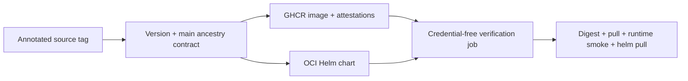

# Architecture

KubeFit uses a ports-and-adapters boundary around a deterministic recommendation
domain. Collection and Git hosting are replaceable infrastructure concerns.

```text
Kubernetes API ----\
                    collector -> recommender -> evaluator -> GitOps patch/PR
Prometheus API ----/                    |
                                         +-> FastAPI -> dashboard
```

The recommendation path is read-only. Writing occurs only in a configured Git
repository, and the initial pull request is a draft. Cluster rollout remains the
responsibility of the repository's existing GitOps controller and human approval
policy.

## Historical workload identity

The collector reads the current Deployment UID and retains only live ReplicaSets
whose controller owner UID matches it. Container usage is then joined with
`kube_pod_owner` for that exact ReplicaSet allowlist at each Prometheus range-query
timestamp, preserving a separate series per Pod.

The query begins no earlier than the current Deployment creation time, while
coverage remains relative to the full requested window. This prevents a same-name
recreation from inheriting older evidence and keeps new workloads non-actionable.
kube-state-metrics ownership retention remains an explicit prerequisite. ReplicaSets
already removed from the Kubernetes API require the optional identity snapshot to
have observed them before deletion.

An optional local identity snapshot provides that mapping for ReplicaSets KubeFit
has already observed. Records merge only while the Deployment UID remains identical;
a new UID replaces same-name history. Writes are atomic, and malformed or unsupported
snapshot schemas fail closed. This single-process adapter is not a shared audit store
or a replacement for a future controller-backed identity source.

The disposable local environment gives Prometheus a 5 GiB `standard` PVC, keeps a
two-day time horizon, and caps TSDB retention at 4 GB to leave WAL and compaction
headroom. This preserves observation evidence across Prometheus Pod and Docker
restarts. The volume belongs to the kind cluster and is not an external evidence
archive; deleting the cluster deletes the claim and restarts coverage accumulation.

## Recommendation policy v0

- CPU request: observed P95 plus 25% margin, rounded up to 10 millicores
- Memory request: observed P99 plus 25% margin, rounded up to 16 MiB
- CPU limit: 2x recommended request
- Memory limit: 1.5x recommended request
- Enforce small non-zero floors for idle or incomplete observations
- Calculate each percentile per Pod and retain the busiest Pod's value
- Pair CPU and memory samples by both Pod identity and timestamp
- Require 70% observation coverage and at least 100 metric samples
- Require every current Pod to contribute its share of the 100-sample floor
- Require desired, available, and observed replica counts to match
- Require CPU throttling coverage and samples to meet the same thresholds
- Require target-container status for every desired replica
- Treat CPU throttled-period P95 of at least 1% as medium risk and 10% as high
- Treat any current OOMKilled container status as high risk

These defaults are deliberately transparent and deterministic. Restarts are exposed
as evidence but are not automatically attributed to memory pressure. Application
latency and traffic representativeness still need to be added before production use.

The CLI preserves those production defaults under the `production` observation
profile. Its separate `demo` profile fixes a one-hour window, one-minute query step,
90% coverage, and the same 100-sample floor. Short-window recommendation evidence
is labeled controlled-demo-only. The matching checked-in k6 profile generates load
throughout the hour; demo mode without that controlled traffic is mechanically valid
but not representative evidence and must not be presented as such.

CPU and memory request changes are reported separately because millicores and MiB
cannot be combined into a meaningful percentage. The evaluator converts both into
USD only after the caller provides CPU and memory hourly prices, a price source,
replica count, and monthly hours. It returns CPU and memory components separately
and identifies the calculation basis as `resource_requests`.

```text
CPU cost    = request mCPU / 1000 × core-hour price × hours × replicas
Memory cost = request MiB / 1024 × GiB-hour price × hours × replicas
```

The evaluator uses exact decimal arithmetic. Prices and calculated money are
serialized as decimal strings so JSON transport does not silently reintroduce
binary floating-point rounding.

Resource calculation and change authorization are separate. An insufficient result
still includes its candidate and evidence for inspection, but future patch generation
must accept only an evaluation whose `patch_eligibility.status` is `eligible`.

## Replayable analysis artifact

New analysis output uses schema v2. It retains the aggregate `ObservedUsage` and a
`resource-recommendation/v1` policy snapshot alongside the evaluation and workload
identity. On load, KubeFit verifies UID, creation time, and replica relationships,
then reruns recommendation, risk, cost, and eligibility and requires exact model
equality. Schema v1 remains accepted and preserves its original serialized shape so
existing content-addressed proposal IDs do not change.

This is recommendation replay, not raw metric replay. P95/P99 values are retained
inputs; Prometheus range samples and query responses are not. The review surface
therefore exposes `recommendation_replayed` rather than claiming that percentile
aggregation or producer authenticity was independently proven.

## Observation readiness projection

The read-only readiness command reuses the exact workload, Prometheus, identity,
recommendation, and eligibility path used by analysis. For the requested window it
converts the 70% coverage threshold into a required sample count and takes the
larger of that value and the policy's 100-sample floor.

```text
required = max(100, ceil(points-per-Pod × desired replicas × 70%))
required per current Pod = ceil(100 / desired replicas)
remaining intervals = max(aggregate deficit / replicas, current-Pod deficit)
```

Aggregate samples count only CPU/memory observations with matching Pod identities
and timestamps. Historical authorized rollout Pods may support the aggregate window
and busiest-Pod percentile, but only current Pod identities satisfy Pod coverage.
The least-observed current Pod must independently reach the per-Pod floor for both
usage and throttling.

An estimate is emitted only when replicas, usage/throttling current-Pod coverage,
and container statuses are complete and no high-risk signal is already present.
Otherwise the status is `blocked`, because passage of time alone is not a defensible
remediation. Estimates remain projections: a rollout, scrape gap, OOM, throttling
change, or replica change invalidates their assumptions.

## Patch eligibility policy v0

```text
recommendation readiness ─┐
OOM risk                  ├─> structured checks ─> eligible | blocked
CPU throttling risk       ┘
```

- Insufficient readiness blocks a proposal.
- High or unknown OOM and throttling risk blocks a proposal.
- Medium risk remains eligible for a draft proposal but emits a reviewer warning.
- Projected savings and upsize/downsize direction do not grant or remove eligibility.

This gate authorizes only manifest proposal generation. It does not authorize a
merge, cluster mutation, or rollout.

## Manifest proposal boundary

The manifest generator consumes the complete evaluation so the observed current
resources, recommendation, eligibility, warnings, and evidence cannot be supplied
as unrelated arguments.

```text
eligible evaluation + YAML sources + exact target
  -> unique Deployment/container match
  -> stale resource comparison
  -> four scalar-span replacements
  -> patched content + unified diff + SHA-256 report
```

PyYAML is used to compose a syntax tree and obtain scalar source positions. KubeFit
does not serialize the tree back to YAML; it replaces only selected scalar spans in
the original text. This preserves unrelated formatting and comments byte-for-byte.
Blocked evaluations, duplicate targets or fields, aliases, missing resource maps,
invalid quantities, and repository values that differ from the evaluation all fail
before an artifact is returned.

The generator is pure: it does not write the repository or touch the cluster.

## Analysis identity boundary

CLI analysis output binds the evaluation to namespace, Deployment, container,
Deployment UID, and creation timestamp. Proposal creation derives its target from
this artifact rather than accepting retyped identity, and includes `analysis.json`
in the content digest. Before benchmark mutation, the live Deployment UID and
creation timestamp must still match. This extends stale resource checks across
same-name workload recreation.

Manifest sources are loaded only from an explicit repository root. Traversal,
outside files, duplicates, directories, invalid UTF-8, and symlinked roots or path
components fail before patch generation. Stored source paths are stable POSIX paths
relative to that root.

## Immutable proposal artifacts

The artifact writer turns a pure patch into stable input for benchmark and Git
workflows without changing the source repository.

```text
evaluation + original/candidate manifest + diff/report
  -> canonical payload bytes
  -> content digest and per-file SHA-256 index
  -> private staging directory
  -> fsync
  -> atomic directory rename
  -> immutable proposal-<digest>
```

The bundle contains no generated timestamp, so identical inputs produce the same
ID across output locations. A cooperative exclusive publication lock serializes
writers. If the destination already exists, every file and byte must match before
the existing bundle is reused; extra files, symlinks, and changed bytes fail closed.

Benchmark output does not belong inside this bundle. A benchmark run must create a
separate result artifact that references the proposal ID, preserving the proposal as
an immutable before/after input.

Full `manifests/before/<path>` and `manifests/after/<path>` payloads preserve the
repository change for review. They are not executable benchmark inputs. The writer
also slices the patch report's selected YAML document, reparses it, and verifies its
`apps/v1 Deployment` target and container before storing
`benchmark/manifests/before.yaml` and `after.yaml`. The loader derives those files
again from the full sources and requires byte equality after all hashes pass. This
prevents a multi-document source from expanding one benchmark into reconciliation
of neighboring Kubernetes objects.

## Benchmark comparison boundary

The checked-in `kubefit-load-v1` k6 profile fixes warmup, steady, spike, and recovery
arrival rates and timing. Its compact result records expected and completed
iterations separately from HTTP request count, along with per-phase errors and tail
latency. The script explicitly exports P95 and P99 through `summaryTrendStats`;
threshold calculation alone does not expose P99 to `handleSummary`. Before/after
measurements add Prometheus throttling, Kubernetes OOM and restart evidence,
recovery time, and request cost.

The verdict first rejects results that do not reference the same proposal and fixed
offered load. Completed iterations must meet the phase minimum and match exactly
or exceed it by one scheduler-boundary iteration in each run. A missing iteration or
two-iteration overshoot invalidates the evidence. Only comparable runs reach the
safety policy. Safety failures and cost change remain independent outputs, preventing
projected savings from masking a latency, error, throttling, recovery, or OOM
regression. The current module defines this policy as a pure contract, independently
of cluster mutation and artifact I/O.

## Restoring benchmark execution

The execution core loads and rehashes every proposal payload before invoking a
cluster controller. It then applies and measures before and after sequentially. As
soon as the first apply begins, every exit path attempts to reapply before and wait
for its Deployment rollout. A successful result is returned only after restoration;
if execution and restoration both fail, both causes remain available to the caller.
This includes one operator `KeyboardInterrupt`: the runner restores first and then
re-raises the same interrupt instead of converting Ctrl+C into an ordinary benchmark
error. It does not mask a second interrupt during restoration, so this remains a
best-effort process boundary rather than an external transactional controller.
Rollout completion is followed by a stricter stabilization gate: exactly the desired
number of selector-matching Pods must remain, none may be terminating, and the target
container in every Pod must be Running and Ready. Runtime snapshots therefore begin
after old ReplicaSet Pods leave, while identity changes during the load remain errors.

The k6 subprocess boundary does not equate exit code zero with valid evidence. It
rejects the structured `hint="script exception"` stderr marker observed from k6
1.4.2, then independently requires summary/raw files, typed parsing, and exact
proposal/variant identity. The file checks remain authoritative if k6 changes its
textual diagnostic format.

The kubectl adapter requires an explicit context and bounded rollout timeout. It
receives only the isolated single-Deployment manifests; full multi-document source
payloads remain reviewer evidence and are never passed to `kubectl apply`. The
measurement collector remains injected and composes k6 with aligned
Prometheus/Kubernetes evidence. This mutation workflow is still restricted to a
disposable benchmark cluster because each apply reconciles the complete selected
Deployment, not only its four resource scalars.

## Aligned measurement evidence

One measurement brackets k6 execution with Pod-level runtime snapshots, then queries
CPU throttling only from the recorded run interval. Stable Pod identity is required;
replacement or decreasing counters invalidates collection. A custom raw k6 marker
anchors five-second recovery windows, while the proposal's validated evaluation
supplies the matching current or recommended monthly request cost.

The typed provenance stores the run boundaries, Pod set, Prometheus rate window,
and hashes of the k6 summary and raw stream. Candidate OOM is an absolute failure,
incomplete candidate recovery is a failure, and incomplete baseline recovery makes
the comparison invalid. The execution result retains raw stream bytes for the
immutable result publisher.

## Immutable benchmark results

The restoring run carries exact k6 summary/raw bytes until publication. Before any
write, the publisher checks those bytes against measurement provenance, reparses the
summary, verifies proposal/variant identity, and recomputes the verdict. It then
publishes canonical before/after measurements, exact raw evidence, verdict, and a
generated Markdown report under a content-derived `benchmark-<digest>` ID.

Result publication uses the same private staging, `fsync`, exclusive lock, atomic
rename, and byte-exact retry principles as proposal publication, but writes to a
separate root and never modifies proposal inputs. Restricted k6 system tags and URL
validation keep common URL credentials out of retained evidence. The publication
lock does not serialize cluster mutation; the local CLI wraps the wider workflow in
the separate Deployment-scoped execution lock below.

## Deployment-scoped execution lock

The local benchmark command hashes explicit kubectl context, namespace, and
Deployment into a lock filename and acquires a non-blocking POSIX advisory lock.
The kernel releases ownership on process exit, avoiding stale PID-file cleanup.
Symlinked roots and files are rejected and the lock is held across proposal
revalidation, both applies and measurements, restoration, and result publication.

The runner accepts explicit `before-after` and `after-before` execution orders. It
stores measurements by logical role rather than chronological position, validates
that their retained wall-clock intervals do not overlap, and emits a warning naming
which role ran first. Either sequence still ends by applying and waiting for the
baseline manifest. Opposite-order artifacts can be inspected together, but no paired
metric aggregate exists. The pair assessor fully verifies both artifacts,
requires a shared proposal, opposite orders, and matching profile/cost bases, then
compares every non-order policy check status and requires both verdicts to pass. Its
canonical result is content-addressed independently of argument order. PASS is
published atomically as a self-contained `benchmark-pair-<digest>` directory containing
the assessment, report, canonical index, and complete copies of both benchmark bundles.
Loading rehashes the exact 21-file set and independently replays both results and the
pair decision. Publication preflight requires this artifact; FAIL and INVALID are never
persisted as publishable evidence.

The CLI accepts only an explicit `kind-*` context plus a required disposable-cluster
acknowledgement. This is a product boundary rather than a claim that lower-level
adapters are production safe. Locks coordinate only local cooperating processes;
distributed execution remains outside the MVP.

## Verified pull request plan

The GitHub boundary begins with a pure plan rather than a network request. Proposal
loading regenerates the minimal patch from the full before source and evaluation,
then requires the persisted after source, diff, report, and isolated benchmark files
to agree. Result loading verifies its canonical index and exact file set, reparses
measurements and raw k6 evidence, recomputes the verdict, and regenerates its
Markdown report. Pair loading repeats that verification for both embedded bundles,
recomputes the canonical PASS assessment and report, and requires the separately
supplied primary before-after result to be one of the pair members.

Only a `pass` result inside a `pass` pair referencing the exact proposal and the
proposal-fixed before and after costs can produce a plan. The plan contains one
repository-relative path, its expected before SHA-256, exact before/after bytes,
deterministic branch/title, draft-only flag, both pair member IDs, evidence summary,
and rollback guidance. A later repository adapter must compare the live file hash
again before writing; planning itself performs no checkout, commit, push, or GitHub
operation.

## Transactional repository commit

The local repository adapter requires the explicit root to equal Git's top-level,
an attached branch, and a completely clean tracked/untracked status. It rejects
symlinked roots and planned path components, then compares both SHA-256 and exact
source bytes before creating the deterministic branch.

The adapter atomically replaces only the planned file, stages only that path, and
commits without changing Git configuration. It verifies the generated commit has
the original base as its sole parent, exactly one changed path, unchanged Git file
mode, exact planned blob bytes, and the planned subject. It then returns to the base
branch and requires a clean tree. A matching existing one-commit branch is reused;
all other collisions fail without overwrite.

If a failure occurs after branch creation, cleanup restores and unstages only the
adapter-owned file, switches back, and deletes only the newly created branch. It
does not reset or erase unrelated paths. Repository hooks are honored; their
external side effects cannot be rolled back, and unexpected hook-created files are
reported as cleanup failure instead of being deleted.

## Idempotent GitHub publication

Publication revalidates the clean base checkout, source bytes, local branch tree,
and recorded commit SHA before contacting a remote. The production Git adapter
accepts only credential-free public `github.com` HTTPS or SSH URLs and derives the
owner/repository identity from that URL. Git credentials remain the responsibility
of the configured credential helper or SSH agent; they are never inserted into a
command by KubeFit.

The publisher first observes the exact remote branch ref. An absent ref is created
by pushing the verified commit with `--force-with-lease=<ref>:`: the empty expected
value makes this a compare-and-swap that cannot update an existing ref. The ref is
reused only when it already equals the verified SHA. A different SHA is neither
overwritten nor deleted.

The GitHub boundary then queries open pull requests for the exact repository owner,
head branch, and base branch. One result is reused only if its title, body, open
state, draft state, repository URL, head, and base all match the frozen plan. Zero
results authorize one draft creation; multiple or divergent results fail closed.
After an ambiguous push or create error, the publisher observes the boundary again
and succeeds only if the exact intended state exists. This makes retry the recovery
mechanism and avoids unsafe remote rollback.

`GitHubRestClient` supports only `https://api.github.com`. Its token lives in memory
and is placed only in the HTTP `Authorization` header, never in Git arguments,
models, URLs, artifacts, or exception text. Publication does not merge, approve,
mark ready, delete branches, or initiate deployment.

## Publication CLI secret boundary

`kubefit publish` composes verified artifact loading, local commit creation, and
idempotent publication without accepting a literal token option. The command line
contains only the name of an environment variable, defaulting to `GITHUB_TOKEN`.
It requires `--confirm-publish`, validates that the named variable is non-empty
before plan construction or repository mutation, and constructs the REST client in
memory.

Successful JSON contains identifiers and reuse state only. It excludes the token,
PR body, and manifest contents. Known adapter failures are rendered as a concise
CLI exit, and the token value is replaced defensively if an underlying exception
unexpectedly includes it. This reduces accidental disclosure through normal output;
the process environment remains the caller's secret-management responsibility.

## Read-only publication preflight

`kubefit publish-check` builds the same semantically verified pull request plan, but
uses `inspect_repository_plan` instead of the commit adapter. The inspection requires
the exact Git top-level, clean attached base, unchanged source bytes, and either an
absent deterministic branch or a fully verified reusable commit. It does not switch
HEAD, write the file, stage, commit, or create refs.

After local validation, the command parses the credential-free GitHub remote and
uses `git ls-remote` to classify the planned ref as absent, reusable, or colliding.
It never pushes. A present API token authorizes one repository GET; the response
records readability, default branch, visibility, and any permission flags GitHub
chooses to report. Those flags remain evidence, not a guarantee that branch rules,
SSO, or pull-request writes will succeed.

The JSON report has ordered artifact, local repository, Git remote, and GitHub API
checks plus blockers and warnings. It always includes `mutation_performed: false`.
Artifact or local failures stop dependent checks; token absence and remote/API
failures are explicit blockers rather than prompts or automatic repair attempts.
The CLI prints the report before returning exit 2 for a blocked diagnostic; only a
report without blockers returns exit 0. This lets shell control flow enforce the
same gate without parsing JSON, while the JSON retains the reason.

## Content-addressed publication evidence

`kubefit verify-publication` consumes the immutable proposal, primary benchmark, and
self-contained benchmark pair plus an exact directory containing `preflight.json`,
`first-publish.json`,
`second-publish.json`, `remote-ref.txt`, and `github-pr.json`. The directory and
every entry must be regular and non-symlinked; any missing or additional name fails.

The verifier rebuilds `PullRequestPlan`, then requires the ready preflight to bind
the same proposal, benchmark, pair, and pair-member IDs, planned path, base,
repository, remote, and initially absent
local/remote branch. The first publication must report creation and the second must
report reuse. Repository, branch, SHA, PR number, and URL must remain identical. The
independent remote ref and GitHub PR evidence must prove the same SHA, open Draft
state, head/base, planned title, and one changed file.

Each source file is SHA-256 hashed. A canonical object containing the proposal ID,
benchmark ID, pair ID, both pair-member IDs, and sorted hash map produces a
deterministic `publication-<digest>` verification ID. This binds the locally verified
bytes but does not authenticate who captured them or replace the live procedure.

## API image and Helm security boundary

The container build uses a wheel-producing builder stage and a slim runtime stage.
Only installed project/runtime dependencies cross the stage boundary. The runtime
uses numeric UID/GID `10001`; Kubernetes additionally enforces non-root execution,
RuntimeDefault seccomp, no privilege escalation, all capabilities dropped, and a
read-only root filesystem with a dedicated empty `/tmp` volume.

The default chart deploys the current stateless HTTP API behind a ClusterIP Service
with liveness/readiness probes and explicit resource requests/limits. Its dedicated
ServiceAccount and Pod both disable token automount. No Role is rendered while
`rbac.targetNamespaces` is empty.

Optional observation RBAC is generated as one Role and RoleBinding per explicitly
named namespace. It contains only Deployment `get`, ReplicaSet `list`, and Pod
`list`, matching the current collector's Kubernetes reads. Values validation rejects
invalid namespace names and template validation rejects incomplete RBAC/token/service
account combinations. There are no ClusterRoles, Secrets, watch, logs, events, or
write verbs.

This RBAC is a prepared boundary, not a claim that the current HTTP API performs
in-cluster observation. The packaged image does not include kubectl and the API
routes remain pure recommendation/evaluation endpoints; operator-side collection
continues through the CLI.

## Disposable kind package verification

The local integration script is restricted to a derived `kind-*` context and passes
that context to every Helm and kubectl operation. It builds a local-only image, loads
it directly into kind, uses `imagePullPolicy: Never`, and never invokes registry push
or cluster deletion.

The test first installs reset chart values and proves the ServiceAccount cannot read
the demo Deployment. After temporarily enabling one target namespace, Kubernetes
impersonation must allow exactly Deployment `get`, ReplicaSet `list`, and Pod `list`.
Pod watch, Secret get, Deployment update, and Pod list in `monitoring` must remain
denied. A final reset removes Role/RoleBinding and token automount, then repeats the
initial denial. An EXIT trap attempts the same restoration after interruption.

## Public package release boundary

Package publication starts only from an existing annotated `vMAJOR.MINOR.PATCH`
tag whose target is reachable from `main`. The tag version must equal the Python
project version, Helm chart version, and chart `appVersion`. The release never
creates or moves a source tag.

The image publisher uses digest-pinned Node and Python base indexes and emits one
multi-architecture image index for `linux/amd64` and `linux/arm64`. It publishes
only the semantic version and `sha-<full source commit>` tags, plus BuildKit SBOM and
provenance attestations. The matching chart is published under
`oci://ghcr.io/sangmu1126/charts/kubefit`.



The verification job has no package permission and performs no registry login. A
successful publish is therefore not sufficient: release status remains failed until
the same image digest and chart version are anonymously accessible. GHCR visibility
is an account-level owner action and is not silently broadened by the workflow.

This establishes source and public-installation identity, not bit-for-bit build
reproducibility.

## Python dependency boundary

`pyproject.toml` keeps the supported dependency ranges exposed to package consumers,
while KubeFit's own installation paths consume three reviewed snapshots:
`requirements/runtime.lock`, `requirements/dev.lock`, and
`requirements/build.lock`. Every entry is exact and hash-checked. CI and the Docker
builder install build dependencies before disabling build isolation, so neither path
can silently download a different Hatchling environment.

The Docker builder turns only the runtime snapshot into dependency wheels and builds
KubeFit itself with `--no-deps --no-build-isolation`. The runtime stage continues to
install only from the local wheel directory. Development tools therefore stay out of
the production image and package resolution does not occur in the final stage.

The hosted Python quality gate fans the same locked install, `pip check`, Ruff, and
test commands across Python 3.12, 3.13, and 3.14. Matrix fail-fast is disabled so a
failure on one interpreter does not cancel compatibility evidence for the others.
Repository tests bind this active matrix to the declared `>=3.12` lower bound; adding
a future supported minor remains an explicit policy update.

The locks control Python distributions, not OS files, timestamps, or every byte of a
container build. They narrow and expose the dependency input without claiming
bit-for-bit reproducibility.

## License distribution boundary

The root `LICENSE` is the canonical Apache-2.0 text. Python packaging declares the
SPDX expression and includes that exact file under wheel `.dist-info/licenses`; the
Docker builder receives the same file before constructing and installing the wheel.
The README links back to the root copy rather than duplicating legal text.

KubeFit does not create an empty NOTICE file because the project currently has no
NOTICE attribution content to preserve. Third-party packages retain their own
licenses and remain separately visible through package metadata and the image SBOM;
the KubeFit license does not replace them.
