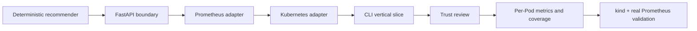
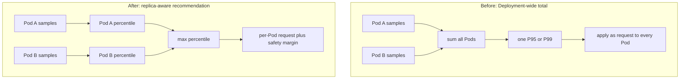

# 0001: Building a trustworthy analysis path

- **Date:** 2026-08-20
- **Status:** validated
- **Related phase:** Phase 1 — trustworthy resource analysis
- **Commits:** `5967c22` through `a79bf32`

## Why

KubeFit promises a safe, explainable recommendation rather than an opaque automatic
resize. That promise is already broken if a mathematically valid percentile is
calculated at the wrong Kubernetes scope, if unrelated units are combined into a
single savings number, or if incomplete observations are labeled low-risk.

The first development slice therefore optimized for trustworthiness before YAML
patches, pull requests, dashboards, or HPA recommendations.

## Success criteria

- Read one Deployment and its target container without mutating the cluster.
- Calculate CPU P95 and memory P99 per Pod replica.
- Keep the busiest Pod so load imbalance is not hidden by an average.
- Expose observation coverage and refuse to present unsupported low-risk claims.
- Reproduce the full collector-to-recommender path on a local Kubernetes cluster.

## What changed

The repository started with a deterministic recommendation domain, added FastAPI
and CLI entry points, then connected Kubernetes and Prometheus adapters. A review
of the first vertical slice found three misleading behaviors:

1. Prometheus summed every replica before producing a request intended for each Pod.
2. The result added millicores and MiB to produce one apparent reduction percentage.
3. Risk was derived from limits created by the same formula, making `low` nearly
   inevitable under the default policy.

The analysis now retains Pod-level time series, reports CPU and memory changes
separately, includes maxima and sample coverage, and returns `unknown` when evidence
is insufficient.

## How

### Development sequence



The sequence kept the recommendation policy independently testable, then added one
infrastructure boundary at a time. The local cluster was added only after the core
behavior had unit coverage, so integration failures could be isolated more easily.

### Aggregation correction



The previous flow could multiply a Deployment total by its replica count when the
recommendation was applied. The new flow selects the busiest replica's percentile,
which is deliberately conservative when replicas receive uneven traffic.

### Alternatives and trade-offs

| Option | Benefit | Cost or risk | Decision |
|---|---|---|---|
| Deployment-wide sum | Useful for total capacity planning | Wrong unit for per-Pod resources | Rejected |
| Average across Pods | Stable and inexpensive | Hides a consistently hot replica | Rejected for v0 |
| Maximum per-Pod percentile | Protects against replica imbalance | Can overstate needs when one Pod is abnormal | Selected, with evidence shown |
| Directly install Prometheus on macOS | Simple process model | Unlike the target Kubernetes environment | Rejected |
| kind plus kube-prometheus-stack | Reproducible and close to production metrics | More local resources and startup time | Selected |

## Problems encountered

### Mock tests accepted invalid PromQL

The first real CLI execution returned HTTP 400 even though unit tests passed.
Python's `re.escape()` converted hyphens in Pod names to `\-`. Prometheus parses the
matcher inside a PromQL string literal and rejects that escape.

The mock transport checked query contents but did not parse PromQL, so it could not
detect this integration error. The matcher now leaves DNS-name hyphens unescaped
and double-escapes only regex backslashes that must survive the PromQL string.

### A fresh cluster cannot support a one-day claim

The local analysis had only two paired samples across the requested one-day window.
Instead of treating a successful query as sufficient evidence, the result calculated
`0.3%` observation coverage and classified both risks as `unknown`.

This is a desired safety result: connectivity was validated, but the sample was not
misrepresented as production-quality evidence.

## Evidence

### Environment

| Component | Validated version |
|---|---|
| Docker Engine | 29.6.2 |
| kind | 0.32.0 |
| kubectl client | 1.36.1 |
| Helm | 4.2.4 |
| kube-prometheus-stack | 88.5.0 |
| Demo replicas | 2 |

### Reproduction

```bash
./deploy/local/up.sh

kubectl port-forward \
  -n monitoring \
  svc/monitoring-kube-prometheus-prometheus \
  9090:9090

kubefit analyze \
  --namespace kubefit-demo \
  --deployment overprovisioned-api \
  --prometheus-url http://localhost:9090 \
  --days 1
```

### Results

| Signal | Current | Candidate | Interpretation |
|---|---:|---:|---|
| CPU request | 1000m | 10m | Idle demo reached the policy floor |
| Memory request | 2048Mi | 32Mi | Idle demo reached the policy floor |
| Observation coverage | — | 0.3% | Insufficient for an operational change |
| OOM risk | — | unknown | Correctly withheld due to coverage |
| CPU throttling risk | — | unknown | Correctly withheld due to coverage |

Automated verification after the integration fix produced:

```text
12 tests passed
Ruff: all checks passed
Prometheus Pods: Running
Demo Pods: 2/2 Running
End-to-end CLI analysis: succeeded
```

## Decision and limitations

The evidence supports the claim that KubeFit can discover a Deployment, retrieve
real cAdvisor CPU and memory samples from Prometheus, and produce a replica-aware
candidate with explicit observation quality.

It does **not** yet support the claim that the candidate is safe to deploy. The
current run represents an idle, newly created workload. Historical Pods from older
rollouts are not yet included, traffic representativeness is unknown, and throttling,
OOM, restart, latency, and monetary cost signals are still absent.

## Next question

How can KubeFit distinguish a genuinely representative observation window from a
short-lived or recently rolled-out set of Pods before allowing patch generation?
