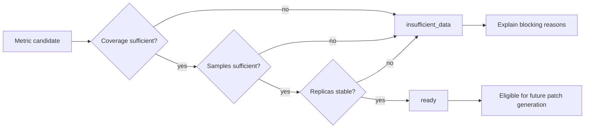
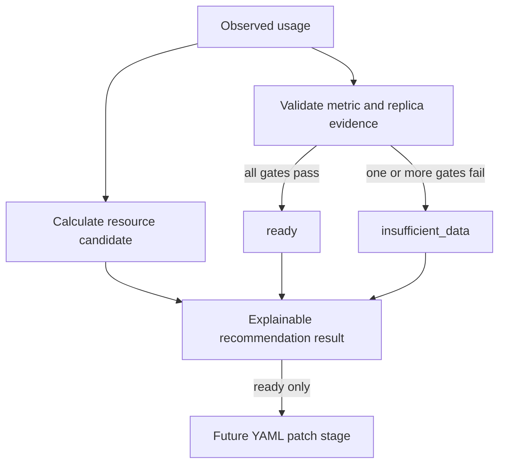

# 0002: Gating recommendations on observation readiness

- **Date:** 2026-08-20
- **Status:** validated
- **Related phase:** Phase 1 — trustworthy resource analysis
- **Commits:** `c9333ec feat: gate recommendations on observation readiness`

## Why

The first real cluster analysis successfully calculated a candidate from only two
paired metric samples. Its risks were marked `unknown`, but the result did not give
a downstream GitOps component one explicit answer to the operational question:
is there enough evidence to propose this change?

A numerical candidate and an actionable recommendation are different states.
KubeFit needs a machine-readable boundary between them before YAML patch generation
is implemented.

## Success criteria

- Report whether a recommendation is `ready` or `insufficient_data`.
- Require minimum observation coverage and sample count.
- Require desired, available, and observed replica counts to agree.
- Preserve the candidate and its evidence even when action is blocked.
- Validate both unit-test scenarios and the running local cluster.

## What changed

`ResourceRecommendation` now includes a readiness result with a machine-readable
status and concrete blocking reasons. The Kubernetes collector also reports desired
and available replicas, while the CLI supplies the number of Pods used for metrics.

The default policy requires all of the following:

- at least 70% observation coverage;
- at least 100 metric samples;
- equal desired, available, and observed replica counts.

The resource candidate is still returned when these checks fail. This preserves
explainability while giving future patch generation one strict boundary to enforce.

## How

### Readiness flow



The candidate remains visible in both branches so users can inspect the algorithm,
but only the `ready` branch may feed the future manifest patch workflow.

### Separating calculation from authorization



Calculation and authorization are deliberately separate. A user can inspect what
the deterministic policy would calculate without interpreting that number as an
approval to change production.

### Alternatives and trade-offs

| Option | Benefit | Cost or risk | Decision |
|---|---|---|---|
| Return an API error for incomplete data | Impossible to overlook the gate | Hides useful diagnostic candidate and evidence | Rejected |
| Omit the candidate until ready | Simple user interface | Makes algorithm behavior difficult to debug | Rejected |
| Return candidate plus readiness | Transparent and machine-readable | Consumers must enforce the status | Selected |
| Check coverage only | Small policy | Can accept a misleadingly tiny or unstable replica sample | Rejected |

## Problems encountered

The local cluster had been running for roughly 21 hours, but Docker Desktop was
stopped for most of that period. Pod age alone would therefore have suggested a much
stronger observation window than Prometheus actually contained. After Docker was
restarted, the live query returned only nine metric samples and 1.6% coverage.

This confirmed that readiness must be based on collected evidence, not only
Deployment or Pod creation timestamps.

## Evidence

### Unit and static verification

```text
13 tests passed
Ruff: all checks passed
```

Tests cover ready evidence, low coverage, missing evidence, and a rollout-like
replica mismatch.

### Live cluster result

```text
desired replicas: 2
available replicas: 2
observed replicas: 2
metric samples: 9
observation coverage: 1.6%
readiness: insufficient_data
```

The returned blocking reasons were:

```text
observation coverage is 1.6%; at least 70% is required
sample count is 9; at least 100 is required
```

Replica stability passed, while both metric-quality gates failed. OOM and CPU
throttling risks remained `unknown`, so a consumer cannot mistake the idle resource
candidate for a validated production recommendation.

## Decision and limitations

Future patch generation must accept only recommendations whose readiness status is
`ready`. The current gate protects fresh, interrupted, and actively rolling
workloads using evidence already available in the MVP.

The 70% and 100-sample defaults are initial policy values rather than empirically
validated universal thresholds. Current Pod names also exclude deleted Pods from
older ReplicaSets, so a rollout can reduce coverage even when Prometheus still has
usable historical workload data.

## Next question

How can historical Pod metrics be associated with the owning Deployment across
ReplicaSet rollouts without accidentally including an unrelated workload?
