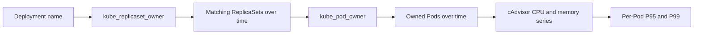
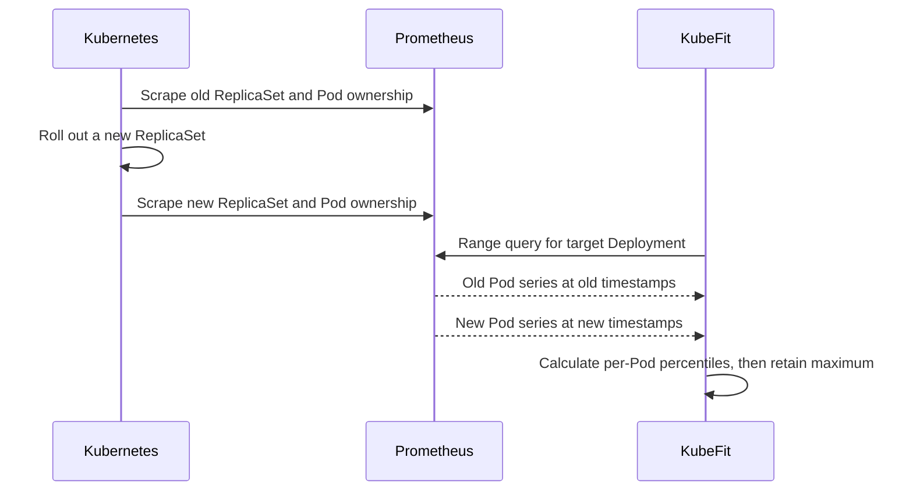

# 0003: Preserving workload identity across rollouts

- **Date:** 2026-08-20
- **Status:** validated
- **Related phase:** Phase 1 — trustworthy resource analysis
- **Commits:** `ec68756 feat: preserve metrics across deployment rollouts`

## Why

KubeFit currently asks Kubernetes for the Pods that exist now and inserts their
names into a seven-day Prometheus query. A Deployment rollout replaces those Pod
names. Metrics from the previous ReplicaSet can still exist in Prometheus, but the
query no longer selects them, reducing coverage and potentially hiding a different
traffic profile.

Matching Pods by a loose name prefix would recover more history but could include
an unrelated workload with a similar name. Historical metrics need to be associated
through Kubernetes ownership, not naming convention.

## Success criteria

- Resolve `Deployment → ReplicaSet → Pod` ownership in PromQL.
- Include samples from a previous ReplicaSet after a rollout.
- Exclude a similarly named Deployment and its Pods.
- Preserve per-Pod percentile behavior and observation-quality reporting.
- Validate the query against the real local Prometheus deployment.

## What changed

Prometheus queries no longer contain a regex made from only the currently running
Pod names. They select cAdvisor series by namespace and container, then intersect
them with Kubernetes ownership metrics from kube-state-metrics.

The result also reports how many distinct Pod time series participated. This count
is evidence about rollout history and is intentionally separate from the current
replica count used by the readiness gate.

The CLI gained `--step-seconds` so short integration experiments can retain enough
temporal resolution while the production-oriented default remains five minutes.

## How

### Ownership join



The join is evaluated at each Prometheus range-query timestamp. This should allow a
deleted Pod's older samples to participate while its historical ownership series is
still retained by Prometheus.

Conceptually, the query applies these joins:

```text
container metric
  * on(namespace, pod)
    kube_pod_owner
  * on(namespace, replicaset)
    kube_replicaset_owner{owner_kind="Deployment", owner_name="target"}
```

`max by(...)` is applied to both ownership metrics before joining. This prevents
duplicate kube-state-metrics replicas from producing a many-to-many PromQL match.
The final CPU and memory series remain grouped by Pod, so the busiest per-Pod
percentile policy is unchanged.

### Identity behavior across a rollout



The ownership join is evaluated at every range-query timestamp. It does not require
deleted Pods to remain visible through the live Kubernetes API.

### Alternatives and trade-offs

| Option | Benefit | Cost or risk | Decision |
|---|---|---|---|
| Current Pod names | Exact for the present state | Drops every previous rollout | Rejected |
| Deployment name prefix | Simple and recovers old Pods | Can include similarly named workloads | Rejected |
| Application label | Readable and stable when managed well | Labels are user-defined and may be shared or changed | Rejected as the ownership source |
| kube-state-metrics owner join | Uses Kubernetes controller relationships over time | Requires ownership metrics and a more complex query | Selected |

## Problems encountered

The first generated range query returned HTTP 400 although the mock-based unit tests
passed. Query composition emitted one extra closing brace around the `kube_pod_owner`
selector. As in entry 0001, an HTTP mock could validate parameters but could not act
as a PromQL parser.

The selector construction was fixed, a regression assertion was added, and the
query was rerun against Prometheus before rollout testing continued. This reinforces
the need for a small real-Prometheus integration suite in addition to unit tests.

## Evidence

### Rollout test

The original Deployment had two Pods owned by ReplicaSet `6964bc8c5`. A Pod-template
annotation triggered ReplicaSet `7587c7647c`; Kubernetes then removed the old Pods.

With a 15-second query step, KubeFit returned:

```text
current replicas: 2
Pod identities in the metric window: 4
metric samples: 216
observation coverage: 1.9%
```

The four identities are the two deleted Pods from the previous ReplicaSet plus the
two current Pods. Coverage remained insufficient because Docker and Prometheus had
not been running for most of the requested one-day window.

### Similar-name isolation test

An ephemeral Deployment named `overprovisioned-api-shadow` was created in the same
namespace with a container also named `api`. Prometheus confirmed that its cAdvisor
series existed. Re-running the target analysis produced:

```text
target Deployment metric Pod identities: 4
```

The count did not increase to five, demonstrating that exact controller ownership,
not the shared name prefix or container name, selected the workload. The temporary
Deployment was deleted after the test.

### Automated verification

```text
13 tests passed
Ruff: all checks passed
End-to-end ownership range query: succeeded
```

## Decision and limitations

kube-state-metrics ownership joins are now the required source of historical
Deployment identity. This is safer than a naming heuristic and supports ordinary
ReplicaSet rollouts without querying deleted Pods from the Kubernetes API.

If ownership metrics are missing or have shorter retention than cAdvisor metrics,
KubeFit cannot recover that history and will return no or reduced coverage. Deleting
and recreating a Deployment with the exact same namespace and name can also connect
two logically different incarnations because the owner series does not currently
filter by Deployment UID.

## Next question

How should KubeFit detect Deployment recreation and metric-source gaps so same-name
history is blocked rather than treated as one continuous workload?
