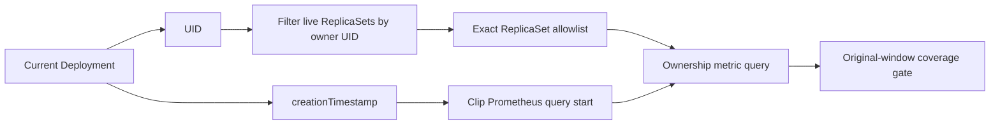
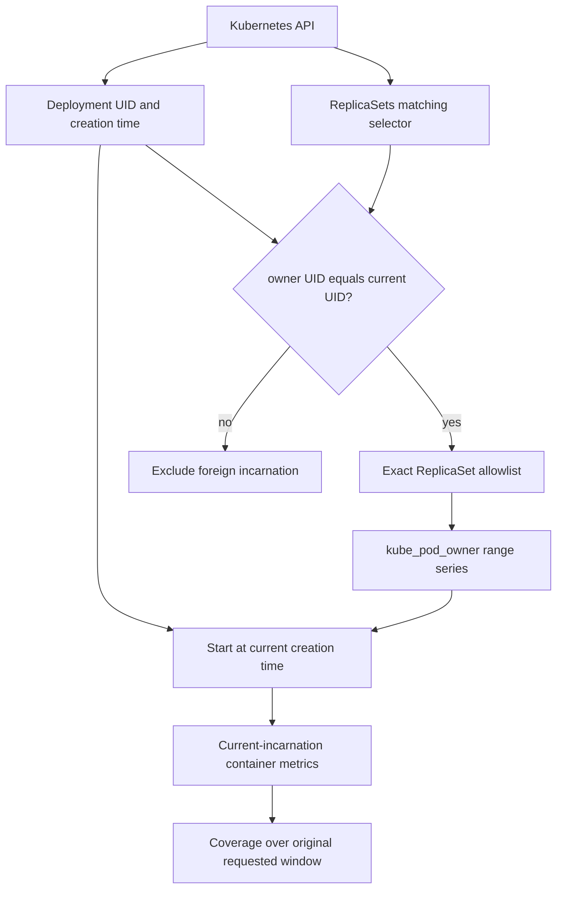

# 0004: Separating same-name Deployment incarnations

- **Date:** 2026-08-21
- **Status:** validated
- **Related phase:** Phase 1 — trustworthy resource analysis
- **Commits:** `3657594 feat: isolate recreated workload metric history`

## Why

The rollout ownership join identifies a Deployment by namespace and name because
`kube_replicaset_owner` does not expose the owning Deployment UID. If a Deployment
is deleted and a different workload is created with the same name within the metric
retention window, a name-only query can combine both workloads.

Kubernetes already stores the authoritative UID chain in live object
`ownerReferences`. KubeFit should use that identity before constructing a historical
metric query.

## Success criteria

- Collect the current Deployment UID and creation timestamp.
- Select only ReplicaSets whose controller owner UID equals that Deployment UID.
- Limit metric history to timestamps at or after the current Deployment creation.
- Keep coverage relative to the originally requested window so a new incarnation
  remains insufficient rather than appearing fully observed.
- Delete and recreate a local test Deployment with the same name and prove that old
  metric identities are excluded.

## Planned boundary



The ReplicaSet allowlist protects identity in the live ownership graph. The creation
timestamp protects the historical time range even when a recreated Deployment
produces the same ReplicaSet hash and therefore the same ReplicaSet name.

## What changed

The Kubernetes collector now reads the Deployment UID and creation timestamp. It
lists ReplicaSets selected by the Deployment labels but retains only objects whose
controller `ownerReferences.uid` equals the current Deployment UID.

Prometheus receives that exact ReplicaSet-name allowlist and queries
`kube_pod_owner`; it no longer trusts a Deployment name exposed by
`kube_replicaset_owner`. The query range begins at the later of the requested start
and current Deployment creation time.

Coverage still uses the original requested duration. A two-minute-old Deployment
queried with `--days 1` therefore has roughly two minutes of possible evidence over
a one-day requirement, rather than being treated as fully covered.

## How

### Two independent boundaries



The UID check protects the current ownership graph. The time boundary protects
Prometheus history. Both are needed because a recreated Deployment can generate the
same ReplicaSet hash when its Pod template is identical.

### Why PromQL alone was insufficient

Live metric inspection showed:

```text
kube_pod_owner.uid          = Pod UID
kube_replicaset_owner      = Deployment name, no Deployment UID
Deployment ownerReference  = authoritative Deployment UID
```

The required owner UID exists in the Kubernetes ReplicaSet object but not in the
available ReplicaSet-owner metric labels. KubeFit therefore resolves identity
through the read-only Kubernetes API before constructing PromQL.

### Alternatives and trade-offs

| Option | Benefit | Cost or risk | Decision |
|---|---|---|---|
| Deployment name in PromQL | Recovers deleted ReplicaSets | Mixes same-name incarnations | Rejected |
| Creation timestamp only | Removes most older history | Does not verify current owner graph | Rejected alone |
| Live owner UID plus time clipping | Stateless and uses authoritative Kubernetes identity | Limited to ReplicaSets still visible through the API | Selected for MVP |
| Custom UID-labelled identity metric | Full durable identity across deletion | Requires a controller and stored history | Deferred |

## Problems encountered

The first metric-readiness poll searched for container name `recreation-probe`, but
`kubectl create deployment --image=nginx...` named the container `nginx`. Inspecting
the actual Prometheus labels exposed the assumption, and subsequent analysis selected
the explicit container name. The product collector already handles this safely by
reading the container list and requiring selection when it is ambiguous.

The live output also exposed grammatically incorrect singular evidence (`1 samples`
and `1 identities`). Evidence formatting now handles singular and plural counts, with
a regression test.

## Evidence

### Same-name recreation experiment

The first isolated Deployment incarnation produced:

```text
Deployment UID: 37c0dfad-acbb-4808-87ef-039ac57e908f
Created:        2026-08-20T15:07:05Z
ReplicaSets:    recreation-probe-746bf64c76
                recreation-probe-78548c5847
Metric Pods:    2
Metric samples: 7
```

The Deployment was deleted, then recreated with the same name, image, and resource
template. Kubernetes generated the same two ReplicaSet names, which makes a name-only
historical query ambiguous. The second incarnation produced:

```text
Deployment UID: eec63737-be5e-4145-9a4a-f771480bd5e8
Created:        2026-08-20T15:08:55Z
ReplicaSets:    recreation-probe-746bf64c76
                recreation-probe-78548c5847
Metric Pods:    1
Metric samples: 1
Readiness:      insufficient_data
```

Despite identical Deployment and ReplicaSet names, the second analysis did not
include the first incarnation's two Pod identities or seven samples. Its evidence
reported the new UID and clipped history to the new creation timestamp.

### Automated verification

```text
17 tests passed
Ruff: all checks passed
Existing Deployment end-to-end analysis: succeeded
Same-name delete and recreate experiment: succeeded
```

Tests cover foreign owner UID rejection, missing owned ReplicaSets, creation-time
clipping, original-window coverage, future timestamps, and singular evidence.

## Decision and limitations

The stateless MVP will use the current Deployment UID to authorize ReplicaSets and
the current creation timestamp to bound metric history. This prevents a stable,
same-name recreation from inheriting the previous workload's evidence and naturally
keeps a new workload below the readiness threshold.

ReplicaSets already removed by `revisionHistoryLimit` cannot be recovered by the
live UID allowlist even if Prometheus retains their metrics. A rapid background
deletion can also briefly overlap old child Pods with a new same-name Deployment;
low coverage and replica mismatch protect patch readiness, but durable attribution
would require storing UID relationships or emitting a UID-labelled identity metric.

## Next question

What is the smallest persistent identity record that can recover deleted
ReplicaSets without expanding the MVP into a full in-cluster controller?
