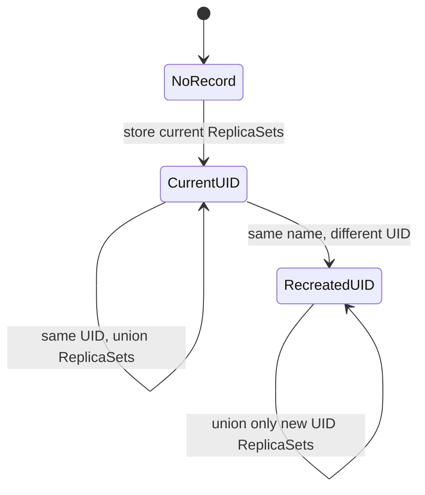
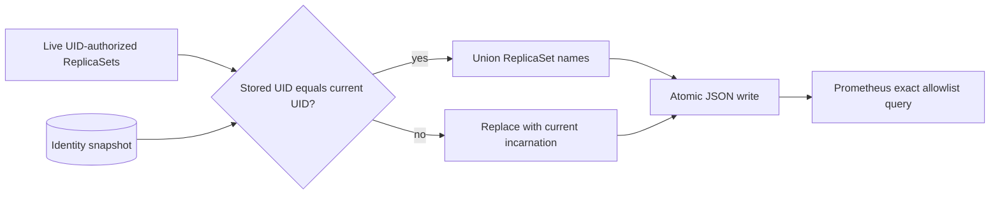
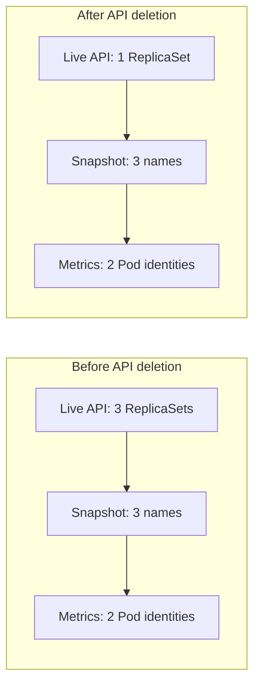

# 0005: Retaining deleted ReplicaSet identity without a controller

- **Date:** 2026-08-21
- **Status:** validated
- **Related phase:** Phase 1 — trustworthy resource analysis
- **Commits:** `65c15d5 feat: persist observed workload identity snapshots`

## Why

UID filtering protects a current Deployment from same-name history, but Kubernetes
eventually deletes old ReplicaSets according to `revisionHistoryLimit`. Prometheus
may still retain useful Pod metrics after the live ReplicaSet object and its owner
UID relationship disappear.

A full controller and database would solve this durably but would expand the MVP's
operational footprint. The smallest useful bridge is an explicit local snapshot of
identity relationships already observed through the read-only Kubernetes API.

## Success criteria

- Persist only namespace, Deployment name, UID, creation time, and ReplicaSet names.
- Merge ReplicaSets when the Deployment UID is unchanged.
- Replace, never merge, records when the same name has a new UID.
- Write atomically and reject unsupported or malformed snapshot data.
- Keep persistence opt-in through a CLI path.
- Prove that a deleted ReplicaSet remains authorized from the snapshot.

## Planned state transition



The snapshot stores identity, not metrics, recommendations, credentials, or cluster
state. Prometheus remains the source of metric history.

## What changed

An opt-in JSON identity store records one active incarnation per namespace and
Deployment name. Its record contains only namespace, name, UID, creation timestamp,
and observed ReplicaSet names.

`kubefit analyze --identity-store PATH` merges live UID-authorized ReplicaSets with
names previously observed for the same UID. A different UID replaces the record
rather than inheriting it.

Writes use a temporary file in the destination directory, flush and `fsync` it,
then atomically replace the snapshot. Malformed data, unsupported schema versions,
and conflicting creation times fail closed.

## How

### Read and write path



The store is consulted only after the Kubernetes API establishes the current UID.
It cannot make an older incarnation cross the creation-time boundary from entry
0004.

### Alternatives and trade-offs

| Option | Benefit | Cost or risk | Decision |
|---|---|---|---|
| Depend only on live ReplicaSets | Stateless | Loses deleted rollout identity | Insufficient alone |
| Local JSON snapshot | Small, inspectable, no service dependency | Single-host and opt-in | Selected for MVP |
| SQLite | Transactions and stronger concurrency | More schema and lifecycle complexity | Deferred |
| In-cluster controller and CRD | Durable shared identity | Major operational and RBAC expansion | Out of MVP |

## Problems encountered

The integration probe used an `nginx` container label rather than the Deployment
name assumed by the first metric poll. Inspecting real Prometheus labels corrected
the test assumption. The product collector already reads actual container names and
requires explicit selection when multiple containers exist.

The live evidence also produced `1 ReplicaSets`. ReplicaSet evidence now handles
singular and plural forms, alongside the sample and Pod identity formatting fixed in
entry 0004.

## Evidence

### Deleted ReplicaSet experiment

The isolated `identity-probe` Deployment used UID:

```text
fef3afda-2aeb-47eb-8da3-e5a136bd0ab3
```

Two template changes produced three ReplicaSets. Before deletion, the snapshot and
Prometheus evidence reported three authorized ReplicaSets and two metric Pod
identities. The two scale-zero ReplicaSet objects were then deleted, leaving only
`identity-probe-6ccb5d44d6` in the live API.



The post-deletion comparison was:

| Mode | Authorized ReplicaSets | Metric Pod identities | Interpretation |
|---|---:|---:|---|
| Snapshot disabled | 1 | 1 | Only the current live rollout remained |
| Snapshot enabled | 3 | 2 | Deleted rollout metric identity was recovered |

The temporary Deployment and snapshot directory were removed after validation.

### Automated verification

```text
21 tests passed
Ruff: all checks passed
Deleted ReplicaSet recovery experiment: succeeded
```

Tests cover same-UID merging, new-UID replacement, conflicting creation timestamps,
unsupported schemas, and singular evidence.

## Decision and limitations

The snapshot remains opt-in because analysis without local state is still a valid,
more conservative mode. The file contains Kubernetes identifiers but no credentials
or metric values and is excluded from Git by default.

Atomic replacement prevents partial files, but this version does not coordinate
multiple concurrent writers; the last writer can overwrite another process's update.
It also cannot recover a ReplicaSet KubeFit never observed. Shared deployments will
eventually need SQLite locking or a controller-backed identity source.

## Non-goals

- Running an in-cluster controller
- Synchronizing snapshots between multiple KubeFit instances
- Treating the local file as an audit database
- Recovering relationships that KubeFit never observed

## Next question

Can Phase 1 now be closed with a reproducible longer-running workload, or do resource
quantity parsing and selector edge cases still block a trustworthy demo?
