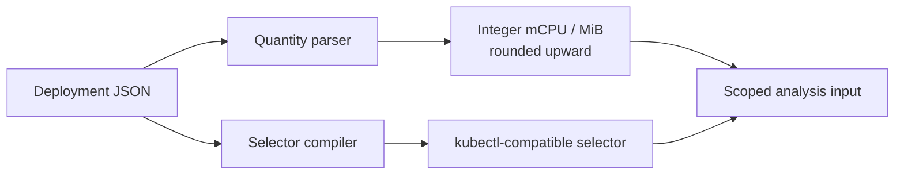
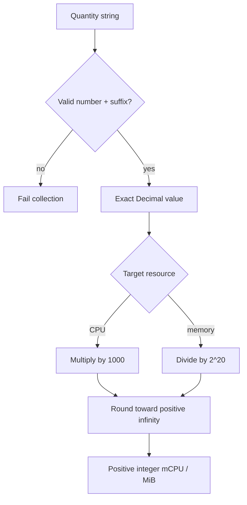
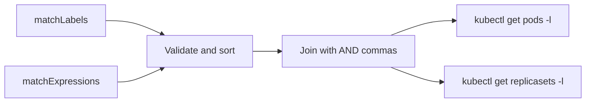

# 0006 — Kubernetes resource input boundary

**Status:** validated  
**Date:** 2026-08-21
**Related phase:** Phase 1 — trustworthy resource analysis  
**Feature commit:** `603ebf0 feat: harden Kubernetes resource input parsing`

## Why

KubeFit's first recommendation is only as trustworthy as the Deployment input it
interprets. Kubernetes accepts more resource quantity forms than `m`, `Mi`, and
`Gi`, while a Deployment selector may contain both `matchLabels` and
`matchExpressions`. Misreading either can understate the configured capacity or
collect Pods and ReplicaSets from the wrong scope.

The previous parser used binary floating-point and rounded to the nearest integer.
For a value smaller than one millicore or one MiB, that could report zero. The
previous selector builder also ignored `matchExpressions` entirely.



The boundary converts every accepted representation into one conservative,
deterministic internal form before analysis begins.

## Success criteria

- Parse Kubernetes decimal SI, binary SI, and exponent quantity forms without
  binary floating-point arithmetic.
- Round positive CPU and memory quantities upward so the collector never reports
  less configured capacity than the manifest declares.
- Compile `matchLabels` and all four set-based selector operators into a stable
  kubectl selector.
- Reject malformed quantities and selector expressions with an actionable
  collection error.
- Close the remaining Phase 1 test gaps for missing Prometheus samples and both
  recommendation directions.

## Non-goals

- Preserve the original quantity spelling after normalization.
- Support Deployments that omit any CPU or memory request or limit.
- Change the recommendation policy or mutate the cluster.

## What changed

The collector now parses Kubernetes quantities with `Decimal`, converts them to
the existing integer mCPU and MiB model, and rounds upward. It accepts the suffixes
implemented by Kubernetes: nano, micro, milli, decimal SI, binary SI, and decimal
exponents. Unsupported spellings fail before a recommendation is constructed.

The selector compiler now combines `matchLabels` with every supported
`matchExpressions` operator:

| Kubernetes expression | kubectl selector fragment |
|---|---|
| `matchLabels: {app: demo}` | `app=demo` |
| `In: [production, qa]` | `environment in (production,qa)` |
| `NotIn: [alpha, beta]` | `version notin (alpha,beta)` |
| `Exists` | `tier` |
| `DoesNotExist` | `!debug` |

Keys and set values are sorted so equivalent Deployment inputs produce the same
kubectl command and test evidence.

## How

### Quantity normalization



Kubernetes itself uses a fixed-point Quantity representation and documents that it
does not use floating point. Matching that property avoids conversion artifacts.
KubeFit deliberately normalizes more coarsely than Kubernetes because its current
recommendation model emits scheduler-friendly integer mCPU and MiB values.

Representative conversions are:

| Input | Resource | Internal result | Reason |
|---|---|---:|---|
| `.5` | CPU | 500 mCPU | Decimal core value |
| `500u` | CPU | 1 mCPU | 0.5 mCPU rounded upward |
| `1.1e-3` | CPU | 2 mCPU | 1.1 mCPU rounded upward |
| `1.5Gi` | memory | 1536 MiB | Exact binary conversion |
| `100M` | memory | 96 MiB | 95.37 MiB rounded upward |
| `1048577` | memory | 2 MiB | One byte above 1 MiB |

### Selector compilation



The same compiled selector is used for Pod discovery and ReplicaSet discovery.
ReplicaSets are still filtered a second time by controller owner UID, so selector
membership alone never authorizes metric history.

### Alternatives and trade-offs

| Option | Benefit | Cost or risk | Decision |
|---|---|---|---|
| Python `float` | Minimal code | Precision loss and nearest rounding can understate input | Rejected |
| Kubernetes Python client quantity utility | Less local parsing code | Pulls a large client dependency into the CLI boundary | Deferred |
| Exact `Decimal` parser | Deterministic, small, testable | Must track the accepted suffix grammar | Selected |
| Only `matchLabels` | Simple selector | Silently analyzes an incomplete workload scope | Rejected |

## Evidence

### Automated boundary matrix

```text
43 tests passed
Ruff: all checks passed
```

The added tests cover six CPU forms, five memory forms, malformed quantities, all
four expression operators, malformed selector expressions, empty Prometheus
results, and an upsize recommendation. Existing tests continue to cover multiple
replicas, rounding, and downsize recommendations.

### Live collector-to-recommender run

The full CLI was run against the existing `kind-kubefit` cluster, its two-replica
demo Deployment, and kube-prometheus-stack:

| Signal | Observed result |
|---|---:|
| Deployment availability | 2 desired / 2 available |
| Metric samples | 24 |
| Observation coverage | 4.2% |
| Metric Pod identities | 4 |
| Authorized ReplicaSets | 2, via identity snapshot |
| Readiness | `insufficient_data` |

The CLI completed the Kubernetes and Prometheus collection path, but correctly
refused to describe the output as ready because 4.2% coverage and 24 samples are
below the 70% and 100-sample gates. The temporary Prometheus port-forward was
stopped after the run.

## Decision

Phase 1 is complete for the MVP boundary. Its done conditions now have explicit
tests for multiple replicas, missing samples, unit conversion, upward rounding,
and both upsize and downsize recommendations. A real-cluster run also proves that
the safeguards remain visible instead of turning a short observation into an
actionable claim.

This does not mean the recommendation is production-approved. Integer MiB
normalization can be deliberately coarse for tiny memory values, and KubeFit still
requires all four request/limit fields. Those constraints are explicit and safe
for the current MVP.

## Next

Phase 2 starts by making cost assumptions explicit and collecting the runtime
signals—throttling, restarts, and OOMKilled events—that can invalidate an apparently
cheap recommendation.
