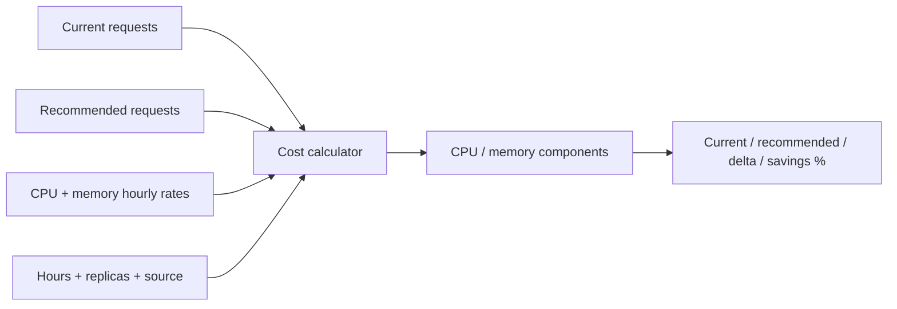
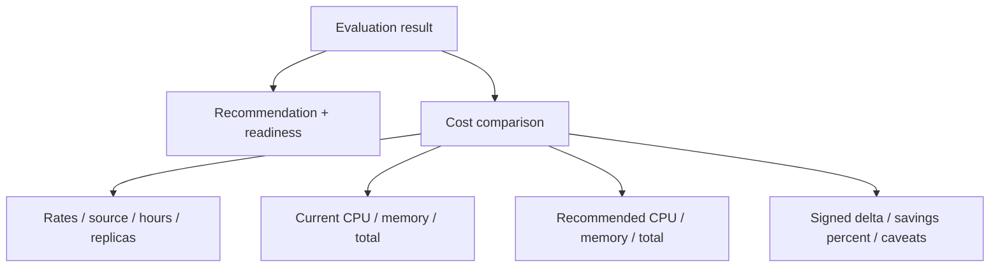

# 0007: Making cost comparisons explicit and reproducible

- **Date:** 2026-08-21
- **Status:** validated
- **Related phase:** Phase 2 — cost and safety evaluation
- **Feature commit:** `578495c feat: add explicit request cost evaluation`

## Why

“38% cheaper” is not a defensible claim unless the price, billing horizon, replica
count, and charged resource basis are visible. Kubernetes requests affect scheduled
capacity, but they are not a cloud bill by themselves: providers charge different
rates and node bin-packing can prevent theoretical request savings from becoming
cash savings.

The first Phase 2 slice therefore needs a transparent calculator, not a hidden
vendor price catalog.

## Success criteria

- Accept CPU core-hour and memory GiB-hour prices as exact decimal inputs.
- Record price source, currency, monthly hours, and replica count in every result.
- Calculate CPU and memory request costs separately for current and recommended
  resources.
- Report signed delta and savings percentage for both downsizing and upsizing.
- Keep recommendation readiness separate from the mathematical cost projection.
- Expose the comparison through the API and live-analysis CLI.
- Reject missing, partial, zero, or negative pricing assumptions.

## Planned calculation



Only request-based capacity enters this calculation. Limits, observed usage, taxes,
discounts, node fragmentation, and provider-specific billing rules do not.

## Non-goals

- Claim that projected request savings equal an invoice reduction.
- Bundle a mutable multi-cloud price catalog.
- Mix cost confidence with OOM or throttling risk.
- Estimate HPA replica-hours in this first model.

## What changed

The new evaluator accepts exact decimal CPU core-hour and memory GiB-hour prices,
a price-source label, a monthly-hour assumption, and replica count. It returns the
following structure around the existing recommendation:



The separation is intentional: cost can be calculated from candidate resource
values even when metrics are insufficient, but readiness remains the authority for
whether a later patch may be generated.

The API now exposes `POST /v1/evaluations`. The live CLI requires all pricing
arguments and emits the combined evaluation. The narrower
`POST /v1/recommendations` endpoint remains available for clients that only need
capacity analysis.

## How

### Formula and precision

```text
CPU monthly cost
  = request_mCPU / 1000 × CPU_core_hour_USD × monthly_hours × replicas

Memory monthly cost
  = request_MiB / 1024 × memory_GiB_hour_USD × monthly_hours × replicas

Savings percent
  = (current_total - recommended_total) / current_total × 100
```

All arithmetic uses `Decimal`. Monetary results are rounded half-up to six decimal
places only at the output boundary; savings percentage is rounded to one decimal
place. JSON represents decimals as strings, preventing transport through a binary
float from changing the recorded assumption.

### Decision boundaries

| Question | Decision | Reason |
|---|---|---|
| Which resources are priced? | CPU and memory requests | Requests express scheduled capacity; limits are not additive prices |
| Where do rates come from? | Required caller inputs with source label | Avoids a stale or misleading built-in catalog |
| Which replica count? | Explicit API input; desired replicas in live CLI | Makes the multiplication visible and deterministic |
| Can low coverage hide the projection? | No | Inspection is useful even when action is blocked |
| Can savings override readiness? | No | Economics and evidence quality are independent decisions |

### Alternatives and trade-offs

| Option | Benefit | Cost or risk | Decision |
|---|---|---|---|
| Hard-code one cloud provider's rate | Simple demo command | Quickly stale and implies false portability | Rejected |
| Calculate only a single total | Compact output | Hides whether CPU or memory drives the result | Rejected |
| Use binary floating point | Familiar JSON numbers | Reproducibility loss in currency arithmetic | Rejected |
| Exact inputs plus visible caveats | Auditable and provider-neutral | Caller must supply rates | Selected |

## Evidence

### Automated verification

```text
57 tests passed
Ruff: all checks passed
```

The new tests prove component arithmetic, exact decimal output, downsize savings,
negative savings for an upsize, zero/negative/missing/blank assumption rejection,
zero-replica rejection, CLI requirements, API serialization, and independence from
recommendation readiness.

### Live kind and Prometheus evaluation

The same two-replica demo from Phase 1 was evaluated with clearly artificial rates:

| Assumption | Value |
|---|---:|
| CPU core-hour | USD 0.04 |
| Memory GiB-hour | USD 0.005 |
| Monthly hours | 730 |
| Price source | `example://local-model` |
| Replicas | 2 |

The live result was:

| Projection | Current | Recommended | Difference |
|---|---:|---:|---:|
| CPU request cost | USD 58.400000 | USD 0.584000 | — |
| Memory request cost | USD 14.600000 | USD 0.228125 | — |
| Total request cost | USD 73.000000 | USD 0.812125 | USD -72.187875 |
| Savings | — | — | 98.9% |

At the same time, only 26 samples and 4.5% observation coverage were available.
The recommendation therefore remained `insufficient_data`, with OOM and throttling
risk `unknown`. This is the central proof for the slice: the evaluator can show an
attractive mathematical projection without presenting it as safe to apply.

The Prometheus port-forward was stopped after verification and no cluster resource
was changed.

## Decision and limitations

KubeFit can now claim a reproducible **request-cost projection**, not a predicted
cloud invoice. Every result includes the exact assumptions and caveats. Positive
savings never alter readiness or risk status.

The current model assumes a constant replica count for every monthly hour. It does
not model bin-packing, idle node capacity, HPA replica-hours, reserved pricing,
discounts, taxes, or provider billing increments. Those limitations stay in the
machine-readable result so downstream PR reports cannot silently omit them.

## Next question

Which observed runtime signals should block a low-cost recommendation even when its
request-based projection is attractive?
