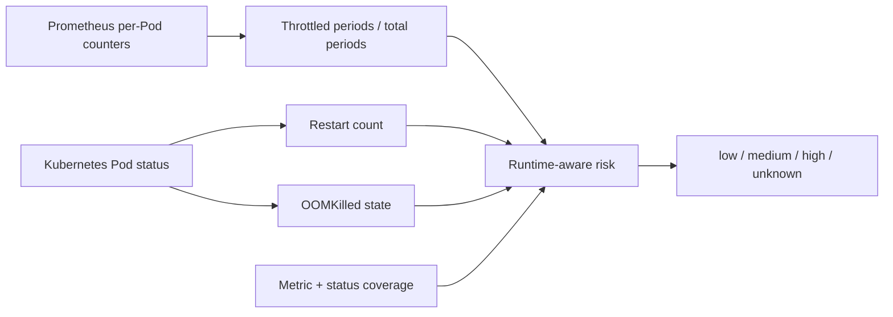
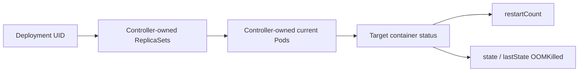
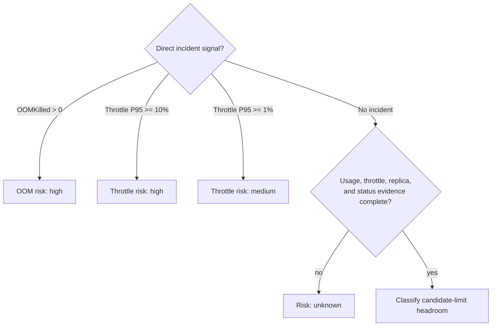

# 0008: Grounding risk in runtime safety signals

- **Date:** 2026-08-21
- **Status:** validated
- **Related phase:** Phase 2 — cost and safety evaluation
- **Feature commit:** `833c575 feat: evaluate runtime safety signals`

## Why

Headroom derived from CPU and memory usage is only an indirect risk estimate. A
workload can show acceptable percentiles while already being throttled, restarting,
or recovering from an OOM kill. A cheaper candidate must not receive a low-risk
label when direct runtime evidence disagrees—or when the direct signal is missing.

## Success criteria

- Collect a per-Pod CPU throttled-period ratio through the same UID-authorized
  Prometheus workload scope as CPU and memory usage.
- Read target-container restart counts and OOMKilled state from current Pod status.
- Surface signal presence and coverage in recommendation evidence.
- Classify observed OOMKilled as high risk even when the observation window is
  otherwise incomplete.
- Classify material throttling from the direct signal; require sufficient evidence
  before calling low throttling risk.
- Treat unavailable direct signals as `unknown`, never silently as zero.
- Prove the behavior with unit tests and a real kind/Prometheus run.

## Planned evidence flow



Positive incident evidence can raise risk immediately. Absence of incidents may
support a low-risk result only when observation and status coverage are sufficient.

## Non-goals

- Attribute every restart to memory pressure.
- Recover historical OOM events after Kubernetes has discarded Pod status.
- Collect application latency in this slice.
- Generate or apply a resource patch.

## What changed

The Prometheus collector now calculates the busiest Pod's throttled-period P95 and
maximum from `container_cpu_cfs_throttled_periods_total` divided by
`container_cpu_cfs_periods_total`. The query reuses the exact ReplicaSet allowlist
and time-varying `kube_pod_owner` join used by CPU and memory usage.

Throttling has its own sample count, Pod identity count, and observation coverage.
It is optional at collection time so clusters without the cAdvisor counter can
still return usage metrics, but its absence explicitly blocks a ready result.

The Kubernetes collector now follows a stricter ownership path and reads only the
target container status from Pods owned by the current Deployment's ReplicaSets:



This excludes a standalone or foreign Pod that merely shares the Deployment's
labels. The status result records how many target containers were actually found,
so zero observed incidents cannot be confused with missing status.

## How risk is decided



Positive evidence raises risk immediately even if the full window is incomplete.
By contrast, a low-risk result requires all readiness evidence because a missing
counter is not proof that no throttling occurred.

Restart counts are reported but do not directly change OOM risk. Kubernetes does
not imply that every restart was caused by memory pressure, so automatic
attribution would overstate what the signal proves.

### Alternatives and trade-offs

| Option | Benefit | Cost or risk | Decision |
|---|---|---|---|
| Treat missing counter as zero | Simple result | Creates unsupported low-risk claims | Rejected |
| Query all Pods sharing labels | Easy selection | Mixes unrelated workload status | Rejected |
| Infer OOM from every restart | Aggressive warning | Misclassifies crashes and probe failures | Rejected |
| Direct signals plus independent coverage | Explainable and fail-safe | More readiness requirements | Selected |

## Problems encountered

Adding ReplicaSet-to-Pod ownership filtering caused two old collector tests to fail.
Their Pod fixtures contained labels but omitted the ownerReferences that real
Deployment Pods have. Updating the fixtures—and including a same-label foreign
Pod—proved the stricter behavior instead of weakening it for test convenience.

The first implementation gated throttling with only a sample count. Historical
rollout Pod series can increase that count, so the final model also computes
throttling coverage against the requested window and current replica baseline.

## Evidence

### Automated verification

```text
61 tests passed
Ruff: all checks passed
```

Tests cover owner-filtered Pod status, restart/OOM extraction, throttling PromQL
scope, per-Pod P95/max calculation, optional missing counters, independent coverage,
medium/high thresholds, direct OOM escalation, and missing-signal `unknown` behavior.

### Live kind and Prometheus verification

The full CLI ran against the two-replica demo and kube-prometheus-stack without
changing either workload:

| Signal | Result | Interpretation |
|---|---:|---|
| Current target-container statuses | 2 / 2 desired | Kubernetes status coverage complete |
| Restarts | 0 | No current Pod restart evidence |
| OOMKilled states | 0 | No current Pod OOM evidence |
| Throttled-period P95 | 0.00% | No material throttling in collected samples |
| Throttling samples | 30 | Below the 100-sample gate |
| Throttling coverage | 5.2% | Below the 70% gate |
| Throttling Pod identities | 4 | Includes retained rollout history |
| Final throttling risk | `unknown` | Quiet but insufficient window |

The result still projected 98.9% request-cost savings, demonstrating that neither a
large saving nor a zero observed throttling value bypasses coverage requirements.
The Prometheus port-forward was stopped after validation.

No deliberate live OOM was triggered in this slice because that would mutate the
shared demo and create a misleading clean-up-sensitive result. High-risk OOM and
throttling paths are deterministic unit evidence now; controlled failure injection
belongs in the reproducible benchmark phase.

## Decision and limitations

Risk is now grounded in direct throttling and current container-state evidence, not
only calculated headroom. Missing or incomplete signals fail closed as `unknown`.

Kubernetes `restartCount` is cumulative for the current Pod lifetime rather than
the requested Prometheus window. `lastState` preserves only the last termination,
and deleted Pods can no longer supply their status. Historical OOM accounting will
eventually need an event or metric source with explicit retention. The current
signals are sufficient to prevent false low-risk claims, but not to prove a complete
incident history.

## Next question

How should these signals combine into the explicit eligibility gate consumed by
future manifest patch generation?
