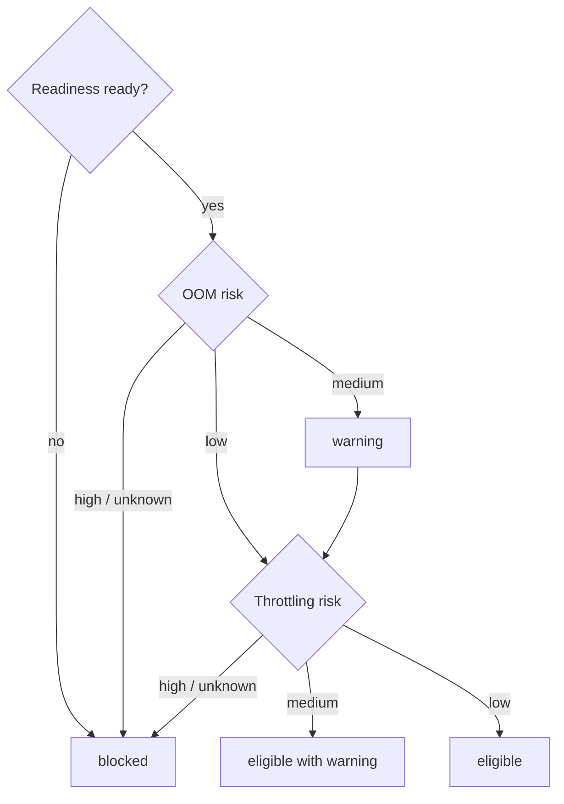
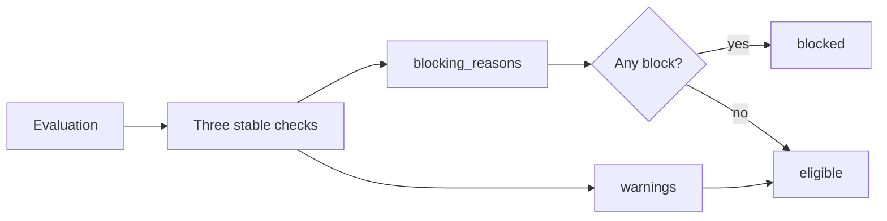
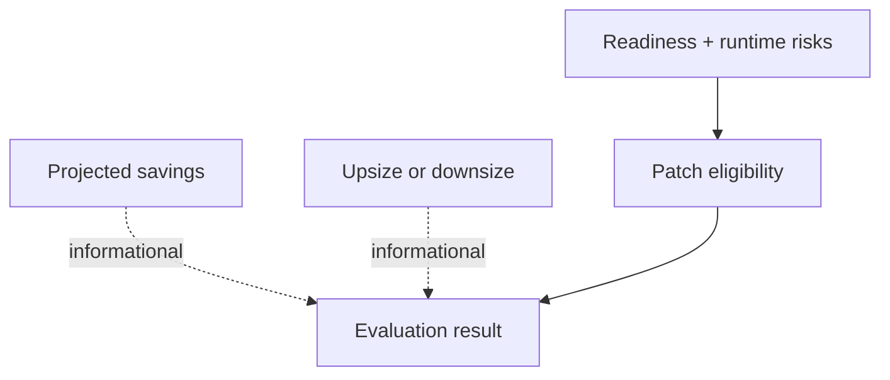

# 0009: Defining the patch eligibility gate

- **Date:** 2026-08-21
- **Status:** validated
- **Related phase:** Phase 2 — cost and safety evaluation
- **Feature commit:** `1d51e03 feat: add patch eligibility gate`

## Why

Readiness, OOM risk, throttling risk, and projected savings are currently visible,
but a future patch generator should not reinterpret those fields independently.
Without one explicit gate, separate consumers could generate a manifest from an
incomplete observation or treat an unknown safety signal as permission.

Patch eligibility is permission to **propose a GitOps change**, not permission to
deploy it. Human review and the existing GitOps rollout policy remain separate.

## Success criteria

- Return one structured `eligible` or `blocked` result with individual checks.
- Block when recommendation readiness is insufficient.
- Block `high` or `unknown` OOM and throttling risk.
- Preserve `medium` risk as a visible warning while allowing a draft proposal.
- Keep projected savings and recommendation direction out of the safety gate.
- Include stable machine-readable check codes for the future patch generator.
- Expose the decision through the evaluator, API, and live CLI.
- Prove downsize, upsize, warning, high-risk, unknown, and insufficient-data paths.

## Planned policy



## Non-goals

- Generate YAML in this slice.
- Approve deployment or bypass human review.
- Require projected savings; safety-driven upsizing remains valid.
- Collapse medium risk into a false pass.

## What changed

The evaluator now returns `patch_eligibility` beside the recommendation and cost
comparison. It contains three ordered checks with stable codes:

| Check code | Pass | Warning | Block |
|---|---|---|---|
| `recommendation_readiness` | `ready` | — | `insufficient_data` |
| `oom_risk` | `low` | `medium` | `high`, `unknown` |
| `cpu_throttling_risk` | `low` | `medium` | `high`, `unknown` |

The overall result is `blocked` if any check blocks. Otherwise it is `eligible`,
with medium-risk messages retained in a separate `warnings` list. Every block is
also copied to `blocking_reasons`, so a CLI, API client, or future patch generator
does not need to reverse-engineer the checks.



## Why medium remains eligible

The gate controls creation of a reviewable draft proposal, not deployment. Blocking
every medium headroom signal would discard useful proposals that a human may accept
with benchmark evidence. Silently passing medium risk would be equally misleading.
The warning state preserves that distinction.

High and unknown risks block. `unknown` is intentionally not neutral: a missing
signal cannot prove safety. Readiness is checked independently even though it often
causes unknown risk, producing complete machine-readable reasons rather than only
the first failure.

## Cost and direction are not gates



An upsize may be necessary to restore safety, while a large saving can still be
unsafe. Neither value is allowed to override evidence quality.

## Prior-project reuse check

Before implementation, the earlier FaaS repository was inspected for reusable
GitOps policy, YAML patch, rollback, or GitHub PR code. No matching implementation
was present, so this gate was designed independently for KubeFit.

The FaaS constant-arrival-rate k6 scripts, raw/summary artifact layout, and benchmark
reports remain useful later for Phase 4. Its peak-memory AutoTuner was not reused
because it lacks percentile windows, coverage, replica stability, and direct
throttling/OOM evidence.

## Alternatives and trade-offs

| Option | Benefit | Cost or risk | Decision |
|---|---|---|---|
| Patch generator reinterprets raw fields | Fewer evaluator models | Policy drifts across consumers | Rejected |
| Any non-low risk blocks | Most conservative | Prevents reviewable medium-risk proposals | Rejected |
| Unknown risk passes | More proposals | Missing evidence becomes permission | Rejected |
| Structured pass/warning/block checks | Traceable and reusable | Slightly larger response | Selected |

## Evidence

### Automated verification

```text
70 tests passed
Ruff: all checks passed
```

Tests cover ready/low eligibility, insufficient readiness, high and unknown OOM,
high and unknown throttling, both medium warning paths, upsize eligibility, evaluator
integration, and API serialization of stable check codes.

### Live kind and Prometheus evaluation

The two-replica demo produced a 98.9% request-cost saving projection, but only 32
usage/throttling samples and 5.5% coverage. The resulting gate was:

| Check | Status | Reason |
|---|---|---|
| Recommendation readiness | `block` | Usage and throttling samples/coverage below policy |
| OOM risk | `block` | Risk remained `unknown` |
| CPU throttling risk | `block` | Risk remained `unknown` |
| Overall | `blocked` | Three blocking reasons |

This is the intended end-to-end proof: the cost projection remains visible, but it
cannot authorize a patch. The run was read-only and the Prometheus port-forward was
stopped afterward.

## Decision and limitations

Phase 2 is complete for the MVP. A single evaluator-owned gate now translates
recommendation confidence and runtime risk into permission for Phase 3 proposal
generation.

Eligibility is based on the current policy version and does not yet encode latency,
benchmark results, maintenance windows, or organization-specific approval rules.
Those can become additional stable checks without changing the existing check
semantics. Eligibility also does not authorize merge or deployment.

## Next question

Can the Phase 3 patch generator change exactly one selected container while
preserving unrelated YAML and refusing every blocked evaluation?
