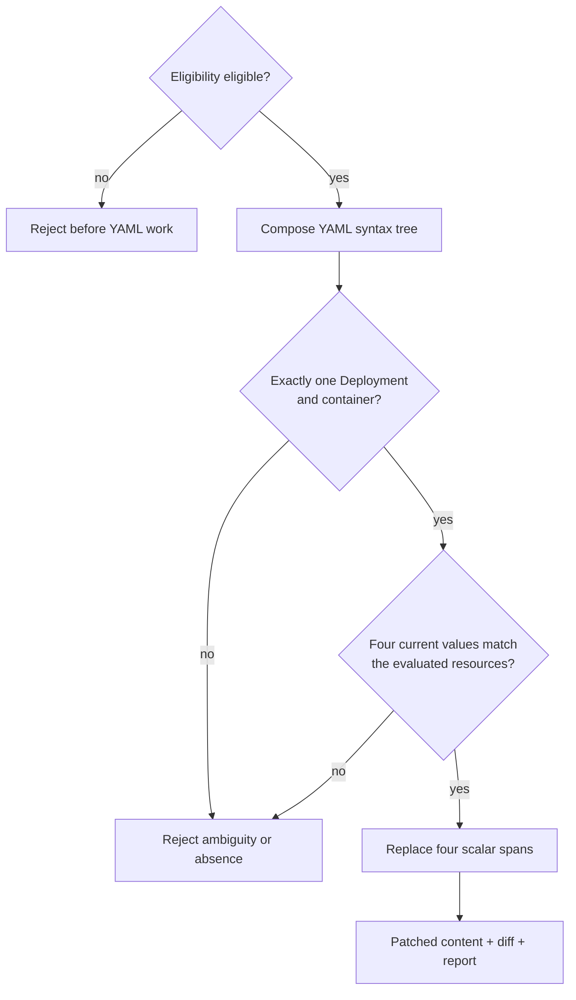
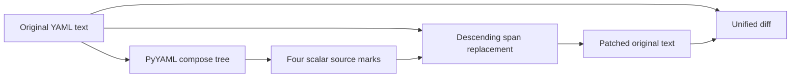
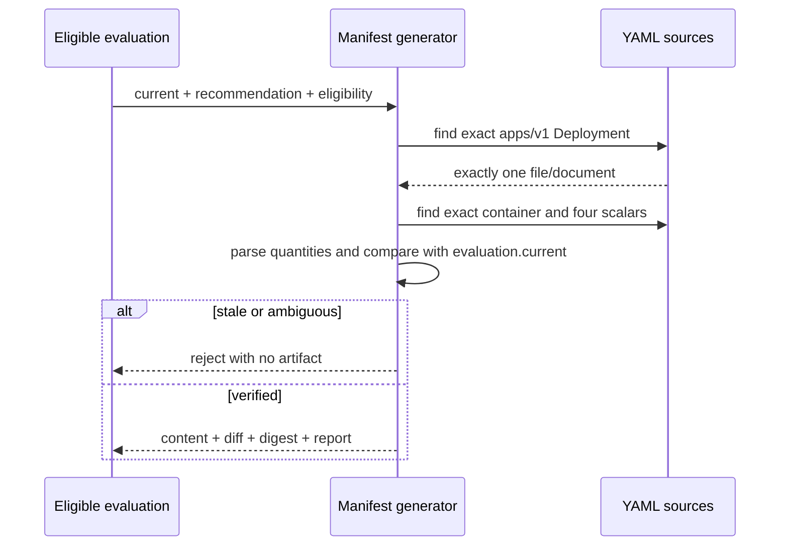

# 0010: Generating a minimal, stale-safe manifest patch

- **Date:** 2026-08-21
- **Status:** validated
- **Related phase:** Phase 3 — manifest patch generation
- **Feature commit:** `1c64ec0 feat: generate minimal manifest resource patches`

## Why

A valid recommendation is not enough to edit a repository safely. KubeFit must
prove that one manifest document and one container match the observed workload,
that the repository still contains the resources that were evaluated, and that no
unrelated YAML is rewritten by serialization.

## Success criteria

- Require `patch_eligibility.status == eligible` before parsing or changing YAML.
- Match exactly one `apps/v1` Deployment by namespace and name across multiple
  files and multi-document YAML streams.
- Match exactly one target container and four scalar request/limit fields.
- Reject missing, duplicate, aliased, malformed, or stale resource values.
- Replace only CPU/memory request and limit scalar ranges.
- Preserve comments, key order, quoting outside changed scalars, and unrelated
  documents byte-for-byte.
- Return patched content, a unified diff, original-content digest, and a structured
  change report without writing the source file.
- Prove the behavior with golden files and the real demo manifest.

## Planned safety path



## Non-goals

- Write files, create branches, or open GitHub pull requests.
- Add missing resource sections automatically.
- Reformat a complete YAML document.
- Evaluate Helm templates or Kustomize overlays in this slice.

## What changed

The new pure manifest generator accepts a complete `EvaluationResult`, a target,
and one or more repository-relative YAML sources. The evaluation now retains its
observed `current` resources so the generator can detect repository drift without
receiving a second, potentially inconsistent baseline.

The output contains:

| Artifact | Purpose |
|---|---|
| Patched content | Candidate file content; not written automatically |
| Unified diff | Reviewable Git-style before/after representation |
| Original SHA-256 | Detects changes before a future write or commit |
| Four structured changes | Field-level current and recommended values |
| Target identity | Namespace, Deployment, container, file, document index |
| Eligibility warnings | Preserves medium-risk reviewer attention |
| Recommendation evidence | Keeps the change traceable to metric decisions |

## How

### Syntax-aware, text-preserving replacement



Loading and dumping YAML would reorder or restyle the document and discard comments.
Instead, KubeFit uses the composed nodes only for structure and character offsets.
Replacement runs from the last offset toward the first, so earlier source positions
remain valid. Double quotes, single quotes, and plain scalar style are retained for
each changed value.

If a resource is semantically unchanged—for example, current CPU `"1"` and a
recommendation of 1000m—its original spelling is left untouched.

### Identity and stale-data checks

The generator first requires one Deployment match across all input sources and all
YAML documents. Only then does it find one container. This order prevents a duplicate
Deployment from being hidden merely because only one copy contains the requested
container.



Quantity comparison is semantic rather than textual, using the same exact parser as
the Kubernetes collector. This accepts equivalent values such as `1` and `1000m`
while still detecting real drift.

### Alternatives and trade-offs

| Option | Benefit | Cost or risk | Decision |
|---|---|---|---|
| Parse and dump with PyYAML | Simple mutation | Rewrites formatting and loses comments | Rejected |
| Regular expressions only | Preserves text | Cannot establish YAML identity safely | Rejected |
| Round-trip YAML library | Better formatting retention | New dependency and still broader rewrites | Deferred |
| Syntax positions plus scalar replacement | Minimal byte changes and semantic matching | Rejects aliases and unusual block scalars | Selected |

## Problems encountered

The first alias test placed an anchor in the Service document and referenced it from
the Deployment document. YAML anchors are document-scoped, so parsing correctly
failed before the intended alias guard. Moving the anchor into the same document
created a valid alias and proved that KubeFit rejects non-local resource scalars.

The first target search combined Deployment and container matching. That could have
selected one file when two same-identity Deployments existed but only one contained
the target container. The search now establishes unique Deployment identity first,
then unique container identity.

The replacement pass initially normalized every one of the four fields. It now
replaces only semantically changed resources, preserving an equivalent original
spelling when no capacity change is needed.

## Evidence

### Automated verification

```text
86 tests passed
Ruff: all checks passed
```

Golden tests cover a multi-document file containing a Service, comments, an inline
comment, a sidecar, mixed scalar quoting, and unrelated metadata. They also cover a
blocked evaluation, malformed YAML, stale resources, multiple Deployments, missing
and duplicate containers/fields, aliases, invalid quantities, unchanged semantic
values, warning propagation, and unsafe diff paths.

### Golden preservation result

| Element | Before/after result |
|---|---|
| Service document | Byte-identical |
| Deployment metadata and selector | Byte-identical |
| Sidecar and image comment | Byte-identical |
| Key order and indentation | Byte-identical |
| Resource scalar lines | Exactly four changed |

### Real demo manifest, read-only

The repository's `deploy/demo/overprovisioned-api.yaml` was patched in memory with
an eligible synthetic evidence set representing the existing validated policy. No
file write occurred.

```text
Original SHA-256: d6a35186e70f4247160d96eefc9b6630780198f8dd6293d713fdaf9d482f57b0
Matched target: kubefit-demo/overprovisioned-api, container api
Changed scalars: 4
```

| Field | Repository | Candidate |
|---|---:|---:|
| CPU request | 1000m | 290m |
| Memory request | 2Gi | 896Mi |
| CPU limit | 2000m | 580m |
| Memory limit | 4Gi | 1344Mi |

The generated unified diff contained only these four minus-lines and four plus-lines.
The working manifest remained unchanged.

## Decision and limitations

Phase 3 is complete for the MVP's pure generation boundary. KubeFit can produce a
minimal, reviewable and stale-safe artifact without mutating a repository or cluster.

The parser supports concrete `apps/v1` Deployment YAML with existing scalar CPU and
memory requests/limits. It deliberately rejects aliases and block scalar styles and
does not render Helm templates, resolve Kustomize overlays, add missing resources,
or scan the filesystem itself. A caller must supply safe repository-relative source
content. Atomic file writing and Git commit packaging remain separate authorized
steps.

## Next question

How should the generated artifact be written atomically and packaged with its
evaluation report for a Git commit?
