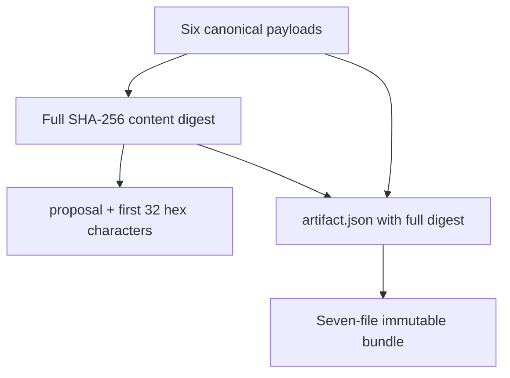
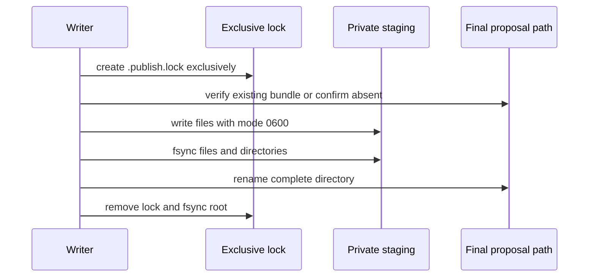

# 0011: Publishing a reproducible proposal bundle

- **Date:** 2026-08-21
- **Status:** validated
- **Related phase:** Phase 4 — reproducible before/after benchmark
- **Feature commit:** `c735c10 feat: publish immutable proposal bundles`

## Why

A diff printed to stdout is not enough input for a reproducible benchmark. Before
and after manifests, the exact evaluation, pricing assumptions, eligibility, and
change report must stay together. Partial writes or accidental overwrites would
make later benchmark results impossible to trace back to one proposal.

## Success criteria

- Package original and candidate manifests, evaluation JSON, unified diff, patch
  report, and benchmark context together.
- Derive a stable proposal ID from canonical artifact content rather than time.
- Record SHA-256 and byte size for every payload file.
- Write into a private staging directory, flush files, then publish the complete
  directory with one rename.
- Reuse an existing byte-identical bundle idempotently.
- Reject collisions, extra files, symlinks, unsafe manifest paths, and partial or
  tampered bundles without overwriting them.
- Keep the bundle immutable; future benchmark output must reference it rather than
  modifying its contents.
- Validate the real demo proposal without changing the source manifest.

## Planned artifact

```text
proposal-<content digest>/
├── artifact.json
├── evaluation.json
├── patch.diff
├── patch-report.json
├── benchmark-context.json
└── manifests/
    ├── before/<repository path>
    └── after/<repository path>
```


## Non-goals

- Apply the candidate manifest to Kubernetes.
- Write benchmark results into the immutable proposal bundle.
- Create a Git branch, commit, or pull request.
- Store credentials or live metric time series.

## What changed

`write_proposal_bundle` publishes seven immutable files:

| File | Contents |
|---|---|
| `artifact.json` | Schema, proposal ID, full content digest, per-file hashes and sizes |
| `evaluation.json` | Current resources, recommendation, cost, risks, and eligibility |
| `patch.diff` | Unified manifest diff |
| `patch-report.json` | Target, original digest, scalar changes, warnings, evidence |
| `benchmark-context.json` | Before/after resources and required comparison metrics |
| `manifests/before/<path>` | Byte-exact repository input |
| `manifests/after/<path>` | Candidate manifest produced by entry 0010 |

The manifest patch model now retains its original content. This allows benchmark
consumers to use both sides without rereading a repository that may have changed
after proposal generation.

## How

### Deterministic identity

Every payload path, length, and byte sequence contributes to one SHA-256 digest.
The directory uses the first 128 bits for a readable ID while `artifact.json` stores
the complete digest. The index itself is generated afterward to avoid a recursive
hash dependency.



Canonical JSON uses sorted keys, stable indentation, UTF-8, and a final newline.
No current timestamp or output-directory path enters the digest, so identical inputs
produce the same ID in different locations.

### Atomic publication and retry



The staging and final directories use private permissions. A failure removes only
the writer-created staging directory and lock. It never removes or overwrites an
existing proposal.

On retry, the writer requires exactly the expected file set, rejects every symlink,
and compares every byte. A matching bundle returns `reused: true`; a modified,
partial, or extended directory raises an error without repair or overwrite.

### Benchmark handoff

`benchmark-context.json` fixes the target, before and after resources, eligibility
warnings, and required measurements:

- request cost
- latency P95 and P99
- CPU throttling P95
- OOMKilled count
- error rate
- traffic-spike recovery time

The proposal remains immutable. A later benchmark result will reference its proposal
ID rather than append files to it.

### Alternatives and trade-offs

| Option | Benefit | Cost or risk | Decision |
|---|---|---|---|
| Write artifacts directly into final path | Simple | Readers can observe partial state | Rejected |
| Timestamp-based run directory | Human-readable chronology | Identical inputs create unrelated artifacts | Rejected |
| Overwrite existing ID | Easy recovery | Destroys audit evidence | Rejected |
| Content ID plus atomic publish | Reproducible and idempotent | Requires canonicalization and locking | Selected |

## Problems encountered

The artifact ID cannot hash `artifact.json` when that index contains the artifact ID
itself. The final design hashes the six payloads, derives the ID, and then writes an
index containing the full digest and hashes for those payloads. The index is still
validated byte-for-byte on reuse.

The initial idea was to let benchmarks add results inside the proposal directory.
That conflicts with idempotent validation and weakens provenance. Proposal inputs
are now immutable; benchmark outputs will be separate referencing artifacts.

## Evidence

### Automated verification

```text
94 tests passed
Ruff: all checks passed
```

Tests cover complete publication, per-file hashes and sizes, private file modes,
before/after preservation, deterministic IDs across roots, identical retry, modified
and extra files, an active lock, mid-write failure cleanup, and revalidation of a
mutated unsafe manifest path.

### Real demo proposal

The repository demo manifest and the same eligible synthetic evidence used in entry
0010 were packaged inside a temporary directory. This validated artifact mechanics;
it does not replace the live cluster result, which remains blocked for low coverage.

```text
Artifact ID: proposal-57850296aabc30999d172965d99b95cd
Full digest: 57850296aabc30999d172965d99b95cd1a5428a715e61eb3a3320068e7c4ced1
Payload files indexed: 6
Files published including index: 7
First publication reused: false
Identical second publication reused: true
Source manifest unchanged: true
```

The temporary directory was automatically removed after verification. No source
manifest or Kubernetes resource was changed.

## Decision and limitations

Phase 4 now has a reproducible input boundary. A benchmark can consume exact
before/after manifests and prove which evaluation authorized them.

Atomic rename and directory `fsync` target POSIX filesystems, matching the current
Linux/macOS development and CI scope. The lock coordinates KubeFit writers using the
same output root; it is not a defense against a malicious process modifying files
outside that protocol. Bundles contain no credentials, raw Prometheus series, or
automatic expiration policy. Storage lifecycle remains the caller's responsibility.

## Next question

How should the benchmark runner reference this bundle and produce a separate,
comparable before/after result with a safety verdict?
