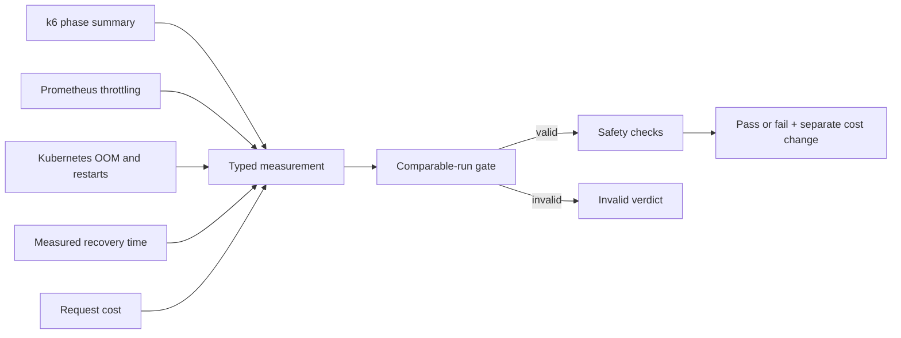
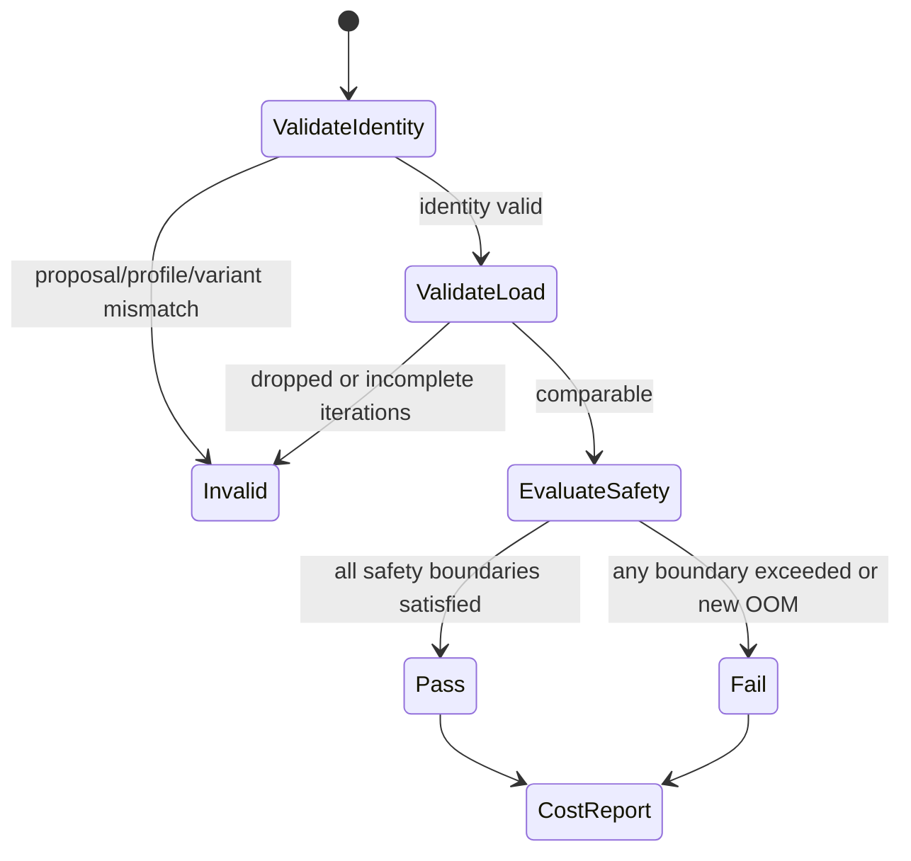

# 0012: Fixing the before/after load and verdict contract

- **Date:** 2026-08-21
- **Status:** validated
- **Related phase:** Phase 4 — reproducible before/after benchmark
- **Feature commit:** `600b683 feat: define reproducible benchmark verdicts`

## Why

Before and after numbers are comparable only when they use the same offered load,
phase timing, result schema, and verdict policy. Allowing each run to choose its own
rate or silently dropping iterations can make a cheaper configuration appear safe.

The earlier FaaS project established a useful constant-arrival-rate and raw-summary
pattern, but its authenticated function payload, SQS completion semantics, and
worker timings do not apply to a Kubernetes HTTP Deployment.

## Success criteria

- Define one versioned warmup → steady → spike → recovery HTTP profile.
- Require proposal ID, `before|after` variant, target URL, and summary path.
- Store phase request count, dropped iterations, error rate, and latency P95/P99 in
  a small machine-readable k6 summary.
- Define typed before/after measurements that also include throttling, OOM,
  restarts, recovery time, and request cost.
- Mark results invalid when proposal IDs, profile versions, phases, or offered-load
  completeness differ.
- Fail safety on excessive latency/error/throttling/recovery regression or new OOM.
- Report cost change separately so an upsize does not become a false safety failure.
- Unit-test every verdict boundary and validate the k6 script with the local binary.

## Fixed profile v1

```mermaid
gantt
    title kubefit-load-v1
    dateFormat X
    axisFormat %Ss
    warmup, 0, 10s
    steady, 10, 60s
    spike, 70, 30s
    recovery, 100, 60s
```

| Phase | Offered rate | Duration | Expected iterations |
|---|---:|---:|---:|
| Warmup | 1 RPS | 10s | 10, excluded from comparison |
| Steady | 5 RPS | 60s | 300 |
| Spike | 25 RPS | 30s | 750 |
| Recovery | 5 RPS | 60s | 300 |

## Initial safety policy

| Signal | Failure boundary |
|---|---:|
| Steady latency P95/P99 regression | greater than 10% |
| Spike latency P95/P99 regression | greater than 15% |
| Error rate after | greater than 1% |
| Error-rate increase | greater than 0.5 percentage points |
| Throttling P95 after | greater than 5% |
| Throttling increase | greater than 1 percentage point |
| New OOMKilled | any |
| Recovery-time regression | greater than 20% |

## Non-goals

- Apply before/after manifests to a cluster in this slice.
- Claim a real performance result from schema fixtures.
- Reuse FaaS authentication, SQS, function, or Worker metrics.
- Treat lower cost as proof of safety.

## What changed

`benchmarks/k6/resource_profile.js` now owns the versioned offered-load contract.
The rates, durations, phase order, and expected iteration counts are constants rather
than caller-controlled environment values. Callers provide only the target URL,
proposal ID, `before|after` variant, and output path.

The k6 summary separates three concepts that are easy to confuse:

| Field | Meaning | Why it is separate |
|---|---|---|
| `expected_iterations` | Load promised by the profile | Detect profile drift |
| `completed_iterations` | Iterations the executor actually ran | Detect insufficient offered load |
| `requests` | HTTP requests observed | Preserve evidence when redirects create extra requests |

The Python contract adds runtime evidence and cost to this HTTP result:



`compare_benchmarks` returns stable check codes, reasons, invalid inputs, safety
failures, warnings, and the request-cost change. A cost increase is a warning, not a
safety failure. A restart increase is also a warning because the aggregate count
alone cannot prove that the candidate caused the restart; a new OOM is an explicit
failure.

## How comparability is enforced

Before any safety claim, both results must:

- be ordered as `before` then `after`;
- reference the same immutable proposal ID;
- use exactly `kubefit-load-v1`;
- report zero dropped iterations;
- report the fixed expected and completed count for every measured phase; and
- contain at least one request per completed iteration.

Warmup prepares connections and runtime state but is intentionally absent from the
comparison result. Steady, spike, and recovery remain separate so a good average
cannot hide one unsafe phase.



Regression boundaries are strict: a result equal to the configured limit passes;
only a value greater than the limit fails. A zero baseline remains comparable only
when the candidate is also zero. Moving from zero to a positive latency or recovery
value fails instead of dividing by zero or silently passing.

## Alternatives and trade-offs

| Option | Benefit | Cost or risk | Decision |
|---|---|---|---|
| Caller-configurable rates | Flexible experiments | Before/after runs can silently differ | Rejected for profile v1 |
| Average latency only | Small result | Hides tail latency and spike behavior | Rejected |
| HTTP request count as offered load | Easy to collect | Redirects can inflate it | Rejected |
| One combined optimization score | Easy ranking | Cost can conceal a safety regression | Rejected |
| Comparable-run gate then independent checks | Auditable verdict | More structured output | Selected |

## Problems encountered

The first boundary test rounded a `10.0005%` regression to `10.000%` before making
the decision, which incorrectly passed it. The comparison now uses full Decimal
precision and rounds only the human-readable reason.

The first local `k6 inspect` attempt relied on process environment variables. This
k6 version does not expose system variables to the script during inspection unless
explicitly enabled. The reproducible validation command now passes each required
value with `-e`, which also makes the invocation self-describing.

An initial schema used the request count to prove arrival-rate completeness. That
was ambiguous because one iteration can issue more than one request after redirects.
The final schema records completed iterations independently and requires their exact
fixed count while retaining request count as evidence.

## Evidence

```text
pytest: 126 passed, 1 external Starlette/httpx2 deprecation warning
Ruff: all checks passed
k6 inspect: parsed kubefit-load-v1 with four sequential constant-arrival-rate scenarios
```

The tests cover both sides of every numeric policy boundary, P95 and P99 checks,
zero baselines, per-phase error rates, throttling, recovery time, new OOM, restart
warnings, cost increases, schema validation, proposal/profile/variant mismatch,
dropped iterations, changed load, incomplete iterations, and inconsistent request
counts.

`k6 inspect` confirms the checked-in script resolves to the recorded rates and
start times: warmup `1 RPS @ 0s`, steady `5 RPS @ 10s`, spike `25 RPS @ 70s`, and
recovery `5 RPS @ 100s`. This is structural validation, not a real workload result;
no before/after performance claim is made yet.

## FaaS reuse boundary

The earlier FaaS work contributed the constant-arrival-rate and raw-summary design
idea. KubeFit did not copy its authentication payload, function lifecycle, SQS
completion tracking, or worker-specific timing. The new contract is an independent
HTTP Deployment benchmark tied to an immutable KubeFit proposal.

## Decision and limitations

Phase 4 now has a reproducible load and verdict contract, but not an executor. The
runtime signals are typed inputs and therefore cannot yet be claimed as collected
evidence. A real runner must apply each manifest, wait for rollout stability, run
k6, query the exact Prometheus window, capture Kubernetes event deltas, restore the
original manifest in every exit path, and publish a separate result artifact.

## Next question

How should the runner apply each immutable manifest, wait for rollout stability,
collect Prometheus deltas, and restore the original workload after either success or
failure?
