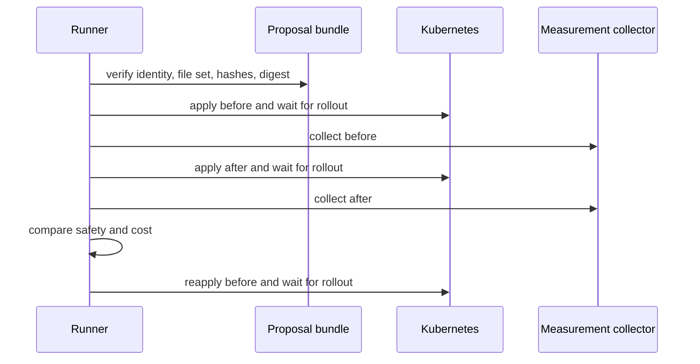
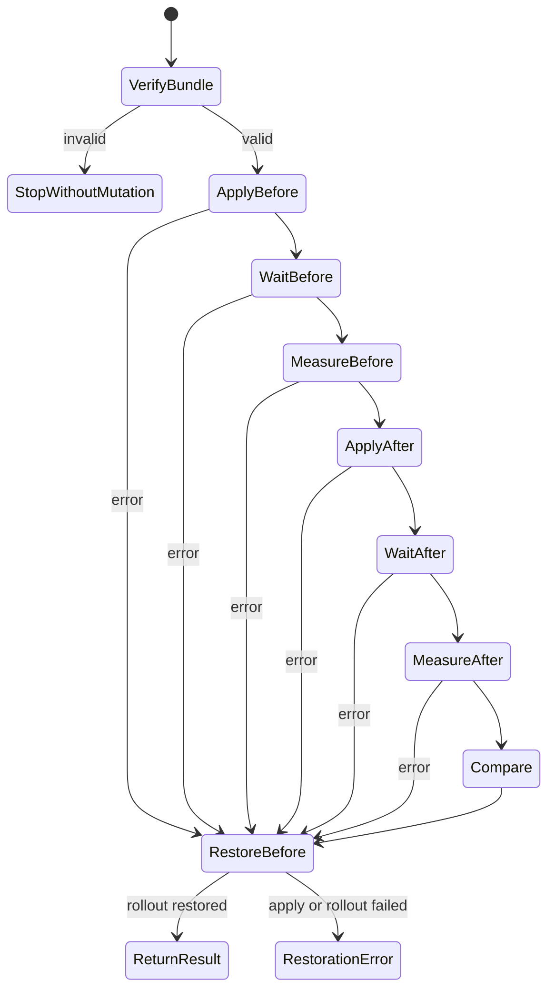

# 0013: Restoring the workload around benchmark execution

- **Date:** 2026-08-21
- **Status:** validated
- **Related phase:** Phase 4 — reproducible before/after benchmark
- **Feature commit:** `3fbe988 feat: restore workloads after benchmark runs`

## Why

A before/after benchmark temporarily mutates a cluster. If load generation,
rollout, result parsing, or verdict generation fails, leaving the candidate manifest
applied is more dangerous than producing no result. The runner therefore needs a
restoration guarantee before it needs convenience or concurrency.

## Success criteria

- Revalidate the immutable proposal bundle before any cluster command.
- Apply and observe `before`, then apply and observe `after` in a fixed order.
- Attempt to reapply `before` after every execution where the first apply started,
  including partial apply failures.
- Wait for the restored Deployment rollout before reporting success.
- Preserve both the primary error and restoration error when both occur.
- Reject tampered, incomplete, symlinked, or wrongly named proposal bundles without
  touching Kubernetes.
- Keep command execution and measurement collection injectable for deterministic
  failure-path tests.

## Planned flow



The restoration path is unconditional after the first apply invocation begins.

## Non-goals

- Run this mutation flow against a production cluster.
- Derive Prometheus windows or recovery time in this slice.
- Publish result artifacts or open a GitHub pull request.
- Hide restoration failure behind the original execution failure.

## What changed

The runner now accepts an immutable proposal path, an explicit manifest controller,
and a measurement collector. It returns the typed before/after values and verdict
only after the before manifest has been reapplied and its rollout completed.

The proposal loader independently revalidates persisted input before mutation:

- canonical `artifact.json` and supported schema version;
- directory name, artifact ID, and full content digest agreement;
- the exact six indexed payloads plus the index, with no extra files;
- safe relative paths, regular files, no symlinks, sizes, and SHA-256 hashes; and
- matching target and source identity between context and patch report.

The kubectl controller requires an explicit context and emits argument arrays rather
than shell strings. It applies the selected manifest and waits on the exact
`namespace/deployment` with a bounded rollout timeout.

## How restoration works



The `restore_required` flag is set immediately before the first apply call. This is
deliberate: kubectl may partially submit a multi-document file and then fail. An
exception from that first call therefore still enters restoration.

Failures retain structured context:

| Situation | Returned behavior |
|---|---|
| Proposal verification fails | Raise before any controller call |
| Execution fails, restoration succeeds | Raise primary stage and cause |
| Execution succeeds, restoration fails | Raise `restore_before`; do not return a result |
| Execution and restoration both fail | Preserve both exceptions in one error |
| Everything succeeds | Return result with `restored: true` |

### Alternatives and trade-offs

| Option | Benefit | Cost or risk | Decision |
|---|---|---|---|
| Restore only after candidate apply | Fewer commands | Partial baseline apply can remain | Rejected |
| Return result before restoration | Faster feedback | Caller can mistake a dirty cluster for success | Rejected |
| Use current kubectl context | Convenient | Can mutate the wrong cluster | Rejected |
| Catch and log restoration error | Keeps primary error simple | Hides unknown cluster state | Rejected |
| Inject controller and collector | Deterministic failure testing | Requires composition layer | Selected |

## Problems encountered

While inserting the persisted-bundle loader, its function boundary initially landed
inside the proposal writer's `try/finally`, separating the successful return from
lock cleanup. A direct source inspection caught it before tests or commit. The
loader was moved after the complete writer function, and the full atomic-publication
suite was rerun.

The first controller design allowed an omitted kubectl context. That made a valid
runner depend on ambient developer state. The final constructor rejects an empty
context, so every mutating command names its cluster explicitly.

The existing proposal fixture contains a Service and Deployment in one YAML file.
`kubectl apply -f` therefore reconciles the whole source file even though only the
target Deployment differs. Restoration reapplies the byte-exact before file, but
this is still too broad for production. The current runner remains restricted to a
disposable benchmark cluster; isolating the target document is future hardening.

## Evidence

```text
pytest: 139 passed, 1 external Starlette/httpx2 deprecation warning
Ruff: all checks passed
git diff --check: clean
```

Failure-path tests inject errors at the first baseline apply, both rollout waits,
candidate apply, measurement, restoration apply, and restoration rollout. They
prove the final baseline apply/wait occurs and that dual failures retain both
causes. Additional tests prove tampered payloads cause zero cluster calls and that
kubectl commands contain the explicit context, target, manifest, and timeout.

No live manifest was applied in this slice. The evidence validates orchestration
and command construction, not real cluster behavior or benchmark performance.

## Decision and limitations

The execution core is safe enough to compose with a measurement collector on the
disposable local kind cluster. It is not authorized for production: it currently
applies the complete YAML source, uses the proposal's before manifest rather than a
captured live-state snapshot, and has no cross-process lock preventing two benchmark
runs from interleaving. The upcoming result-artifact boundary must provide run
identity and exclusivity before end-to-end execution is exposed through the CLI.

## Next question

How should one measurement collector align k6 timestamps, Prometheus samples, and
Kubernetes restart/OOM deltas into the typed result contract?
