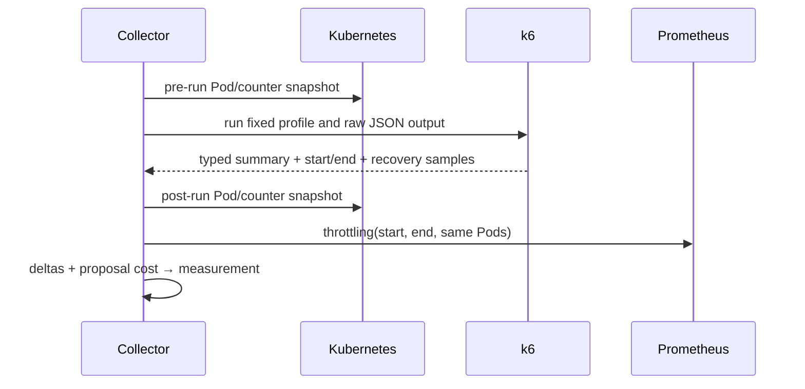
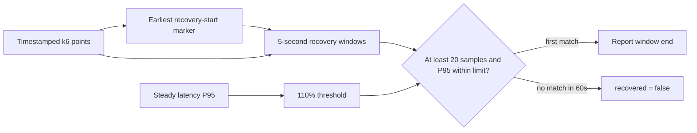

# 0014: Aligning load, runtime, and cost evidence

- **Date:** 2026-08-21
- **Status:** validated
- **Related phase:** Phase 4 — reproducible before/after benchmark
- **Feature commit:** `949c418 feat: align benchmark runtime evidence`

## Why

A k6 summary alone cannot prove Kubernetes safety. Throttling must come from the
same wall-clock interval, restart and OOM counters must be deltas rather than
lifetime totals, and cost must retain the proposal's original assumptions. Mixing
different windows can attribute an earlier incident to the candidate or hide one
that occurred during the test.

## Success criteria

- Execute the checked-in k6 profile with explicit proposal, variant, target, summary,
  and raw-output arguments.
- Record timezone-aware start and finish timestamps around the k6 process.
- Derive recovery time from timestamped recovery-phase samples rather than its
  aggregate latency.
- Query throttling using the exact measured execution window.
- Calculate restart and OOM deltas from stable pre/post Pod identity snapshots.
- Reject Pod replacement, decreasing counters, missing raw samples, mismatched k6
  identity, or missing Prometheus evidence.
- Use the immutable evaluation's current/recommended monthly request cost without
  recalculating prices.

## Evidence alignment



## Initial recovery rule

Recovery begins with the first timestamped recovery-phase request. Partition the
phase into five-second windows and find the first sufficiently populated window
whose P95 is no more than 110% of steady P95. Report the window end as recovery
time. If no window qualifies, report recovery as incomplete rather than inventing a
numeric success.

## Non-goals

- Run the full 160-second load against the cluster in this slice.
- Support distributed k6 workers or cloud execution.
- Infer application-specific business success beyond HTTP status and latency.
- Query arbitrary historical windows outside the measured run.

## What changed

The measurement collector now composes four independently testable adapters:

| Input | Recorded evidence |
|---|---|
| k6 summary | Fixed-profile counts, errors, latency P95/P99, proposal and variant |
| k6 raw stream | Recovery timing plus SHA-256 fingerprint |
| Kubernetes snapshots | Stable Pod identities and restart/OOM deltas |
| Prometheus | Per-Pod CPU throttling P95 from the measured run |
| Proposal evaluation | Current or recommended monthly request cost |

Every final measurement includes a provenance block containing timezone-aware run
boundaries, sorted Pod names, k6 summary/raw hashes, and the Prometheus rate-window
size. This keeps the basis of a later verdict visible instead of returning only
detached aggregate numbers.

The persisted proposal loader now also parses the evaluation, verifies its current
and recommended resources against `benchmark-context.json`, recomputes request cost
from the stored prices and replica count, and exposes those validated before/after
costs to the collector.

## How

### k6 execution and recovery

The subprocess adapter writes summary and raw JSON into a private temporary
directory and invokes k6 with an argument array and a 240-second timeout. The script
emits a `kubefit_recovery_start` counter immediately before each recovery request;
the earliest point anchors recovery independently of response completion time.



An incomplete recovery remains an explicit boolean. The safety verdict fails any
candidate that does not recover; an unrecovered baseline invalidates comparison
because there is no trustworthy recovery reference.

### Runtime deltas

Kubernetes collection now retains Pod-level target-container restart counts and
whether its current or last termination was `OOMKilled`. The collector requires the
same Pod names before and after one load run. It rejects replacement or decreasing
counters rather than joining unrelated container lifetimes.

For a stable Pod, restart delta is exact. If restarts increased and the latest
termination reason is OOMKilled, the collector conservatively attributes the
restart delta to OOM. This can overcount when several different termination reasons
occur between snapshots, but it cannot silently turn a visible final OOM into zero.
Because these values are per-run deltas, any OOM in the candidate run now fails even
when the baseline also experienced one.

### Prometheus window

The throttling query selects only the stable Pod set and target container. A 30-second
`rate()` needs earlier counter samples, so evaluation begins at `run start + 30s`
and ends exactly at the recorded finish. This prevents pre-run samples from entering
the rate function while keeping the query wholly inside the k6 execution interval.
The busiest Pod's P95 is retained rather than averaging replica pressure away.

### Alternatives and trade-offs

| Option | Benefit | Cost or risk | Decision |
|---|---|---|---|
| Lifetime restart/OOM totals | Simple | Attributes old incidents to current run | Rejected |
| Aggregate recovery latency | Small summary | Cannot say when recovery occurred | Rejected |
| Use first completed recovery request as phase start | No custom metric | Slow response hides its own delay | Rejected |
| Query `rate()` from exact start | Covers full duration | Lookback imports pre-run samples | Rejected |
| Recalculate current cloud price | Potentially fresh | Before/after may use different assumptions | Rejected |
| Proposal-fixed cost | Comparable and traceable | Still a projection, not invoice data | Selected |

## Problems encountered

The existing OOM field was a count of Pods whose current or last termination state
showed OOM, not an event counter. Subtracting those aggregate values misses a second
OOM on the same Pod. Pod-level restart deltas plus the final reason now provide a
conservative benchmark signal, and Pod replacement invalidates the run.

The first measurement model used timestamps internally but discarded them after
querying Prometheus. That made the final values impossible to audit. A typed
provenance block now retains the aligned interval, Pod set, raw/summary hashes, and
rate window.

Recovery response metrics are timestamped when requests complete. A separate k6
counter emitted immediately before the request was added so a slow first recovery
response cannot move the apparent phase start forward.

## Evidence

```text
pytest: 155 passed, 1 external Starlette/httpx2 deprecation warning
Ruff: all checks passed
k6 inspect: fixed profile and recovery marker parsed successfully
git diff --check: clean
```

Tests cover the first qualifying recovery window, incomplete recovery, insufficient
window samples, malformed/missing raw data, k6 command construction and identity,
Pod replacement, decreasing counters, restart/OOM inference, before/after proposal
cost selection, aligned Prometheus parameters, short windows, explicit incomplete
recovery verdicts, bundle cost extraction, and Pod-level Kubernetes status.

No 160-second load was executed in this slice, so these results validate parsing,
alignment, query construction, and failure behavior—not application performance.

## Decision and limitations

The runner can now produce one typed and time-aligned measurement after each rollout.
Prometheus must retain enough samples for the 30-second rate window, and the current
snapshot method can only conservatively infer multiple OOM causes between its two
observations. Polling or Kubernetes event capture would improve attribution later.

The k6 raw file currently exists only during collection; its SHA-256 remains in the
measurement, but the bytes are not yet durable. The next result-artifact step must
provide an evidence sink or durable output path before claiming independently
replayable benchmark evidence. Distributed k6 and production mutation remain out of
scope.

## Next question

How should separate before/after measurements, raw k6 evidence, and the verdict be
published as one immutable, retry-safe result artifact?
