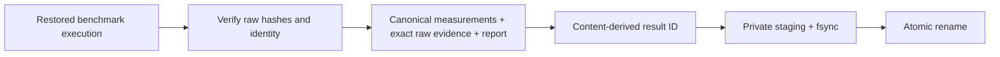
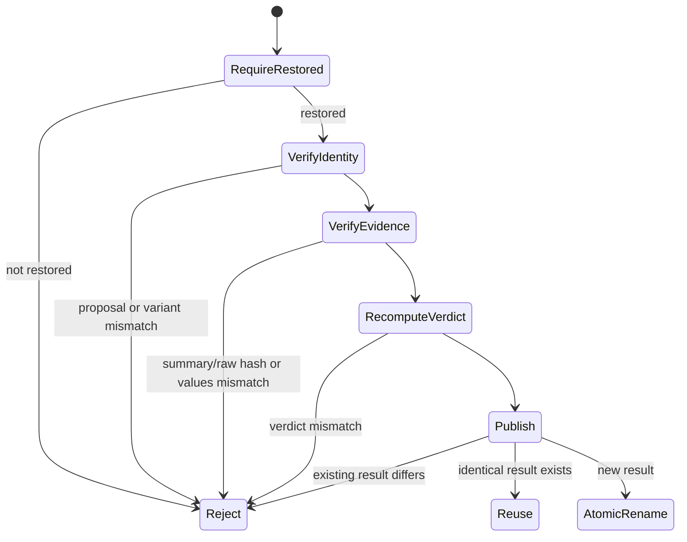

# 0015: Publishing immutable benchmark results

- **Date:** 2026-08-21
- **Status:** validated
- **Related phase:** Phase 4 — reproducible before/after benchmark
- **Feature commit:** `c7de6e5 feat: publish immutable benchmark results`

## Why

A verdict without its raw load evidence is only a claim. Entry 0014 fingerprints
the temporary k6 outputs, but those bytes disappear when collection returns. The
before/after measurements, raw evidence, verdict, and human explanation must be
published together without modifying the proposal that supplied benchmark inputs.

## Success criteria

- Carry exact k6 summary and raw bytes out of the temporary execution directory.
- Verify those bytes against each measurement's recorded SHA-256 before publishing.
- Verify summary identity and phase values against the typed measurement.
- Publish before/after evidence, measurements, verdict, and Markdown report together.
- Derive a stable result ID from canonical payload content.
- Use private staging, file flushes, and one atomic rename.
- Reuse an identical result idempotently and reject modified, partial, extra, or
  symlinked existing results without overwriting them.
- Refuse to publish an execution that did not restore the before workload.

## Planned artifact

```text
benchmark-<content digest>/
├── result.json
├── measurements/
│   ├── before.json
│   └── after.json
├── evidence/k6/
│   ├── before-summary.json
│   ├── before-raw.json
│   ├── after-summary.json
│   └── after-raw.json
├── verdict.json
└── report.md
```



## Non-goals

- Modify the immutable proposal bundle.
- Claim that SHA-256 authenticates who ran the benchmark.
- Upload artifacts to GitHub or object storage in this slice.
- Run the live 160-second benchmark.

## What changed

The k6 executor now reads exact summary and raw bytes before its private temporary
directory is removed. A collected measurement binds those bytes to its typed result:

- the summary must parse as the same proposal, variant, profile, and phase values;
- the summary SHA-256 must equal measurement provenance; and
- the raw SHA-256 must equal measurement provenance.

The restoring runner retains both before and after evidence alongside the typed
measurements and verdict. The publisher revalidates this relationship again, rather
than trusting that a previously valid mutable object remained unchanged.

The result contains nine files:

| File | Purpose |
|---|---|
| `result.json` | Result ID, proposal link, full digest, payload hashes and sizes |
| `measurements/before.json` | Canonical typed baseline measurement and provenance |
| `measurements/after.json` | Canonical typed candidate measurement and provenance |
| `evidence/k6/before-summary.json` | Exact k6 baseline summary bytes |
| `evidence/k6/before-raw.json` | Exact timestamped baseline stream |
| `evidence/k6/after-summary.json` | Exact k6 candidate summary bytes |
| `evidence/k6/after-raw.json` | Exact timestamped candidate stream |
| `verdict.json` | Canonical structured checks, failures, warnings, and cost change |
| `report.md` | Human-readable before/after table and every check reason |

## How publication is validated



Eight payload paths, lengths, and bytes produce one SHA-256. The readable result ID
uses its first 128 bits, while `result.json` stores the full digest and individual
payload hashes. Timestamps are legitimate measured content, so two separate runs
normally have different result IDs; retrying publication of the same in-memory run
is idempotent.

Files are written with mode `0600` beneath a private staging directory. After files
and directories are flushed, one rename exposes the complete result. An exclusive
publication lock prevents cooperating writers from racing within one output root.
Existing content is reused only when its complete file set and every byte match.

### Human explanation

`report.md` shows proposal ID, safety verdict, cost change, restoration status,
before/after cost, steady and spike tail latency, throttling, OOM, restarts, recovery,
and every structured check reason. It is generated from the same typed run used for
`verdict.json`; it is not a separately supplied narrative.

### Raw-data security

k6 already discards response bodies. The checked-in profile now also limits system
tags to status, method, and scenario so raw evidence does not retain full URLs. The
executor rejects target URLs containing userinfo, query parameters, or fragments,
preventing common token-bearing URL forms from reaching process arguments or raw
metrics.

### Alternatives and trade-offs

| Option | Benefit | Cost or risk | Decision |
|---|---|---|---|
| Store only raw hashes | Small artifact | Evidence disappears and cannot be audited | Rejected |
| Append results to proposal | Simple relationship | Breaks immutable benchmark input | Rejected |
| Timestamp result ID | Easy chronology | Retry creates unrelated identities | Rejected |
| Trust the existing verdict object | Less work | Post-validation mutation can forge report | Rejected |
| Recompute and content-address everything | Auditable and idempotent | More storage and validation | Selected |

## Problems encountered

Entry 0014 initially returned only raw/summary hashes after deleting the temporary
files. That could identify evidence only if another system had already retained it,
which the runner did not. The collection contract now carries exact bytes through
restoration to publication; measurements remain compact while the run owns evidence.

Pydantic validates models at construction but the current models are mutable. A
caller could alter raw bytes or verdict fields before publication. The publisher now
reconstructs collected evidence checks and recomputes the verdict immediately before
building payloads. Tests deliberately mutate both and confirm publication refuses.

Persisting raw k6 metrics exposed another boundary: default system tags may include
the complete URL. URL tags were removed, and credential-, query-, and fragment-bearing
targets are rejected before k6 starts.

## Evidence

```text
pytest: 170 passed, 1 external Starlette/httpx2 deprecation warning
Ruff: all checks passed
k6 inspect: fixed profile with restricted system tags parsed successfully
git diff --check: clean
```

Tests cover exact raw retention, summary identity, URL secret boundaries, all result
payload hashes and permissions, proposal immutability, stable IDs across roots,
identical retry, modified and extra content, symlinks, active lock, mid-write cleanup,
unrestored execution, mutated raw data, and a recomputed-verdict mismatch.

An ephemeral synthetic run produced:

```text
Result ID: benchmark-55d6541799e7e07d642ecf559568a960
Files: 9
Identical retry reused: true
Workload restored: true
```

The temporary directory was removed. The fixture exercises artifact mechanics and
does not represent a live performance result.

## Decision and limitations

Phase 4 now has immutable inputs, a fixed load contract, restoration orchestration,
aligned measurement, and an immutable output boundary. SHA-256 proves byte identity,
not operator identity or trust; signing is outside the MVP.

The publisher lock protects only result publication. It does not stop two benchmark
processes from interleaving Kubernetes mutations. Target-document isolation,
cross-process execution locking, a supported CLI command, and one real disposable
cluster run remain required before Phase 4 is complete.

## Next question

How should the CLI acquire a cross-process execution lock, run the disposable demo
benchmark, and print the resulting artifact and restoration status?
