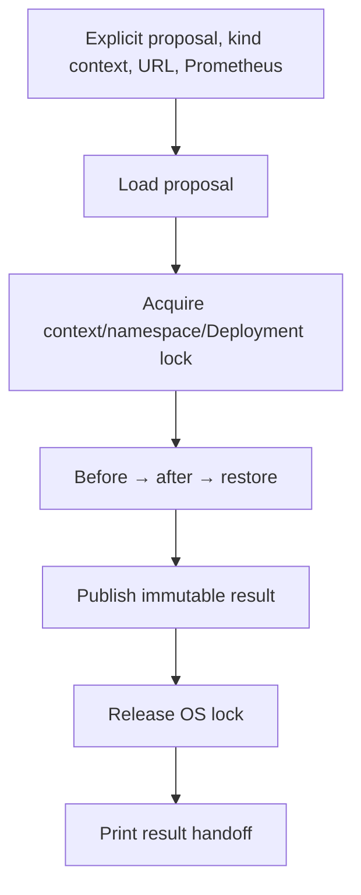
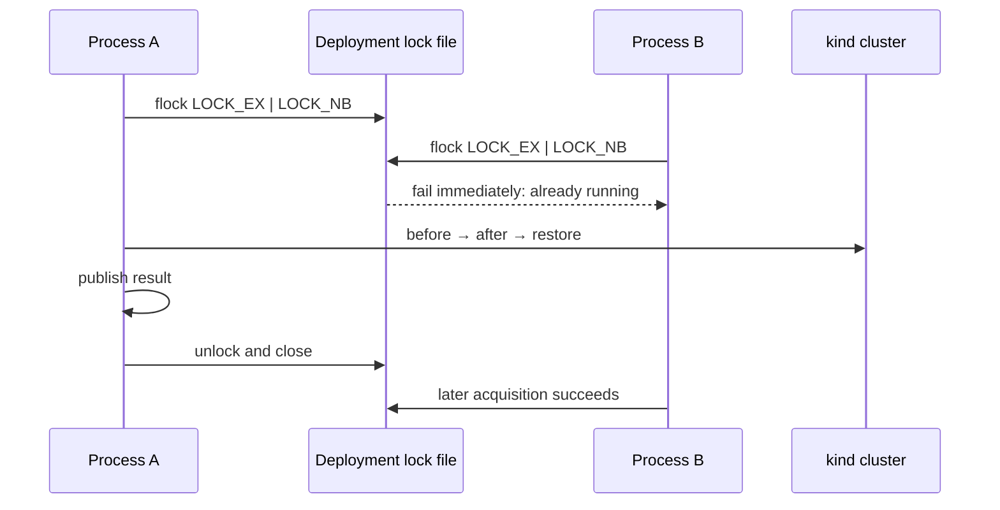

# 0016: Locking and composing the benchmark CLI

- **Date:** 2026-08-21
- **Status:** validated
- **Related phase:** Phase 4 — reproducible before/after benchmark
- **Feature commit:** `921b634 feat: add locked local benchmark command`

## Why

The benchmark components are individually testable, but users still cannot run the
workflow through one supported command. More importantly, two processes targeting
the same Deployment could interleave before/after applies and invalidate both
results or restore the wrong state.

## Success criteria

- Serialize execution by explicit kubectl context, namespace, and Deployment.
- Use an OS advisory lock that is released automatically when a process exits.
- Reject symlinked lock roots/files and fail immediately when another run owns the
  same target lock.
- Add one CLI command that composes proposal verification, kubectl, k6, Kubernetes
  snapshots, Prometheus, restoration, and result publication.
- Require an explicit kind context and disposable-cluster acknowledgement.
- Hold the execution lock from before the first apply through restoration and result
  publication.
- Print a small machine-readable handoff containing result ID, path, verdict,
  restoration, and reuse state.

## Planned command boundary



## Non-goals

- Support production contexts in the MVP command.
- Automatically create port-forwards or the kind cluster.
- Remove a lock file while another process may still hold its OS lock.
- Run the live benchmark before CLI and failure-path validation succeeds.

## What changed

`kubefit benchmark` now accepts the immutable proposal path, target URL, Prometheus
URL, explicit kind context, output and lock directories, k6 script, and bounded
rollout/k6 timeouts. It composes the components completed in entries 0011–0015 and
prints only this machine-readable handoff after the lock is released:

```json
{
  "artifact_id": "benchmark-<digest>",
  "path": "benchmarks/results/benchmark-<digest>",
  "proposal_id": "proposal-<digest>",
  "restored": true,
  "reused": false,
  "verdict": "pass"
}
```

The command requires both `--context kind-...` and
`--confirm-disposable-cluster`. Generic library components still accept an explicit
non-kind context, but this supported MVP command refuses it before loading a
proposal or creating collectors.

## How the execution lock works

The lock identity is SHA-256 over the exact kubectl context, namespace, and
Deployment separated by null bytes. Container is intentionally excluded because
applying one container's proposal still reconciles the entire Deployment.



The file is opened without following symlinks, verified as a regular file, and
forced to mode `0600`. The containing directory rejects a direct symlink. The lock
file remains after release; ownership lives in the kernel lock, so deleting stale
PID files is unnecessary and a crashed process releases its lock automatically.

The CLI loads the proposal once to derive the lock identity, then the runner
revalidates it again while holding the lock before any cluster mutation. Result
publication also occurs inside the lock. JSON output occurs afterward, ensuring a
printed success never precedes release.

### Alternatives and trade-offs

| Option | Benefit | Cost or risk | Decision |
|---|---|---|---|
| PID file with deletion | Portable concept | Crash leaves stale ownership; PID reuse | Rejected |
| One global benchmark lock | Simplest | Unrelated clusters and Deployments block | Rejected |
| Container-level lock | More concurrency | Both runs apply the same Deployment | Rejected |
| Deployment identity with `flock` | Crash-safe and correctly scoped | POSIX/cooperative only | Selected |
| Allow any explicit context | More flexible | MVP command can mutate production | Rejected |

## Problems encountered

The first lock tests used two file descriptors in one test process. That exercises
the OS primitive but did not directly demonstrate the stated cross-process
boundary. A child Python process now attempts the same target while the parent owns
it and receives the expected immediate lock failure; acquisition succeeds again
after release.

An acknowledgement prompt would make automation and testing ambiguous. The CLI
uses a required flag instead: omission is a parser error, while presence is explicit
and remains visible in shell history.

The existing CLI executed `analyze` unconditionally after parsing. It was split into
small command handlers so `benchmark` can compose its dependencies without changing
the existing analysis behavior.

## Evidence

```text
pytest: 181 passed, 1 external Starlette/httpx2 deprecation warning
Ruff: all checks passed
kubefit benchmark --help: command and required safety arguments parsed
git diff --check: clean
```

Tests cover same-target contention, a real child-process contention attempt,
release after exceptions, different-context independence, symlinked root/file
rejection, object re-entry, required acknowledgement, argument parsing, non-kind
rejection before proposal access, dependency composition, lock ordering, publication
inside the lock, and the final JSON handoff.

No Kubernetes command or 160-second load ran during this slice. The evidence proves
CLI composition and locking behavior, not a real benchmark result.

## Reproduction command shape

With an already published proposal, manual Service and Prometheus port-forwards,
and the disposable kind cluster, the supported shape is:

```bash
kubefit benchmark \
  --proposal .kubefit/proposals/proposal-<digest> \
  --target-url http://localhost:8080/ \
  --prometheus-url http://localhost:9090 \
  --context kind-kubefit \
  --confirm-disposable-cluster
```

This is the interface contract, not evidence that the live command has run yet.

## Decision and limitations

The local workflow now has one supported composition point and a Deployment-scoped
cross-process lock. `flock` is available on the current Linux/macOS scope and only
coordinates processes using this protocol; remote hosts or filesystems with weak
advisory-lock semantics are outside the MVP.

Proposal creation is not yet exposed through a matching CLI command, port-forwards
remain manual, and the runner still applies the entire source YAML document set.
Those gaps must be addressed or explicitly constrained before the live demo becomes
a one-command reproduction.

## Next question

Can the complete command reproduce one safe before/after result against the local
kind demo, and what do its real metrics show?
