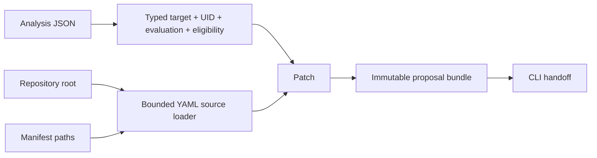
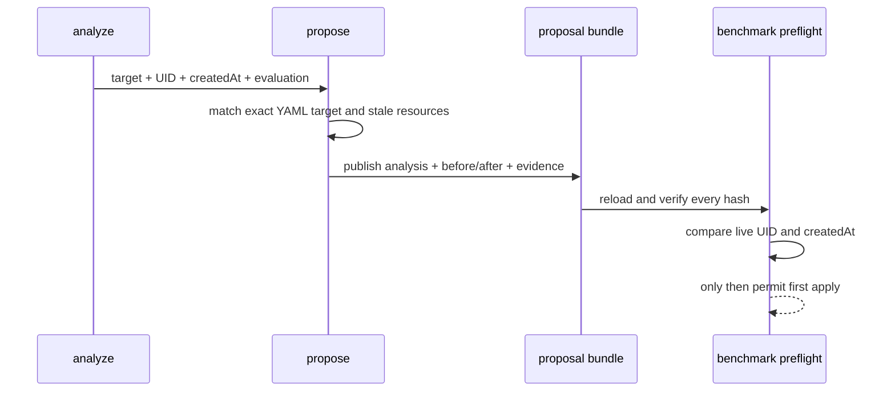

# 0017: Creating proposals from CLI inputs

- **Date:** 2026-08-21
- **Status:** validated
- **Related phase:** Phase 3/4 handoff — evaluation to immutable proposal
- **Feature commit:** `e9fc9ad feat: add repository-safe proposal command`

## Why

The benchmark CLI accepts a proposal, but no supported command creates one. A user
would need to import internal Python functions, leaving the documented analyze →
proposal → benchmark flow incomplete. Manifest loading also needs an explicit
repository boundary so artifact paths cannot escape the intended source tree.

## Success criteria

- Accept one complete analysis artifact containing evaluation and workload identity,
  plus a repository root and one or more Kubernetes YAML sources.
- Require every manifest to be a regular, non-symlinked file inside the repository
  root and record a stable POSIX-relative path.
- Reject duplicate inputs, traversal, outside paths, directories, invalid UTF-8,
  malformed analysis JSON, blocked eligibility, missing targets, and ambiguity.
- Reuse the existing stale-safe patch generator and immutable proposal publisher.
- Never modify source manifests or the analysis input.
- Print a compact JSON handoff with proposal ID, path, reuse state, target, change
  count, and reviewer warnings.
- Make identical retries return the same proposal ID.

## Planned flow



## Non-goals

- Recalculate or override recommendation values in `propose`.
- Make an insufficient analysis eligible for demo convenience.
- Commit YAML changes or open a GitHub pull request.
- Apply any manifest to Kubernetes.

## What changed

`kubefit analyze` now emits a versioned analysis artifact instead of an unbound
evaluation alone. It contains target identity, Deployment UID, timezone-aware
creation time, and the complete evaluation.

`kubefit propose` consumes that artifact and does not accept target override flags.
It loads bounded repository sources, generates the stale-safe patch, and publishes
the proposal. New proposal bundles include `analysis.json`; workload identity thus
contributes to the proposal content digest.

The benchmark runner requires this identity evidence. Before its first apply, the
kubectl controller reads the live Deployment and requires both UID and creation
timestamp to match. A same-name Deployment recreated after analysis is rejected
without apply or restoration commands.



## Repository source boundary

The source loader resolves one explicit repository root and produces POSIX-relative
artifact paths. Every manifest must be unique, readable UTF-8, and a regular file
within that root. It rejects `..`, missing or outside paths, duplicates, directories,
a symlinked root, and symlinked path components.

Symlink components are checked on the lexical path before resolution. Reading only
the resolved path would erase evidence that `deploy/app.yaml` was actually a link.

### Alternatives and trade-offs

| Option | Benefit | Cost or risk | Decision |
|---|---|---|---|
| Retype target in `propose` | Familiar CLI | Evaluation can bind to another workload | Rejected |
| Bind only namespace/name | Simple | Same-name recreation reuses stale evidence | Rejected |
| Bind target + UID + creation time | Detects target drift and recreation | New analysis schema | Selected |
| Accept arbitrary absolute YAML paths | Flexible | Crosses repository boundary | Rejected |
| Normalize copied YAML | Easy parsing | Loses byte-exact source provenance | Rejected |

## Problems encountered

The first CLI design accepted an evaluation file and required namespace, Deployment,
and container again. Two workloads with equal resource values could be confused.
The contract changed before documentation commit: analyze now binds identity,
propose removes target flags, proposals retain the analysis, and benchmark verifies
live UID and creation time.

The first symlink check happened after `Path.resolve()`. An internal symlink pointing
inside the repository then appeared ordinary. The final loader checks original path
components first.

Proposal publication initially created its output root before checking analysis and
patch target agreement. Validation now occurs first, so mismatch leaves no output.

## Evidence

```text
pytest: 199 passed, 1 external Starlette/httpx2 deprecation warning
Ruff: all checks passed
kubefit propose --help: analysis-bound command surface parsed
git diff --check: clean
```

Tests cover analysis serialization and timezone enforcement, ordered source paths,
traversal, outside/missing files, duplicates, root and internal symlinks, directories,
invalid UTF-8, malformed analysis before YAML access, blocked eligibility without
output, target mismatch without output, proposal identity persistence, recreated
Deployment rejection before mutation, source immutability, and identical retry.

An ephemeral fixture execution produced:

```text
Proposal ID: proposal-5dffc7af3bef3e8b054fcb4280c4eacf
Changes: 4
First publication reused: false
Identical retry reused: true
```

This validates mechanics with synthetic eligible evidence, not live performance.

## Command shape

```bash
kubefit analyze \
  --context kind-kubefit \
  --namespace kubefit-demo \
  --deployment overprovisioned-api \
  --prometheus-url http://localhost:9090 \
  --cpu-core-hour-usd 0.04 \
  --memory-gib-hour-usd 0.005 \
  --price-source example://local-model \
  > .kubefit/analysis.json

kubefit propose \
  --analysis .kubefit/analysis.json \
  --repository-root . \
  --manifest deploy/demo/overprovisioned-api.yaml
```

The analysis must be eligible. Policy is not weakened for a fresh demo cluster.

## Decision and limitations

The CLI path now preserves workload identity from collection through benchmark
preflight. SHA-256 proves content identity, not who produced the analysis. Legacy
programmatic proposals without `analysis.json` remain readable for inspection, but
the benchmark runner refuses to execute them. Target-document isolation and enough
real observation coverage remain open.

## Next question

Can a real eligible analysis be obtained and carried through propose and benchmark
on the disposable local cluster without synthetic evidence?
