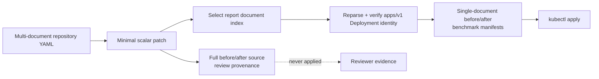

# 0018: Isolating the benchmark target document

- **Date:** 2026-08-21
- **Status:** validated
- **Related phase:** Phase 4 — safe before/after execution
- **Feature commit:** `3001241 feat: isolate benchmark deployment manifests`

## Why

A proposal currently preserves and applies the complete source YAML file. One file
can contain several Kubernetes documents, so benchmarking one Deployment can also
reconcile a neighboring Service, ConfigMap, or unrelated Deployment. Namespace and
workload-identity checks do not constrain what `kubectl apply --filename` reads.

That violates KubeFit's GitOps safety claim: the intended four resource scalar
changes are narrow, but the runtime mutation surface is the whole source file.

## Success criteria

- Keep the byte-exact full before/after source files as review provenance.
- Derive one standalone executable YAML document from the patch report's selected
  document index.
- Require the derived document to remain exactly the selected `apps/v1 Deployment`
  and target namespace/name.
- Put derived before/after files inside the immutable proposal digest and index.
- On load, re-derive the executable files from the full sources and reject any
  mismatch, even when an attacker has rebuilt internally consistent hashes.
- Make the benchmark runner apply and restore only the isolated files.
- Prove with a multi-document fixture that neighboring resources are never present
  in an apply payload.

## Planned artifact boundary



The key decision is to separate evidence from execution: full source files explain
the proposed Git change, while isolated files define the exact cluster mutation.

## Non-goals

- Reformat or replace the repository YAML source.
- Apply all objects needed to bootstrap an empty cluster.
- Support a Kubernetes `List` as the selected target document.
- Open a GitHub pull request in this slice.

## What changed

The proposal now has two deliberately different manifest views:

```text
proposal-<digest>/
├── manifests/
│   ├── before/deploy/demo.yaml       # full byte-exact review source
│   └── after/deploy/demo.yaml        # full patched review source
└── benchmark/manifests/
    ├── before.yaml                   # one verified Deployment document
    └── after.yaml                    # one verified Deployment document
```

`LoadedProposalBundle.before_manifest` and `after_manifest` now resolve to the
isolated files used by the runner. New `before_source_manifest` and
`after_source_manifest` fields expose the full files only to review-oriented
consumers. This makes the safe path the default API path.

## How

The extractor uses the composed YAML node's source marks instead of serializing the
object. It slices only the indexed document, adds a final newline when needed, then
reparses the slice. The second parse must yield exactly the expected `apps/v1`
Deployment namespace/name and contain the target container. This keeps scalar
rendering intact while excluding both preceding and following documents.

Proposal publication hashes all four files. Loading does more than validate those
hashes: it decodes each full source, repeats document extraction using the persisted
report, and compares the result byte-for-byte with its executable file. A test
changes an executable resource value, rebuilds every file hash and the proposal ID,
and still observes rejection because the executable no longer derives from the
source.

| Option | Benefit | Cost or risk | Decision |
|---|---|---|---|
| Apply the full source | No extra artifact | Reconciles unrelated objects | Rejected |
| Serialize one parsed object | Simple standalone YAML | Reformats and loses source-level traceability | Rejected |
| Send a JSON merge patch | Very narrow mutation | Baseline restoration and Git diff use different inputs | Deferred |
| Slice, reparse, and bind one document | Preserves source text and narrows object scope | Drops document-edge comments from executable copy | Selected |

Comments outside the parsed node may not appear in the executable slice. They stay
byte-exact in the full provenance files and do not affect Kubernetes object
semantics.

## Evidence

The multi-document golden fixture has a Service before the target Deployment, and a
second case adds a ConfigMap after it. Tests parse the executable output as exactly
one document and prove neither neighbor is present. The runner test records every
apply, including restoration, and proves each path is under `benchmark/manifests`
and none contains the Service.

```text
pytest: 204 passed, 1 external Starlette/httpx2 deprecation warning
Ruff: all checks passed
git diff --check: clean
Synthetic proposal: proposal-8d84f878a62700739e30a2510ca7df02
```

The first attempted verification command used `uv`, which was not installed in the
active shell. The repository already had `.venv`, so verification continued with
`.venv/bin/pytest` and `.venv/bin/ruff`; no dependency or machine state was changed.

The first runner-test failure was not a product regression. Its recording controller
classified variants by looking for a directory component named `before`, while the
new executable path uses the filename `before.yaml`. The test double now classifies
the explicit filename and retains the original failure/restoration coverage.

## Decision and limitations

It is now accurate to claim that a KubeFit benchmark never applies neighboring YAML
documents from the selected repository file. The full source is retained and
hashed, but only the derived Deployment document reaches kubectl.

This does not make the workflow production-safe. Applying the selected document can
still reconcile non-resource Deployment fields that drifted in the live cluster,
and restoration uses proposal-time repository content rather than a captured live
object. The explicit `kind-*` and disposable-cluster confirmation boundary remains.

## Next question

After target isolation, can the first eligible disposable-cluster benchmark be run
end to end with only measured evidence?
