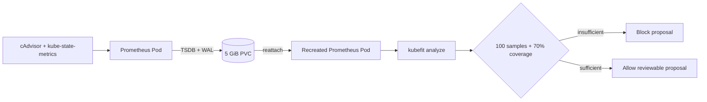

# 0019: Persisting local Prometheus evidence

- **Date:** 2026-08-21
- **Status:** validated
- **Related phase:** Phase 4 — real disposable-cluster evidence
- **Feature commit:** `d8ce2c1 feat: persist local Prometheus evidence`

## Why

The first live post-isolation analysis correctly refused to create a proposal. The
Deployment was 24 hours old, but its current Pods and the available Prometheus
history covered only about 2.5 hours after a local restart. The one-day analysis
reported 64 usage and throttling samples, 11.1% coverage, and unknown OOM and CPU
throttling risk. Readiness requires at least 100 samples and 70% coverage.

The cost model still projected 98.9% request-cost savings. Treating that projection
as permission would demonstrate exactly the unsafe behavior KubeFit is designed to
prevent. Reducing the requested observation window merely to make the demo pass
would weaken the evidence contract rather than fix the local environment.

## Success criteria

- Give the local Prometheus StatefulSet a bound persistent volume instead of its
  implicit ephemeral storage.
- Retain two days of metrics while applying a storage-size ceiling below PVC size.
- Keep the configuration small enough for the disposable single-node kind cluster.
- Prove the pinned Helm chart renders a PVC-backed Prometheus resource.
- Apply only to the explicit `kind-kubefit` context.
- Verify data remains available after a Prometheus Pod recreation.
- Document that the first migration from emptyDir cannot preserve existing history
  and restarts the readiness accumulation window once.

## Planned boundary



Persistence preserves evidence availability; it does not change readiness policy or
turn a short observation into a sufficient one.

## Non-goals

- Make the kind volume survive `kind delete cluster`.
- Migrate the existing emptyDir TSDB into the new volume.
- Lower the readiness thresholds for local demonstrations.
- Claim an eligible analysis or successful benchmark before it is measured.

## What changed

`prometheus-values.yaml` now requests a 5 GiB `ReadWriteOnce` claim from kind's
default `standard` local-path StorageClass. Time retention stays at two days, while
`retentionSize: 4GB` reserves capacity for WAL and compaction overhead.

`up.sh` no longer changes the developer's ambient kubectl context. Helm and every
kubectl mutation name `kind-<cluster>` explicitly. Tests lock the storage contract
and this context boundary so a future values or script edit cannot silently return
to ephemeral storage or ambient cluster selection.

## How

The pinned chart was rendered before cluster mutation. Its Prometheus resource
contained this effective boundary:

```text
spec.storage.volumeClaimTemplate.spec.storageClassName: standard
spec.storage.volumeClaimTemplate.spec.accessModes: [ReadWriteOnce]
spec.storage.volumeClaimTemplate.spec.resources.requests.storage: 5Gi
spec.retention: 2d
spec.retentionSize: 4GB
```

Helm revision 2 then replaced the emptyDir-backed Prometheus Pod on the explicit
`kind-kubefit` context. Kubernetes bound the claim to PV
`pvc-c38ed3aa-0fa5-4ffe-aec6-5ac2e05c8324`, and the StatefulSet Pod mounted that
claim as its Prometheus database volume.

| Option | Benefit | Cost or risk | Decision |
|---|---|---|---|
| Shorten the requested analysis window | Immediate eligibility | Makes a short demo look operationally sufficient | Rejected |
| Keep implicit emptyDir | No disk provisioning | Restarts can erase readiness evidence | Rejected |
| Host-mounted directory | Can outlive a node container | Host-path coupling and permission setup | Deferred |
| kind local-path PVC | Declarative and survives Pod/Docker restart | Deleted with the kind cluster | Selected |

## Evidence

The Prometheus Pod was deliberately deleted once after the PVC bound. Its recreated
instance had creation timestamp `2026-08-20T17:29:55Z`. A five-minute range query
from the new process returned an earliest `prometheus_build_info` sample at
`2026-08-20T17:29:21.348Z`, more than 33 seconds before that Pod existed. Prometheus
also logged both WAL segments loading and `WAL replay completed`.

```text
PVC: Bound, 5Gi, ReadWriteOnce, storageClass=standard
sample count before recreation: 2
sample count after recreation: 3
earliest retained sample: 2026-08-20T17:29:21.348Z
recreated Pod created: 2026-08-20T17:29:55Z
pytest: 206 passed, 1 external Starlette/httpx2 deprecation warning
Ruff: all checks passed
bash -n: passed
Helm 88.5.0 render: storage volumeClaimTemplate present
```

The pre-change live analysis remains valuable negative evidence:

| Signal | Observed | Required | Outcome |
|---|---:|---:|---|
| Usage samples | 64 | 100 | blocked |
| Usage coverage | 11.1% | 70% | blocked |
| Throttling samples | 64 | 100 | blocked |
| Throttling coverage | 11.1% | 70% | blocked |
| Projected savings | 98.9% | not an authorization input | did not bypass gate |

One verification attempt reused a port-forward attached to the deleted Pod and
returned an empty HTTP response. A new port-forward to the recreated Pod succeeded;
this distinguishes tunnel lifetime from TSDB persistence and belongs in the demo
runbook expectations.

## Decision and limitations

The local environment can now accumulate the evidence required for an honest
eligible proposal even when Docker or the Prometheus Pod restarts. No readiness
threshold or risk classification changed.

The first emptyDir-to-PVC upgrade necessarily discarded the existing 2.5-hour
history, so the current live cluster is not yet eligible. The local-path PV remains
inside the kind node container: `kind delete cluster` deletes it, and this is not a
backup or production retention design.

## Next question

After enough persistent history accumulates, does the real recommendation remain
safe under the fixed before/after load profile?
