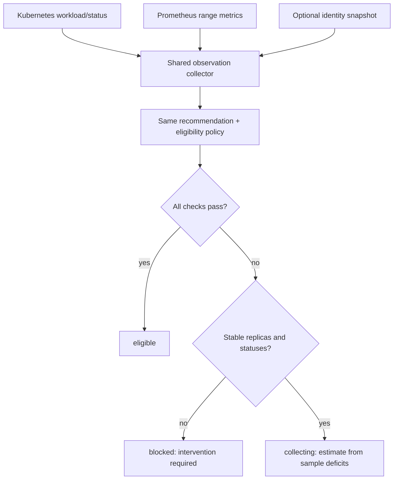
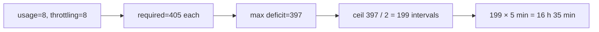

# 0020: Making observation readiness actionable

- **Date:** 2026-08-21
- **Status:** validated
- **Related phase:** Phase 4 — real disposable-cluster evidence
- **Feature commit:** `94942e1 feat: add observation readiness command`

## Why

The live analysis in entry 0019 correctly returned `insufficient_data`, but a user
had to inspect a large recommendation artifact and manually distinguish conditions
that improve with time from conditions requiring intervention. “Coverage is 11.1%”
does not answer the immediate operational question: should I wait, or fix something?

KubeFit needs a read-only readiness command before the mutating benchmark flow. It
must use the same Kubernetes, Prometheus, identity, and policy path as `analyze`, or
the diagnostic can claim readiness that analysis later rejects.

## Success criteria

- Add `kubefit readiness` without price arguments or cluster mutation.
- Reuse analysis collection and recommendation/eligibility policy.
- Report usage and throttling samples, coverage, and Pod coverage against explicit
  thresholds.
- Report desired/available/observed replicas and container-status coverage.
- Distinguish `eligible`, `collecting`, and `blocked`.
- Estimate observation-readiness time only when current stable replicas and
  continued metric collection can resolve every readiness blocker.
- State the estimate assumptions and emit machine-readable JSON.
- Detect incomplete usage-metric Pod coverage as a readiness failure.
- Verify the result against the live `kind-kubefit` environment.

## Planned decision flow



## Non-goals

- Poll continuously or run as a background daemon.
- Lower coverage or sample thresholds.
- Guarantee future eligibility when traffic, replicas, or scrape health changes.
- Persist a second readiness state separate from Prometheus evidence.

## What changed

`kubefit readiness` accepts the same target, Prometheus, observation-window,
kubectl-context, and identity-store inputs as `analyze`, but no pricing assumptions.
Both commands call one shared observation collector before branching into their
different outputs. The report binds namespace, Deployment, container, UID, creation
time, and authorized ReplicaSet count.

The report contains structured progress for usage and throttling, replica and
container-status counts, the canonical recommendation readiness, and the complete
patch eligibility result. Its top-level state has a deliberately small meaning:

| Status | Meaning | Estimate |
|---|---|---|
| `eligible` | Current recommendation and risks permit proposal creation | none needed |
| `collecting` | Only sample/coverage accumulation prevents a decision | conservative timestamp |
| `blocked` | Intervention or a high-risk signal prevents a safe estimate | none |

## How

For a one-day window at a 300-second step, there are 289 expected points per Pod.
With two desired replicas, 70% coverage requires
`ceil(289 × 2 × 0.70) = 405` samples. The estimate takes the larger usage or
throttling deficit, divides by the two samples expected per interval, rounds up,
and adds those five-minute intervals to the observation time.



The timestamp is not shown if desired, available, and observed replicas differ;
container statuses are incomplete; either metric lacks all desired Pods; or current
OOM/throttling risk is already high. A new usage-Pod completeness check was also
added to the recommendation policy, so readiness and analysis reject the same gap.

| Alternative | Benefit | Cost or risk | Decision |
|---|---|---|---|
| Parse reason strings in the shell | No new command | Brittle and duplicates policy interpretation | Rejected |
| Persist a readiness countdown | Easy repeated display | Becomes stale beside Prometheus | Rejected |
| Always print an ETA | Simple UX | Implies rollout or OOM failures heal with time | Rejected |
| Recompute from shared live evidence | One source of truth | Executes the same read queries again | Selected |

## Live validation

The PVC-backed `kind-kubefit` environment returned:

```text
status: collecting
workload UID: acd1ca6e-972c-4574-a199-267af0f603f7
authorized ReplicaSets: 2
usage: 8 / 405 samples, 1.4% / 70%, Pods 2 / 2
throttling: 8 / 405 samples, 1.4% / 70%, Pods 2 / 2
replicas: desired=2, available=2, observed=2, statuses=2
estimated readiness: 2026-08-21T10:20:35Z (19:20:35 KST)
```

The output remained blocked at the embedded patch-eligibility layer because risk is
unknown until coverage is sufficient. Top-level `collecting` says only that current
infrastructure checks support a time projection, not that the future proposal is
guaranteed eligible.

```text
pytest: 213 passed, 1 external Starlette/httpx2 deprecation warning
Ruff: all checks passed
kubefit readiness --help: parsed without price arguments
git diff --check: clean
```

Tests cover exact two-replica ETA arithmetic, eligibility without an ETA,
incomplete usage-Pod coverage, high risk before and after readiness, identity-bound
JSON, and price-free CLI parsing.

## Decision and limitations

Users can now distinguish “wait for evidence” from “repair the workload or metric
pipeline” without weakening policy or generating an analysis artifact they cannot
use. The estimate is deterministic and audit-friendly, but it is not a scheduler or
promise. It assumes the current replica count and per-step series production remain
unchanged and does not poll automatically.

## Next question

Once readiness becomes eligible, can the complete live benchmark produce a safe,
immutable result artifact?
