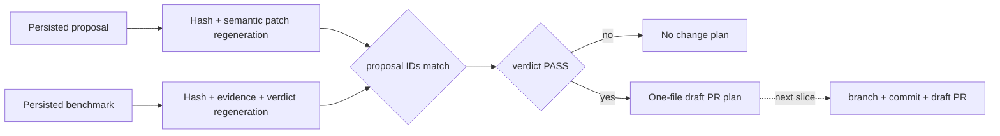
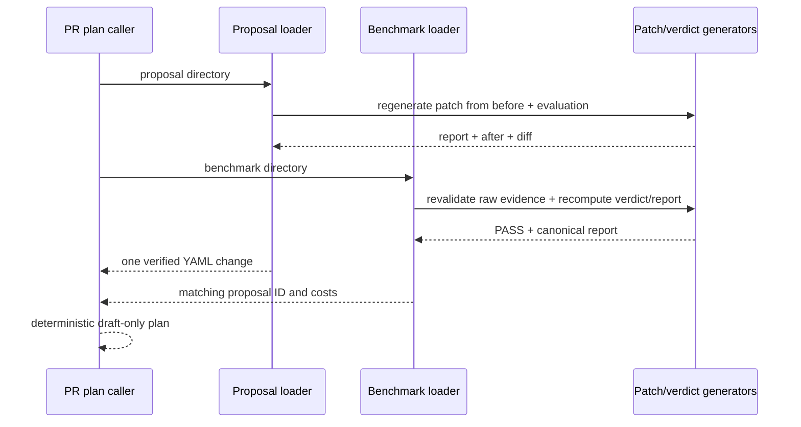

# 0021: Building a verified pull request plan

- **Date:** 2026-08-21
- **Status:** validated
- **Related phase:** Phase 5 — GitHub draft pull request
- **Feature commit:** `44c4fea feat: build verified pull request plans`

## Why

KubeFit can produce immutable proposal and benchmark directories, but opening a PR
directly from paths would trust persisted files more than the current safety model
allows. Proposal loading verifies bytes but does not yet regenerate the patch from
its source and evaluation. Benchmark results validate before publication but have no
equivalent load-time verifier.

The network-writing GitHub adapter should receive a complete, deterministic review
contract, not reinterpret artifacts or decide which file to change. Separating that
pure plan also lets failure and tamper boundaries be tested without credentials,
branches, pushes, or repository mutation.

## Success criteria

- Revalidate a persisted benchmark result's canonical index, exact file set,
  hashes, content digest, measurements, raw evidence, verdict, and Markdown report.
- Regenerate a persisted proposal patch from its full before source and evaluation,
  requiring its after source, diff, report, and isolated executable manifests to
  agree.
- Require result and proposal IDs to match.
- Refuse `fail` or `invalid` benchmark verdicts.
- Produce a typed plan for exactly one repository-relative YAML change.
- Include a deterministic draft title, branch name, explanation, cost comparison,
  safety metrics, warnings, evidence IDs, and rollback guidance.
- Keep this slice read-only: no checkout, commit, push, or GitHub API request.

## Planned trust flow



## Non-goals

- Authenticate to GitHub or request repository write permission.
- Create a branch, commit, push, or pull request.
- Put benchmark raw evidence into the application manifest commit.
- Allow a passing cost result to override a failing safety verdict.

## What changed

`load_benchmark_result` now gives persisted benchmark artifacts the same fail-closed
boundary they had at publication. It requires canonical `result.json`, the exact
eight payload files, every size/hash, the full content digest, typed before/after
measurements, matching raw k6 evidence, a recomputed verdict, and byte-identical
regenerated Markdown.

Proposal loading now goes beyond hashes and isolated-document comparison. It reruns
the patch generator with the persisted full before source, target, and evaluation,
then requires exact equality for patch report, full after source, and unified diff.
Therefore rebuilding all hashes around a fabricated after value still fails.

`build_pull_request_plan` consumes those two loaded objects and returns one typed
contract:

```text
PullRequestPlan
├── draft: true
├── branch/title/commit message
├── proposal ID + benchmark ID + workload target
├── four structured resource changes
├── one RepositoryFileChange
│   ├── repository-relative path
│   ├── expected before SHA-256
│   └── exact before/after content
└── Markdown body
    ├── reason and immutable evidence IDs
    ├── cost projection and caveat
    ├── before/after safety metrics
    ├── policy warnings
    └── rollback and human-review requirement
```

## How



The artifact pair is rejected unless the benchmark references the exact proposal,
both measured request costs equal the proposal-fixed costs, workload identity exists,
and the safety verdict is `pass`. Cost reduction alone never authorizes a plan.

| Option | Benefit | Cost or risk | Decision |
|---|---|---|---|
| Let GitHub adapter read artifact files | Fewer models | Network layer silently becomes policy engine | Rejected |
| Trust hashes only | Fast | Internally consistent fabricated relationships pass | Rejected |
| Commit benchmark evidence with YAML | Evidence visible in branch | Pollutes application repository and expands change scope | Rejected |
| Pure verified one-file plan | Deterministic and credential-free tests | Requires a later repository adapter | Selected |

## Problems encountered

The first benchmark-loader insertion landed between the writer's successful rename
and its `finally` cleanup, temporarily splitting one function boundary. Source
inspection caught it before a test or commit. The return and lock cleanup were moved
back together before the loader definition. This repeated a failure pattern already
recorded in entry 0013 and reinforces why publication control flow must be inspected,
not inferred from passing happy-path code.

The first package export also introduced an import-order cycle: benchmarks imported
the `gitops` package while `gitops.pull_request` imported benchmarks. Tests that
loaded benchmarks first exposed it. The plan module now type-imports benchmark
models only during checking and imports the loader locally at execution; both
`benchmarks → gitops` and `gitops → benchmarks` import-order probes pass.

## Evidence

```text
pytest: 220 passed, 1 external Starlette/httpx2 deprecation warning
Ruff: all checks passed
git diff --check: clean
benchmark-first import: passed
gitops-first import: passed
```

The golden plan uses:

```text
proposal: proposal-444bf37263f2da4d1ffb85512d245598
benchmark: benchmark-784f7e21bb4aead35c2fbb5286f8c824
branch: kubefit/demo-demo-444bf372
file: deploy/demo.yaml
projected request-cost change: -68.050%
benchmark verdict: PASS
```

Tests cover load-time result semantics, fully rehashed fabricated Markdown,
fully rehashed fabricated after YAML, exact golden PR body, one-file before/after
bytes, mismatched proposal IDs, proposal/result cost disagreement, and non-passing
verdict rejection.

## Decision and limitations

KubeFit can now explain exactly what a future GitHub adapter is allowed to write and
why, without repository or network side effects. The plan's expected-before hash is
not yet enforced against a live checkout, and no branch, commit, push, or draft PR
has been created. Those operations remain the next explicit trust boundary.

## Next question

Can the verified plan be applied idempotently to an explicit clean repository and
opened only as a draft PR?
