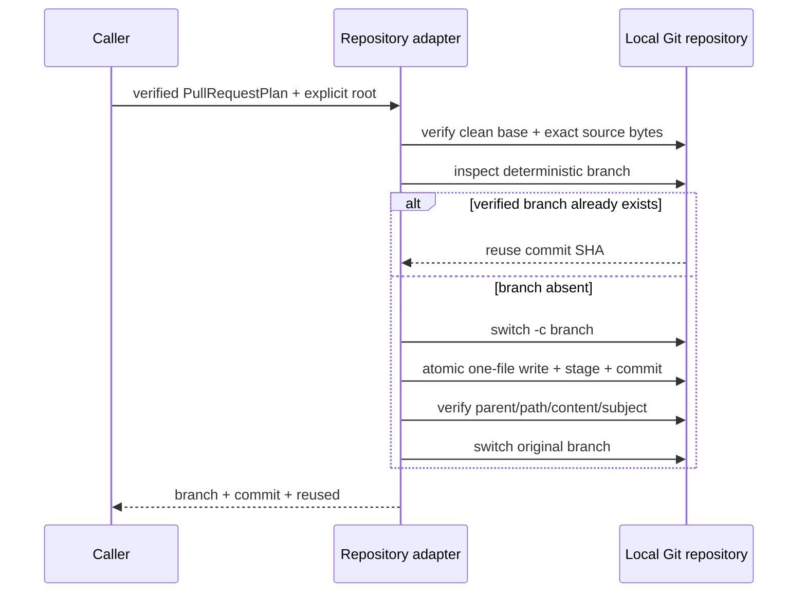
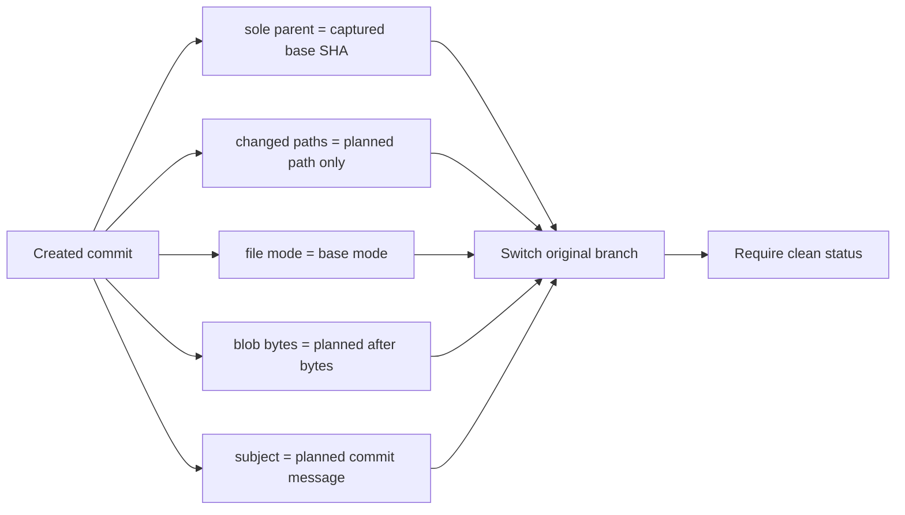

# 0022: Applying a pull request plan transactionally

- **Date:** 2026-08-21
- **Status:** validated
- **Related phase:** Phase 5 — GitHub draft pull request
- **Feature commit:** `3350fec feat: commit pull request plans transactionally`

## Why

Entry 0021 defines exactly one authorized file change, but a local repository can
still drift or contain unrelated work after planning. Writing without rechecking the
checkout could overwrite a developer's edits, follow a symlink outside the repository,
commit extra files, or leave a half-created branch after Git failure.

The next adapter must make one narrow mutation while preserving the user's original
branch and clean working tree. Its output should be a branch ref and commit SHA that
a later publisher can push without reinterpreting the plan.

## Success criteria

- Require an explicit, non-symlinked Git repository and attached current branch.
- Refuse any tracked or untracked working-tree change before mutation.
- Resolve the planned file inside the repository and reject every symlink component.
- Require both the expected SHA-256 and exact before bytes to match.
- Create the deterministic KubeFit branch and commit exactly the planned file.
- Verify the created commit has one parent, one changed path, the expected content,
  and the planned subject.
- Return to the original branch with a clean tree before success.
- On failure, restore only the adapter-owned file and remove only its newly created
  branch.
- Treat a pre-existing byte-identical one-commit branch as an idempotent reuse;
  reject collisions instead of overwriting them.
- Do not push, open a PR, merge, or modify Git configuration.

## Planned transaction



## Non-goals

- Push the branch or authenticate to a Git host.
- Create or update a GitHub pull request.
- Operate on a dirty checkout or preserve unrelated staged changes.
- Repair a colliding branch automatically.

## What changed

`commit_pull_request_plan` accepts one frozen plan and an explicit repository root.
Before mutation it requires the root to be Git's top-level, the working tree and
index to contain no tracked or untracked changes, HEAD to name a branch, and the
planned regular file to remain inside the root without symlink components. Both its
SHA-256 and exact bytes must match the plan.

The adapter returns this small handoff:

```text
RepositoryCommit
├── generated branch name
├── generated commit SHA
├── original base branch and SHA
├── one repository-relative file path
└── reused: true | false
```

The plan and its nested file change are frozen Pydantic models. This prevents an
in-process caller from changing the branch, commit message, path, or content after
artifact verification and before repository mutation.

## How

The write path preserves the original filesystem mode, writes and `fsync`s a
same-directory temporary file, then atomically replaces the destination. Git stages
the explicit path after `--`, and the adapter refuses to commit unless the staged
name list contains exactly that path.

After commit, verification reads Git objects instead of trusting the working tree:



A pre-existing deterministic branch is accepted only if the same five conditions
hold against the current base. It is never checked out or rewritten during reuse.

| Option | Benefit | Cost or risk | Decision |
|---|---|---|---|
| Commit on current branch | Few commands | Pollutes the developer's branch | Rejected |
| Accept a dirty tree and stage one path | Preserves other work | Hooks and index state can mix concerns | Rejected |
| Force-reset on failure | Simple cleanup | Can erase user work | Rejected |
| Stay on generated branch | Easy manual inspection | Changes caller state and complicates retry | Rejected |
| Return to base and retain verified branch ref | Clean caller state and push-ready ref | One extra switch | Selected |

## Failure recovery

Once the adapter creates its branch, any write, stage, hook, commit, verification,
or switch failure enters cleanup. If its one file is dirty, only that file is
atomically restored from the plan and unstaged. The adapter then switches to the
captured base and force-deletes only the branch it created. No repository-wide reset
or clean command is used.

A real temporary repository test installs an executable `pre-commit` hook that
returns failure. After the expected exception, HEAD is back on `main`, the generated
branch is absent, status is clean, and the YAML bytes equal the original plan.

## Verification

```text
pytest: 229 passed, 1 external Starlette/httpx2 deprecation warning
Ruff: all checks passed
git diff --check: clean
temporary Git repositories: 9 repository boundary scenarios passed
```

Tests cover a one-file commit and base-branch return, byte-identical retry, dirty
and stale sources, committed file symlink, symlinked root, detached HEAD, colliding
branch preservation, altered Git file mode, and commit-hook rollback. The successful
case also reads the committed blob directly and proves the base checkout still has
the before bytes.

## Decision and limitations

KubeFit can now produce a locally committed, push-ready branch without leaving the
caller's checkout modified. It still has no CLI command for this operation and does
not push or communicate with GitHub.

Git hooks are intentionally honored. The adapter can restore repository state but
cannot undo a hook's external network or filesystem side effects. A future CLI must
make hook execution and repository write scope explicit before calling this adapter.

## Next question

Can the verified local branch be pushed and mapped idempotently to a draft GitHub
pull request without exposing credentials or widening repository scope?
