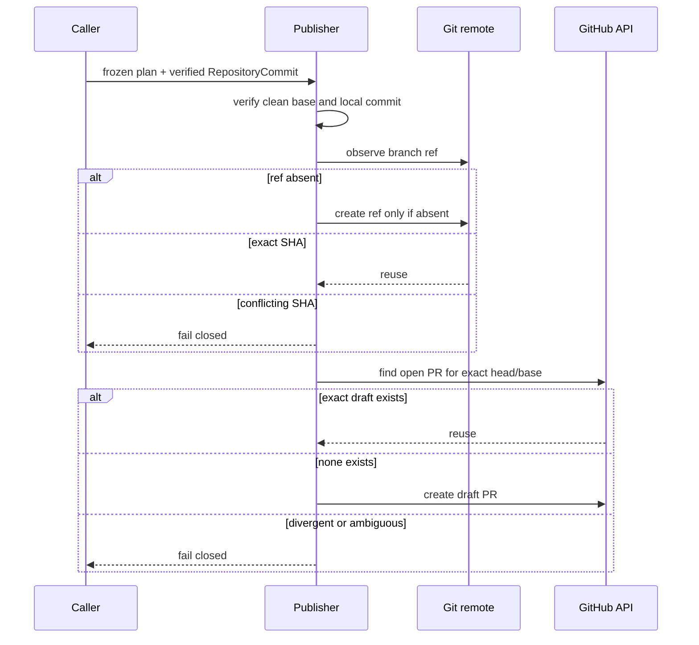
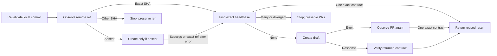

# 0023: Publishing one idempotent draft pull request

- **Date:** 2026-08-21
- **Status:** validated
- **Related phase:** Phase 5 — GitHub draft pull request
- **Feature commit:** `78ac3a8 feat: publish verified draft pull requests`

## Why

Entry 0022 produces a verified local branch without touching a remote. Publication
adds two irreversible boundaries: Git authentication can expose credentials, and a
retry can create a duplicate pull request or overwrite someone else's branch.
KubeFit must publish the exact verified commit without force-updating a conflicting
ref, then map that branch to one draft review contract.

An API timeout is ambiguous: GitHub may have accepted a request even though the
caller did not receive the response. The workflow therefore needs observation and
reuse at each boundary rather than compensating deletion.

## Success criteria

- Revalidate the clean local base, immutable plan, local branch, and commit SHA.
- Accept only credential-free GitHub remote URLs whose owner/repository identity is
  explicit and matches the API target.
- Create an absent remote branch with compare-and-swap semantics.
- Reuse a remote branch only when it already points to the verified commit.
- Never force-update or delete a colliding remote branch.
- Reuse one open pull request only when base, head, title, body, and draft state all
  match the plan; reject ambiguous or divergent matches.
- Create new pull requests as drafts and never merge them.
- Keep tokens out of Git commands, process arguments, models, logs, and exceptions.
- Make a retry converge after either the push or API call succeeded.

## Planned publication boundary



## Non-goals

- Merge, approve, mark ready, or deploy the pull request.
- Rewrite or delete any existing remote branch.
- Store a GitHub token or inject it into a Git remote URL.
- Support arbitrary Git hosts in this MVP slice.
- Automatically remove a branch after an ambiguous API failure.

## What changed

`publish_pull_request` accepts the frozen plan and `RepositoryCommit` from the two
preceding stages. Before network access it repeats every local trust check: exact
top-level and clean checkout, unchanged base branch and SHA, unchanged source bytes,
one verified local branch commit, one path, file mode, blob, and subject.

The result is a credential-free handoff suitable for display or a later CLI:

```text
PublishedPullRequest
├── GitHub owner/repository
├── remote and branch
├── verified commit SHA
├── branch_reused: true | false
├── pull request number and URL
└── pull_request_reused: true | false
```

The production adapters support public GitHub HTTPS/SSH remotes and GitHub REST.
Tests inject protocol-compatible in-memory boundaries, so policy behavior does not
require network credentials.

## How

Remote publication is a sequence of observations and conditional creates:



The Git push source is the verified 40-character commit SHA, not a checked-out
branch. Its destination uses an absent-ref lease. A concurrent publisher can create
the ref first, but cannot cause this operation to overwrite it. After any push
error, KubeFit reads the ref again and accepts only the intended SHA.

GitHub lookup includes exact owner, head branch, and base branch. Reuse additionally
requires open state, draft state, title, body, and canonical repository PR URL to
match. An API creation error triggers one observation; a successfully accepted but
lost response therefore completes without a duplicate.

| Option | Benefit | Cost or risk | Decision |
|---|---|---|---|
| Plain push | Familiar | Race can update an existing ref | Rejected |
| Force push | Easy convergence | Overwrites reviewer or developer work | Rejected |
| Absent-ref lease | Atomic creation without overwrite | Requires observing exact SHA | Selected |
| Delete branch after API failure | Looks transactional | May delete successfully published state | Rejected |
| Observe and retry | Handles ambiguous network results | Leaves an orphan ref until retry | Selected |

## Problems encountered

The first real bare-repository test expected a second absent-ref-lease push of the
same SHA to fail. Git instead reports it as up to date because no ref update is
needed. The safety claim is not “every second command fails”; it is “a different SHA
cannot replace the existing ref.” The test was corrected to attempt the base SHA,
which Git rejects under the empty expected lease. Higher-level policy still avoids
the second push by observing and reusing an identical ref.

This distinction matters because a test can pass or fail for a Git optimization
rather than the concurrency property it intends to prove.

## Evidence

```text
pytest: 248 passed, 1 external Starlette/httpx2 deprecation warning
Ruff: all checks passed
git diff --check: clean
publication boundary: 19 scenarios passed without external network access
repository + publication boundary: 28 scenarios passed
```

Coverage includes first publication, full retry, lost push response, API failure
before creation, lost successful API response, branch collision, edited non-draft
PR, duplicate open PRs, altered local handoff, credentialed/non-GitHub remote URLs,
real bare-remote compare-and-swap behavior, token header isolation, and token-safe
HTTP errors.

## Decision and limitations

The evidence supports safe, idempotent publication policy and the concrete Git/GitHub
protocol boundaries. No real GitHub repository was mutated, so this does not yet
prove live permissions, repository rulesets, or organization policies. The feature
also has no CLI command yet.

Remote rollback is deliberately absent. If GitHub is unavailable after push, the
verified branch can remain without a PR and a later retry will reuse it. Git
authentication must come from an existing credential helper or SSH agent; the API
token is caller-supplied in memory and is not persisted by this layer.

## Next question

Can this publisher be exposed through the CLI without letting credentials enter
shell history or persisted artifacts?
