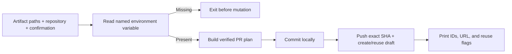
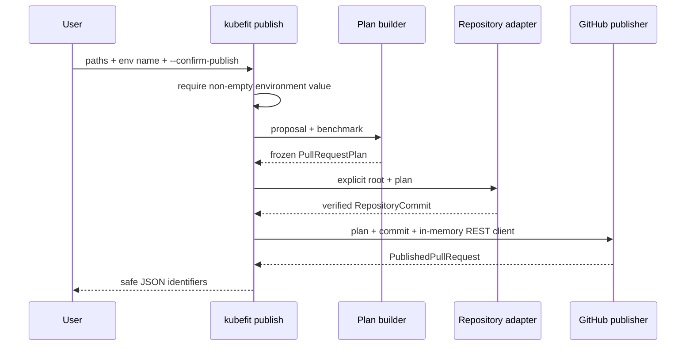

# 0024: Exposing publication without exposing credentials

- **Date:** 2026-08-21
- **Status:** validated
- **Related phase:** Phase 5 — GitHub draft pull request
- **Feature commit:** `69b6e83 feat: expose verified publication CLI`

## Why

The publication library is safe only if its caller preserves the same boundaries.
Accepting a token as a command-line value can place it in shell history and process
listings. Publishing without an explicit acknowledgement also makes a command that
looks analytical perform an external mutation unexpectedly.

The CLI must connect immutable proposal and benchmark evidence to local commit and
GitHub publication without weakening artifact validation, hiding partial success,
or emitting credentials in JSON and errors.

## Success criteria

- Require proposal, benchmark, repository root, and explicit publish acknowledgement.
- Accept only an environment variable *name* on the command line; read its token
  value from the process environment.
- Reject a missing/blank token before creating a local branch or contacting GitHub.
- Compose plan → transactional local commit → idempotent remote publication without
  duplicating their validation logic.
- Emit compact JSON containing review identifiers and reuse state, never PR body,
  before/after YAML, or token material.
- Redact the token if an allowed boundary exception unexpectedly contains it.
- Keep merge, approval, deployment, and credential persistence outside the command.

## Planned command boundary



## Non-goals

- Accept a literal token flag or write the token to a config file.
- Prompt interactively, launch a browser, or implement OAuth device flow.
- Merge, approve, mark ready, delete branches, or trigger a deployment.
- Claim live GitHub validation before a disposable repository test exists.

## What changed

`kubefit publish` accepts the immutable proposal and benchmark directories, explicit
repository root, Git remote name, environment variable name, and required
`--confirm-publish` acknowledgement. There is deliberately no token-value option.

The command returns one compact machine-readable handoff:

```json
{
  "repository": "owner/repository",
  "remote": "origin",
  "branch": "kubefit/default-demo-12345678",
  "commit_sha": "<verified 40-character SHA>",
  "branch_reused": false,
  "pull_request_number": 42,
  "pull_request_url": "https://github.com/owner/repository/pull/42",
  "pull_request_reused": false,
  "draft": true
}
```

It omits token material, PR body, manifest bytes, and benchmark details already
contained in the review contract.

## How

The CLI validates the token boundary before any artifact or Git operation, then
delegates rather than reimplementing trust checks:



The environment variable name must match a conservative shell identifier pattern.
On an adapter exception, the CLI replaces every occurrence of the in-memory token
before converting the error to `SystemExit`; exception chaining is suppressed so a
traceback cannot reintroduce the original message during normal CLI use.

| Option | Benefit | Cost or risk | Decision |
|---|---|---|---|
| Literal `--token` | Easy discovery | Shell history and process arguments | Rejected |
| Token file path | Works with mounted secrets | File permissions and lifecycle enter scope | Deferred |
| Environment variable value | Common CI/secret-manager handoff | Process environment can still be inspected | Selected |
| Interactive prompt | Avoids history | Blocks automation and complicates retries | Deferred |
| Publish without acknowledgement | Shorter command | External mutation is easy to trigger accidentally | Rejected |

## Problems encountered

The first edit inserted `_run_publish` at a syntactically valid closing parenthesis
inside `_run_propose`, moving the latter half of proposal creation into the new
function. Inspecting the edited region before tests exposed the misplaced boundary.
The proposal block was restored intact and `_run_publish` moved after it.

This was a structural editing error rather than a design error. Targeted CLI tests
then covered both proposal behavior and the new publication path, and the full suite
confirmed the existing command was not regressed.

## Evidence

```text
pytest: 253 passed, 1 external Starlette/httpx2 deprecation warning
Ruff: all checks passed
git diff --check: clean
publish CLI: 5 new tests passed
```

The tests prove required acknowledgement, strict environment-variable naming,
missing-token failure before planning, exact stage composition and safe JSON, and
defensive token redaction from an injected boundary error. Publication behavior
continues to be covered separately by the 19 no-network scenarios from entry 0023.

## Decision and limitations

The CLI now exposes the entire evidence-to-Draft-PR path while keeping literal
credentials out of its interface and output. Environment variables reduce accidental
shell-history and process-argument exposure but are not a general secret vault;
callers remain responsible for supplying and clearing a least-privilege token.

No live GitHub repository was changed during validation. GitHub permission scopes,
organization rulesets, SSO, credential-helper behavior, and cleanup instructions
still need a disposable-repository demonstration before Phase 5 is complete.

## Next question

Can a disposable GitHub repository demonstrate the full command with least-privilege
permissions and leave an auditable cleanup procedure?
