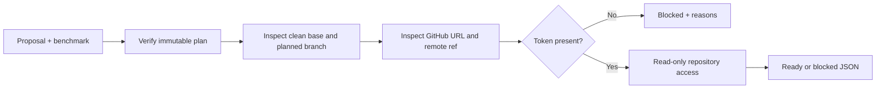
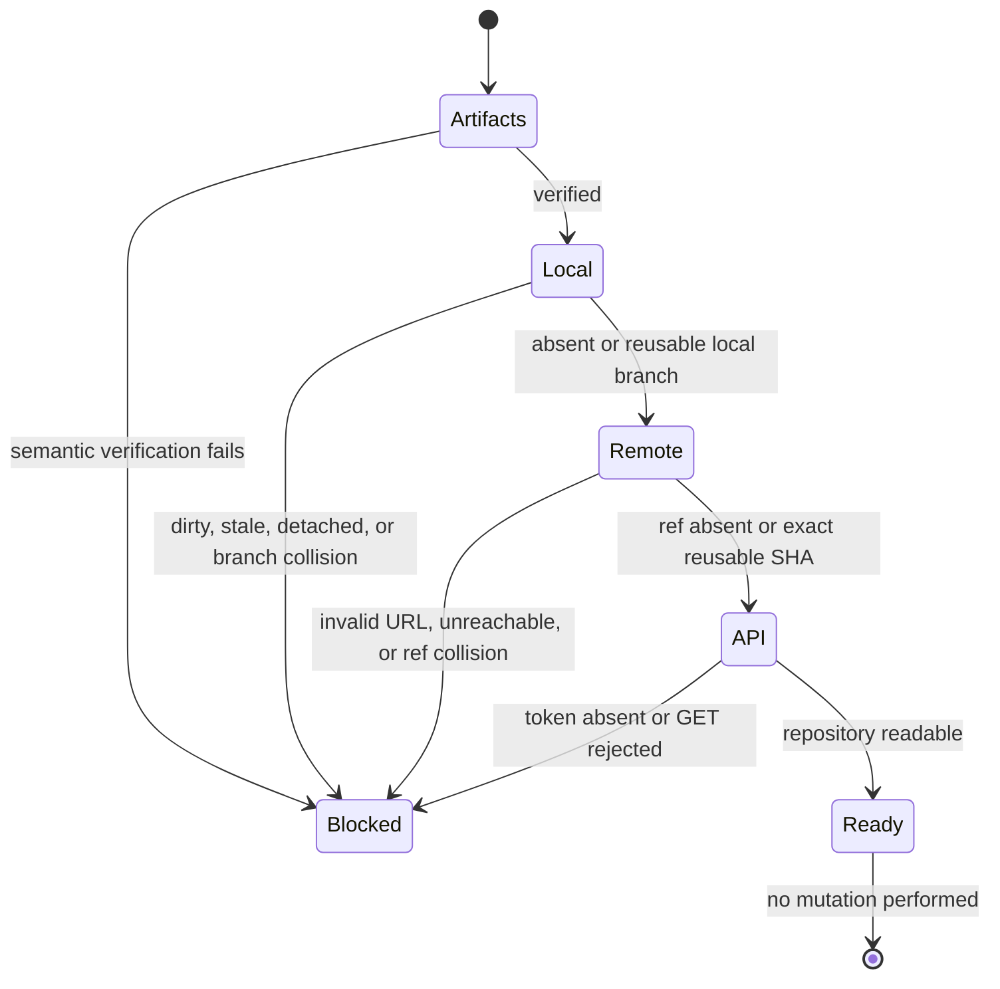

# 0025: Making live publication blockers observable

- **Date:** 2026-08-21
- **Status:** validated
- **Related phase:** Phase 5 — GitHub draft pull request
- **Feature commit:** `cfab885 feat: add read-only publication preflight`

## Why

The first live-readiness inspection found that `origin` points to the real KubeFit
repository, no disposable target is configured, the active GitHub CLI credential is
invalid, and `GITHUB_TOKEN` is unset. Attempting publication would either fail after
creating local state or mutate the wrong repository.

These are expected operational blockers, not reasons to guess or weaken safety. A
read-only command should explain whether immutable evidence, local Git state, remote
branch state, and API authentication are ready before the mutation command runs.

## Success criteria

- Reuse semantic proposal/benchmark verification without creating a branch.
- Inspect the repository root, clean state, source bytes, current base, and any
  deterministic local branch without changing HEAD, index, or files.
- Derive the GitHub repository from a credential-free remote and inspect the remote
  branch without pushing.
- Report token absence before attempting the GitHub API; if present, make only a
  read-only repository-access request.
- Distinguish `ready` from `blocked` and include actionable reasons in JSON.
- Never print the token, create a commit/ref/PR, or modify local/remote state.
- Avoid claiming write permission from a successful read-only API check.

## Planned diagnostic flow



## Non-goals

- Create a local commit, push a branch, or open a pull request.
- Repair GitHub authentication or create a disposable repository automatically.
- Infer effective write permission from repository readability.
- Store credentials or include token values in diagnostics.

## What changed

`kubefit publish-check` accepts the same artifact paths, repository root, remote,
and token environment-variable name as publication, but has no confirmation flag
because it performs no mutation. It emits a versioned JSON report containing four
ordered checks:

```text
publish-check
├── artifacts: immutable proposal/result relationship
├── local_repository: base, path, and absent/reusable branch
├── git_remote: GitHub identity and absent/reusable/collision ref
└── github_api: token presence and read-only repository access
    ├── blockers[]
    ├── warnings[]
    └── mutation_performed: false
```

Unsafe remote names are now rejected by both `publish` and `publish-check` during
argument parsing. This moves failure ahead of local commit creation in the mutating
command as well.

## How

`inspect_repository_plan` reuses the repository adapter's existing validation
primitives but stops before branch creation. If the deterministic local branch
already exists, it validates its single parent, path, mode, blob, and subject and
reports the SHA as reusable. Tests snapshot HEAD, status, and source bytes before
and after both absent and reusable inspection.



The remote classification is conservative. A remote ref is reusable only when a
fully verified local commit exists at the same SHA. If a ref exists while the local
branch is absent, preflight cannot prove its contents and reports a collision.

The GitHub REST check parses repository identity, default branch, visibility, and
reported permission booleans. Even a `ready` report includes a warning that GET
success does not prove write access.

| Option | Benefit | Cost or risk | Decision |
|---|---|---|---|
| Try publish and report failure | Tests real permission | Can leave a local/remote branch | Rejected for diagnosis |
| Check only token presence | No network | Misses expired or wrong-repository credentials | Rejected |
| Read-only Git remote + API checks | Finds identity, connectivity, and authentication blockers | Cannot prove write policies | Selected |
| Automatically create a test repository | Fast setup | Expands external mutation and cleanup scope | Rejected |

## Problems encountered

The live-readiness inspection produced three independent facts: `origin` targets
`sangmu1126/kubefit`, the configured `gh` account is active but its token is invalid,
and `GITHUB_TOKEN` is unset. Because the target is not documented as disposable,
the live mutation was stopped rather than treating a failed credential as the only
problem.

During implementation, the first patch assumed a typing import that did not exist
in the repository module and failed without changing files. The patch was narrowed
to the actual import block and reapplied. As in entry 0024, the CLI insertion region
was inspected immediately to ensure existing command functions remained intact.

## Evidence

```text
pytest: 259 passed, 1 external Starlette/httpx2 deprecation warning
Ruff: all checks passed
git diff --check: clean
new preflight coverage: 6 tests passed
live inspection: no Git commit, push, PR, or authentication change performed
```

The tests cover mutation-free absent/reusable local inspection, read-only repository
response parsing, missing-token blocker output, ready output with a write-permission
warning, artifact failure short-circuit with token redaction, and unsafe remote-name
rejection for both commands.

## Decision and limitations

The command makes technical publication blockers observable before mutation and is
safe to run repeatedly. It does not repair authentication, create a disposable
repository, or prove effective write permissions. The caller must still confirm
that the selected repository is intentionally safe for a live demonstration.

No external state changed in this entry. The observed invalid `gh` credential was
not logged out or replaced because authentication changes require the user's secret
and explicit account flow.

## Next question

After authentication and a disposable repository are prepared, does one live run
create a Draft PR and does the second run reuse it without changing either ref?
