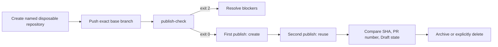
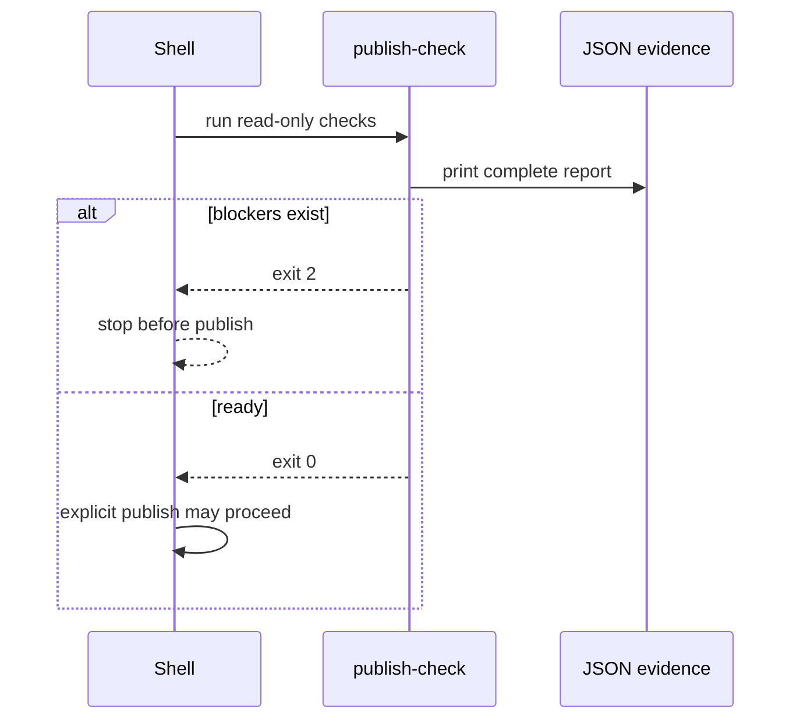

# 0026: Turning live publication into a reproducible experiment

- **Date:** 2026-08-21
- **Status:** validated
- **Related phase:** Phase 5 — GitHub draft pull request
- **Feature commit:** `c65b348 feat: enforce publication preflight status`

## Why

Entry 0025 explains blockers in JSON, but a blocked report currently exits with code
zero. A shell pipeline can therefore proceed to publication unless it parses JSON
correctly. The live demonstration also needs an explicit target lifecycle and
evidence checklist; “run it on GitHub” is not reproducible or safely scoped.

The next contract must let automation stop on preflight failure and show exactly how
to prove first-run creation and second-run idempotent reuse in a disposable repository
without treating the real KubeFit remote as a test target.

## Success criteria

- Exit zero only when every preflight blocker is absent.
- Emit the complete blocked JSON before exiting with a stable nonzero code.
- Preserve normal argparse and publication error behavior.
- Test ready, missing-token, and invalid-artifact exit behavior through `main`.
- Document explicit disposable repository identity and base synchronization.
- Record exact preflight, first publish, second publish, remote-ref, and Draft PR
  evidence to capture.
- Prefer preservation/archive for review; make deletion an explicit optional action.
- Do not create, archive, delete, push to, or authenticate any GitHub repository in
  this entry.

## Planned experiment



## Non-goals

- Run the live experiment without valid user authentication.
- Use `origin` implicitly or infer that a repository is disposable from its name.
- Automatically delete external evidence.
- Claim a successful live demonstration from mocked or local-only tests.

## What changed

`kubefit publish-check` now returns a boolean readiness result internally. The CLI
prints the complete report in both cases, returns normally for `ready`, and raises
`SystemExit(2)` for `blocked`. This gives shell automation a fail-closed gate without
removing the structured diagnosis needed by humans.

The new [live GitHub runbook](../live-github-demo.md) defines an explicit private
disposable repository, non-`origin` remote, exact base push, preflight gate, two
publication runs, independent remote/PR verification, evidence file set, and
archive-first cleanup.

## How



The runbook keeps evidence outside the Git top-level because even an untracked JSON
file would intentionally make KubeFit's repository check fail. It seeds only the
explicit `main` ref instead of asking `gh repo create --push` to decide which local
refs belong in the target.

Two publication outputs must agree on commit SHA and PR number. Independent
`git ls-remote` and `gh pr view` evidence must also prove the branch SHA, open Draft
state, head/base names, and exactly one changed file.

| Option | Benefit | Cost or risk | Decision |
|---|---|---|---|
| Blocked JSON with exit 0 | Easy interactive use | CI can continue accidentally | Rejected |
| Blocked JSON then exit 2 | Human-readable and machine-enforceable | Shares code with argparse errors | Selected |
| Use current `origin` | No setup | Risks changing the real project | Rejected |
| Auto-delete after test | Leaves no remote | Erases review evidence and is irreversible | Rejected |
| Archive by default | Preserves auditable evidence | Repository remains allocated | Selected |

## Problems encountered

The readiness implementation was semantically correct for a person reading JSON but
unsafe as a shell gate because every valid invocation returned zero. The fix keeps
the output contract and changes only process status. Existing blocked tests were
updated to assert both the JSON and exact exit code, while the ready test proves no
exception is raised.

The runbook also exposed a less obvious cleanliness trap: writing captured evidence
under `.kubefit/` would create untracked files and correctly block the repository
adapter. Evidence is therefore created under a unique system temporary directory and
can be copied after the experiment.

The first HTTPS-or-SSH `case` example split the alternative pattern after `|` and
failed `bash -n`. Keeping both patterns on the same case line fixed the grammar. All
Bash fences were concatenated and syntax-checked without executing their commands.

## Evidence

```text
pytest: 259 passed, 1 external Starlette/httpx2 deprecation warning
Ruff: all checks passed
git diff --check: clean
publish-check ready: exit 0
publish-check blocked: complete JSON followed by exit 2
GitHub CLI command syntax: verified against installed gh help
Bash command fences: bash -n passed without execution
external mutations performed: 0
```

## Decision and limitations

The preflight is now suitable as a machine gate, and the live experiment has an
auditable, archive-first procedure. Exit code 2 also represents argparse usage
errors, so automation should use the presence of JSON when it must distinguish a
blocked diagnostic from invalid arguments.

The runbook has not been executed because authentication remains invalid and no
disposable repository has been authorized. Its commands intentionally remain manual;
repository creation, archiving, and deletion require explicit user action at the
external boundary.

## Next question

Can the authenticated two-run experiment be executed and its immutable evidence
captured without discovering organization-specific permission surprises?
