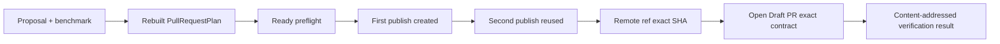
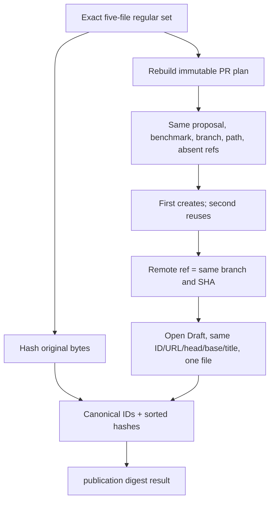

# 0027: Verifying live publication evidence as one contract

- **Date:** 2026-08-21
- **Status:** validated
- **Related phase:** Phase 5 — GitHub draft pull request
- **Feature commit:** `2418372 feat: verify live publication evidence`

## Why

The live runbook captures five files and checks them with individual shell
assertions. Those checks prove important facts, but they do not yet produce one
content-addressed result or rebind the GitHub evidence to the immutable proposal and
benchmark. Files can also be omitted, added, replaced by symlinks, or mixed between
two demonstrations.

A local verifier should treat the directory as an exact evidence bundle, rebuild the
pull request plan from its source artifacts, and prove all identifiers and states
agree without contacting GitHub or modifying Git.

## Success criteria

- Require exactly the five runbook evidence filenames as regular non-symlink files.
- Rebuild and semantically verify the proposal/benchmark pull request plan.
- Require a ready, mutation-free preflight referencing the same artifacts and branch.
- Require first-run creation flags and second-run reuse flags.
- Require repository, remote, branch, commit SHA, PR number, and URL to match across
  both publication outputs.
- Parse the remote ref as the exact planned branch at the published SHA.
- Require one open Draft PR with the same number, URL, head branch/SHA, base branch,
  title, and one changed file.
- Hash every evidence file and derive a deterministic verification ID.
- Reject malformed, missing, additional, stale, or symlinked evidence without
  network access or mutation.

## Planned trust chain



## Non-goals

- Fetch missing evidence from GitHub.
- Replace the live run or claim that local fixtures are live proof.
- Persist credentials, merge the PR, or clean up the repository.
- Accept partial directories or silently ignore unrelated files.

## What changed

`kubefit verify-publication` accepts the immutable proposal, immutable benchmark,
and one evidence directory. It performs no Git or network operation. Success prints
a frozen result containing artifact IDs, GitHub identity, base/head, commit SHA, PR
identity, every input SHA-256, and a deterministic verification ID.

```text
VerifiedPublicationEvidence
├── verification_id: publication-<32 hex>
├── proposal_id + benchmark_id
├── repository + remote + base/head branch
├── commit SHA + PR number/URL
└── evidence_sha256
    ├── preflight.json
    ├── first-publish.json
    ├── second-publish.json
    ├── remote-ref.txt
    └── github-pr.json
```

## How

The loader first compares directory names as an exact set, then rejects symlinked or
non-regular entries before reading bytes. JSON models forbid additional fields for
the stable CLI/GitHub outputs. Preflight checks must appear once in the expected
dependency order and all be ready.



The verification ID hashes canonical JSON containing the proposal ID, benchmark ID,
and sorted filename-to-SHA map. It is stable across repeated verification of the
same bytes and changes when any captured file changes.

| Option | Benefit | Cost or risk | Decision |
|---|---|---|---|
| Keep independent `jq` assertions only | Easy to inspect | No single durable identity | Insufficient alone |
| Ignore extra evidence files | Flexible notes | Mixed-run files can hide in the bundle | Rejected |
| Exact set plus cross-file checks | Strong reproducibility | Notes must live outside | Selected |
| Fetch GitHub again during verification | Fresh state | No longer offline or immutable | Rejected |

## Problems encountered

Ruff found one import-block formatting issue after the first successful test run. Its
safe mechanical fix changed no behavior, and targeted tests plus diff checks were
rerun.

Exact-set validation creates an important output rule: redirecting the verifier's
own result inside the evidence directory would create a sixth file before the
process reads the directory and correctly fail verification. The runbook writes the
result to a sibling `*.verified.json` path instead.

## Evidence

```text
pytest: 266 passed, 1 external Starlette/httpx2 deprecation warning
Ruff: all checks passed
git diff --check: clean
publication evidence verifier: 7 scenarios passed
external Git/GitHub operations: 0
```

Tests prove deterministic success, CLI output, mixed-run SHA rejection, missing and
additional filename rejection, symlink rejection, and PR title/plan mismatch
rejection. Existing pull request plan tests also pass in the targeted trust-chain
run.

## Decision and limitations

KubeFit can now turn the future live run into one reproducible, content-addressed
verification result instead of a loose screenshot collection. Cryptographic hashes
prove the verified local bytes, not who captured them; reviewer trust still depends
on the documented live procedure and repository visibility.

No real evidence bundle exists yet because authentication and a disposable target
remain unavailable. Passing fixture evidence validates the algorithm, not the live
GitHub claim.

## Next question

Can the first authenticated run produce a bundle that passes this verifier unchanged?
