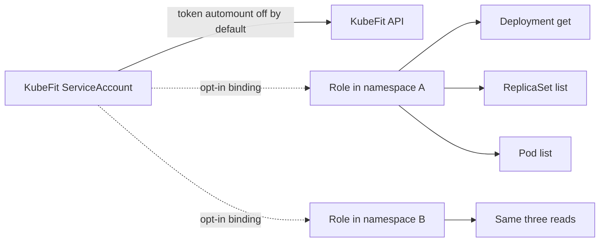
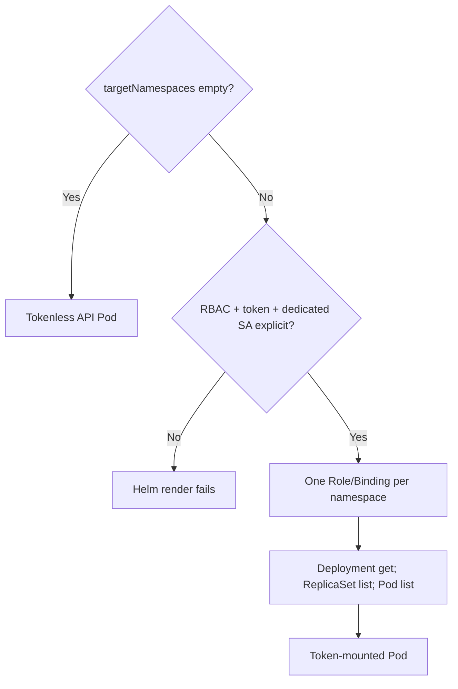

# 0028: Packaging KubeFit without granting controller privileges

- **Date:** 2026-08-21
- **Status:** validated
- **Related phase:** Phase 6 — presentation layer and packaging
- **Feature commit:** `2087026 feat: package API with least-privilege Helm chart`

## Why

The repository promises a Helm chart but currently contains only the demo workload
and local Prometheus bootstrap. Packaging the API carelessly could run it as root,
mount a Kubernetes token it does not use, or grant cluster-wide access in anticipation
of future controller behavior that is outside the MVP.

The package must reflect current behavior honestly: the HTTP API is stateless and
does not collect cluster data itself. Observation RBAC should be opt-in, read-only,
and restricted to explicitly named namespaces for a future in-cluster collector.

## Success criteria

- Build a reproducible Python API image from the project package.
- Run as a numeric non-root user with no privilege escalation or Linux capabilities.
- Render a Deployment, ClusterIP Service, and dedicated ServiceAccount by default.
- Disable service account token automount by default.
- Create no RBAC when no target namespace is configured.
- When targets are explicit, create only namespace Roles and RoleBindings.
- Permit only Deployment `get`, ReplicaSet `list`, and Pod `list`.
- Never render ClusterRole, Secret access, watch, or write verbs.
- Make probes and CPU/memory resources explicit.
- Validate chart linting, default security context, and multi-namespace RBAC rendering.

## Planned permission shape



## Non-goals

- Deploy an in-cluster reconciler or mutate workloads.
- Grant cluster-wide discovery, events, logs, Secrets, or ConfigMaps.
- Package Prometheus as a dependency of the KubeFit chart.
- Publish the container image or chart to an external registry.
- Claim the image has been built in CI before that pipeline exists.

## What changed

KubeFit now has a two-stage Python image and an application Helm chart. The default
render contains exactly a dedicated ServiceAccount, ClusterIP Service, and Deployment.
It mounts no Kubernetes token and creates no RBAC resources.

```text
Default release
├── ServiceAccount (automount: false)
├── Service (ClusterIP)
└── Deployment
    ├── UID/GID 10001
    ├── read-only root + writable emptyDir /tmp
    ├── RuntimeDefault seccomp + drop ALL
    ├── liveness/readiness /healthz
    └── explicit requests/limits
```

Supplying target namespaces together with explicit token opt-in adds one Role and
RoleBinding per namespace. A values schema validates namespace syntax and common
types. Template guards reject incomplete or accidentally shared service account
configurations.

## How



The Docker builder creates a wheel from the same `pyproject.toml` used locally. The
runtime installs only wheels and starts uvicorn as numeric user `10001`. Tests inspect
the Dockerfile boundary without claiming an image build.

The RBAC rules mirror the exact kubectl operations in `KubectlDeploymentCollector`:
one named Deployment `get`, label-selected ReplicaSet `list`, and label-selected Pod
`list`. Kubernetes RBAC cannot restrict `list` by the runtime label selector, so the
namespace is the smallest enforceable scope.

| Option | Benefit | Cost or risk | Decision |
|---|---|---|---|
| ClusterRole for all namespaces | Easy onboarding | Excess visibility and broad blast radius | Rejected |
| Namespace Roles from explicit list | Least enforceable scope | One binding per namespace | Selected |
| Token mounted by default | Collector-ready | Current API receives unused credentials | Rejected |
| No prepared RBAC at all | Smallest chart | Permission design remains invisible | Rejected |
| Optional RBAC with fail-fast guards | Reviewable and dormant by default | Extra values coupling | Selected |

## Problems encountered

The first invalid-namespace test expected Helm to print a dotted schema path. The
installed Helm version reports JSON Pointer form (`/rbac/targetNamespaces/0`). The
schema correctly rejected the value; the test was changed to assert the actual stable
path rather than an assumed formatter.

Ruff also mechanically reordered the new test imports. More importantly, Docker
reported `unavailable`, so no image pull or build was attempted. This prevents a
false claim that the Dockerfile has run successfully while preserving the rendered
Helm and static image-security evidence.

## Evidence

```text
pytest: 274 passed, 1 external Starlette/httpx2 deprecation warning
Helm chart tests: 8 passed
helm lint: 1 chart linted, 0 failed (icon recommendation only)
default render: ServiceAccount + Service + Deployment; no RBAC
two-target render: 2 Roles + 2 RoleBindings; no cluster-scoped RBAC
Ruff: all checks passed
git diff --check: clean
Docker build: not run; local daemon unavailable
```

## Decision and limitations

The chart is structurally ready for an API-only kind installation and makes any
future observation permission explicit and namespace-scoped. The current image/API
does not consume those permissions; observation commands remain operator-side CLI
workflows until an authenticated in-cluster endpoint is designed.

Actual Docker build, image load, Helm install, Pod security admission, and `/healthz`
probe evidence remain open. No image or chart was pushed to an external registry.

## Next question

Can the chart be installed in the disposable kind cluster and its health endpoint
verified without expanding its default permissions?
