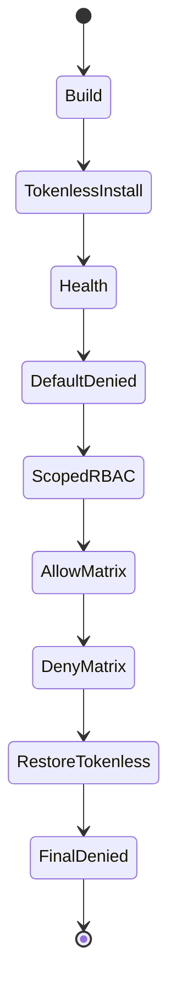
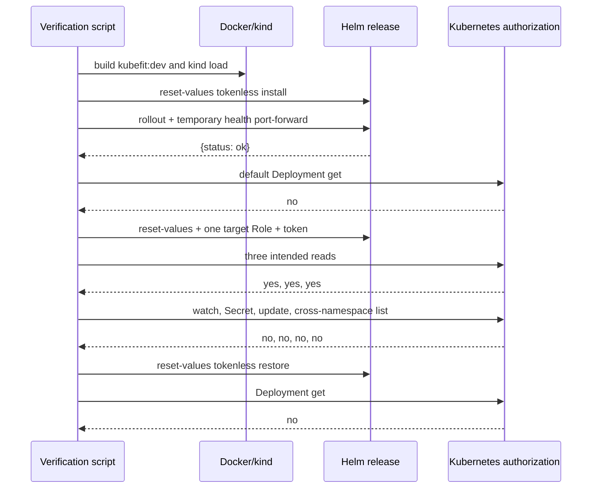

# 0029: Proving the packaged API in a disposable cluster

- **Date:** 2026-08-21
- **Status:** validated
- **Related phase:** Phase 6 — presentation layer and packaging
- **Feature commit:** `a602de1 feat: verify Helm package on kind`

## Why

Entry 0028 proves rendered YAML but not that the image builds, the Pod starts under
its hardened security context, the Service answers, or Kubernetes authorizes exactly
the intended reads. Static RBAC inspection can also miss a binding subject or
namespace error.

The local `kind-kubefit` cluster is explicitly disposable and already exists. A
repeatable integration script should install the default tokenless release, verify
health, temporarily enable observation RBAC, test both allowed and denied actions,
then restore the default release so validation does not leave expanded permissions.

## Success criteria

- Refuse any Kubernetes context not named `kind-*`.
- Build locally and load the image into the explicit kind cluster without registry
  publication.
- Install/upgrade the chart with token automount disabled and wait for rollout.
- Verify `/healthz` through a temporary port-forward with guaranteed cleanup.
- Prove the ServiceAccount cannot read the demo Deployment by default.
- Enable one explicit target namespace and prove only the three intended reads.
- Prove watch, Secret read, workload update, and another-namespace Pod list are denied.
- Restore tokenless/no-RBAC values on every success path and verify denial again.
- Record failures honestly and do not delete the cluster or Prometheus history.

## Planned state transitions



## Non-goals

- Push an image or chart to an external registry.
- Test a production cluster or non-kind context.
- Grant the API an in-cluster observation route it does not yet expose.
- Delete/recreate the cluster or disturb the persistent Prometheus installation.

## What changed

`verify-kubefit-chart.sh` turns the chart claims into one repeatable local experiment.
It validates dependencies, numeric health port, exact kind cluster existence, and
never changes the ambient kubectl context. Helm uses `--reset-values` at every
transition so a prior release cannot silently retain expanded settings.

The release name is passed as `fullnameOverride`, making the Deployment, Service,
and ServiceAccount identity stable even when the operator selects a non-default
release name.

## How



| Check | Expected | Observed |
|---|---|---|
| Image build and kind load | Local success, no push | Passed |
| Deployment rollout | 1 ready replica | Passed |
| `/healthz` | `{"status":"ok"}` | Passed |
| Default Deployment get | denied | `no` |
| Target Deployment get | allowed | `yes` |
| Target ReplicaSet list | allowed | `yes` |
| Target Pod list | allowed | `yes` |
| Target Pod watch | denied | `no` |
| Target Secret get | denied | `no` |
| Target Deployment update | denied | `no` |
| Monitoring Pod list | denied | `no` |
| Final Deployment get | denied | `no` |

## Problems encountered

The first live execution successfully built and loaded the image, installed revision
1, rolled out the hardened Pod, and returned the health JSON. It then stopped on the
expected default denial: `kubectl auth can-i` prints `no` *and exits 1*, which the
initial `set -e` wrapper interpreted as command failure before comparing the text.

The fix accepts exit 0 or 1 as valid authorization answers, rejects larger exit
codes as kubectl errors, and still compares exact `yes`/`no` output. Because failure
occurred before scoped RBAC was enabled, revision 1 was already tokenless. The second
execution passed the complete matrix and restored tokenless revision 4.

The first independent final-state query also used invalid multi-resource `kubectl
get` syntax, causing `service` and `serviceaccount` to be interpreted as Deployment
names. It was read-only and changed nothing. Repeating it with comma-separated
resource types proved Deployment ready `1`, Service present, and ServiceAccount
automount `false`.

The health retry loop logs one initial connection refusal while port-forward starts,
then succeeds. This is expected readiness polling rather than an API failure.

## Evidence

```text
pytest: 277 passed, 1 external Starlette/httpx2 deprecation warning
integration-script tests: 3 passed
Helm chart tests: 8 passed
helm lint: 1 chart linted, 0 failed (icon recommendation only)
image build: passed (python:3.14-slim, kubefit:dev)
kind load: passed on kubefit-control-plane
Helm revisions: 2 tokenless -> 3 scoped RBAC -> 4 tokenless
health: {"status":"ok"}
RBAC allow/deny matrix: all 9 default/scoped/final checks matched
final ServiceAccount automount: false
final target Role/RoleBinding count: 0
final impersonated Deployment get: no
Ruff + Bash syntax + git diff --check: passed
```

## Decision and limitations

The evidence supports actual buildability, hardened Pod startup, Service routing,
namespace RBAC enforcement, negative authorization, and successful privilege
restoration in the disposable kind cluster. The local KubeFit release remains
installed tokenless; the demo workload and persistent Prometheus history were not
changed.

`kubectl auth can-i --as` proves Kubernetes authorization policy, not that the
current API consumes the token or calls those resources. The image/chart have not
been pushed, scanned, signed, or installed outside local kind.

## Next question

After packaging is proven, what is the smallest dashboard slice that visualizes
recommendation evidence without introducing a second analysis implementation?
