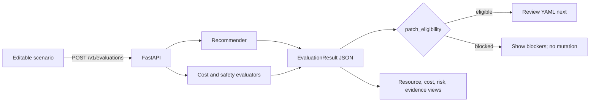

# 0030: Making the recommendation reviewable without duplicating it

- **Date:** 2026-08-21
- **Status:** validated
- **Related phase:** Phase 6 — presentation layer and packaging
- **Feature commit:** `6b7343c feat: visualize recommendation review`

## Why

KubeFit already produces deterministic evaluation JSON, but an API response does
not make its main product distinction obvious during a demonstration: a large cost
reduction is not permission to change a workload. A reviewer needs to see the
resource delta, cost model, evidence quality, runtime risk, and final GitOps gate in
one decision surface.

The main design risk was implementing a second recommendation algorithm in React.
That would let the CLI, API, and dashboard disagree and would turn a presentation
layer into an unverified policy engine. This slice therefore treats
`POST /v1/evaluations` as the only calculation authority.

## Success criteria

- Submit current resources, observed signals, and explicit prices to the existing
  evaluation endpoint.
- Present current/recommended requests and limits without recalculating them.
- Put `patch_eligibility` before the savings number in the visual hierarchy.
- Show evidence, safety checks, price source, and cost caveats.
- Provide both evidence-complete and evidence-insufficient demonstration inputs.
- Keep missing evidence visible as a blocked result, not a form validation failure.
- Build without an external font or image request and work at mobile width.
- Cover the empty, success, insufficient-input, and API-error interactions.

## What changed

The new `dashboard/` package is a React 19 and TypeScript application built with
Vite. It contains two editable scenarios and sends their complete payload to the
FastAPI evaluation endpoint through a same-origin development proxy. The result
view contains:

- an eligible/blocked GitOps decision banner;
- monthly request-cost comparison and two runtime risk summaries;
- proportional before/after bars for all four resource values;
- the API's three safety checks and complete recommendation evidence;
- the exact price source, billing horizon, and cost caveats.

The dashboard formats values but does not calculate recommendations, risk levels,
eligibility, or savings. Its fonts are local system stacks, so the page does not
silently depend on Google Fonts during an offline demonstration.

## How



The conclusion of this boundary is that every displayed decision comes back from
the same Python domain path used by the CLI; the browser owns input and rendering
only.

The screen order intentionally differs from a cost-only dashboard:

```text
┌──────────────────────────────────────────────────────────────┐
│ GitOps decision: eligible or blocked                         │
├──────────────────┬──────────────────┬────────────────────────┤
│ request savings  │ OOM risk         │ throttling risk        │
├──────────────────────────────────────────────────────────────┤
│ current vs recommended CPU/memory bars                       │
├──────────────────────────────┬───────────────────────────────┤
│ safety checks                │ recommendation evidence       │
├──────────────────────────────┴───────────────────────────────┤
│ price assumptions and caveats                                │
└──────────────────────────────────────────────────────────────┘
```

This layout makes the permission boundary the first answer, then explains the
economic and operational trade-off underneath it.

## Problems encountered

The first TypeScript build rejected `allowImportingTsExtensions` because the Node
configuration could emit files. Adding `noEmit` fixed the configuration boundary;
the generated artifacts from the failed attempt were removed and `*.tsbuildinfo`
was ignored.

Vitest 2 carried five development dependency advisories, including one critical
path traversal issue. Production dependencies audited clean, but the development
toolchain was still upgraded to Vitest 4.1.11. A repeated full audit then returned
zero vulnerabilities.

The first component test run exposed two test-harness errors: the accessible button
name included its arrow glyph, and automatic DOM cleanup was not active under this
Vitest configuration. The tests now query the user-visible name with a stable
pattern and perform explicit cleanup.

Most importantly, the real Vite-to-FastAPI request showed that Pydantic serializes
`Decimal` cost fields as JSON strings. The original mocked response used numbers,
so TypeScript accepted code that would call `toFixed` on a string in a browser. The
response contract now models decimal values as `number | string`, formatting
converts at the display boundary, and the fixture uses the real string form. This
is why the live proxy check remains necessary even with component tests.

Both local servers initially failed to bind inside the filesystem sandbox with
`EPERM`. They were rerun with explicit localhost permission, exercised, and stopped
normally. No cluster or external service was mutated.

## Evidence

```text
Python regression suite: 277 passed
Ruff: passed
TypeScript + Vite production build: passed
Dashboard component tests: 4 passed
npm audit (production and development): 0 vulnerabilities
Built assets: HTML 0.57 kB; CSS 7.67 kB; JS 205.12 kB
Vite page request: HTTP success with Korean dashboard document
Vite -> FastAPI proxy: POST /v1/evaluations 200 OK
Live recommendation: CPU 290m/580m, memory 896Mi/1344Mi
Live decision: eligible; OOM low; throttling low; request savings 68.1%
git diff --check: passed
```

The 68.1% figure is a deterministic example request-cost projection using the
explicit local-model assumptions. It is not a measured cloud-bill reduction.

## Decision and limitations

It is now safe to claim that a reviewer can exercise the existing evaluation API
and visually distinguish an actionable recommendation from a blocked one. The
screen also makes the source and limitations of its cost estimate inspectable.

This is a review playground, not yet a live cluster browser. It does not select a
Deployment, trigger collection, load an immutable analysis artifact, generate a
patch, or publish a PR. The production API image and Helm chart do not yet contain
the built frontend; local development currently runs Vite and FastAPI as separate
processes.

## Next question

What is the smallest secure packaging boundary that serves the immutable dashboard
build from the API image without granting the browser or Pod any new Kubernetes
permission?
