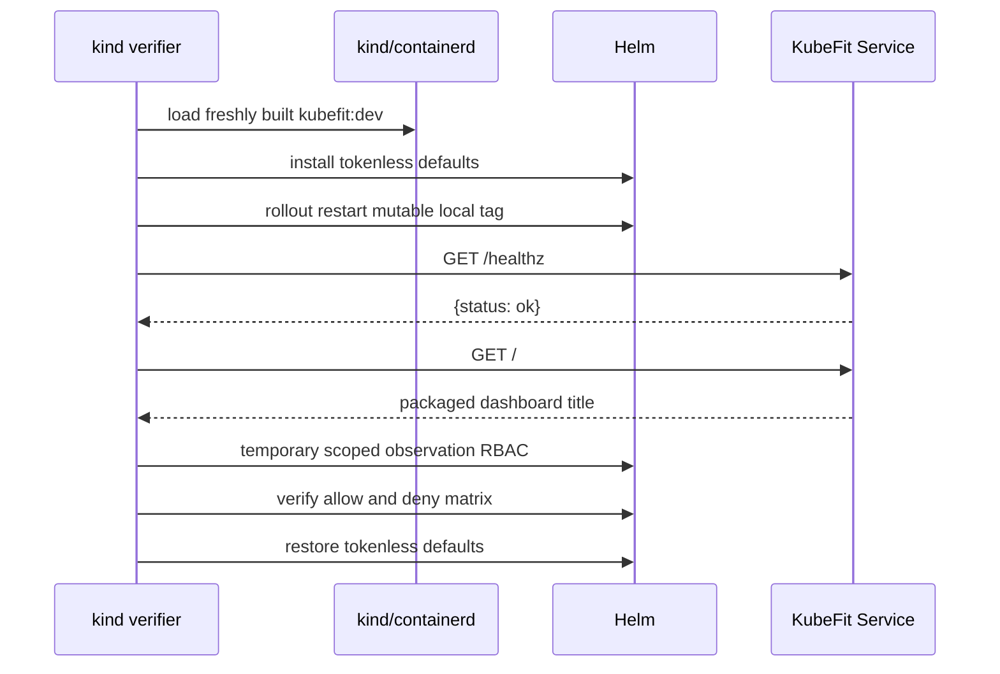

# 0031: Shipping one immutable API and dashboard image

- **Date:** 2026-08-21
- **Status:** validated
- **Related phase:** Phase 6 — presentation layer and packaging
- **Feature commit:** `52c5042 feat: package dashboard with API image`

## Why

Entry 0030 required two development processes: Vite on port 5173 and FastAPI on
port 8000. That is useful for editing but weak as a Helm demonstration contract.
The chart could install a healthy API while the visible product remained outside
the image, depended on a separate server, and was not covered by the cluster proof.

The smallest secure packaging boundary is one immutable image. The browser should
download static files from the same origin as `/v1`, while the Pod keeps its current
non-root, read-only, tokenless defaults. Serving a dashboard must not imply new
Kubernetes reads or introduce a second backend process.

## Success criteria

- Build the locked dashboard in a dedicated Node stage.
- Run no Node runtime or package manager in the final image.
- Copy only `dist/` into the existing Python runtime image.
- Serve `/` and `/assets/*` without shadowing `/v1`, `/healthz`, or `/docs`.
- Fail application startup when a configured dashboard is incomplete.
- Preserve source-mode API behavior when no packaged directory is configured.
- Start as UID/GID 10001 with a read-only root filesystem.
- Verify the dashboard through the Helm Service, then restore tokenless RBAC.

## What changed

The Dockerfile now has three stages:

1. `dashboard-builder` installs the exact npm lockfile with lifecycle scripts
   disabled and produces the Vite bundle;
2. `builder` creates the KubeFit wheel and all Python dependency wheels;
3. `runtime` installs only from that wheelhouse and receives only dashboard
   `dist/` under `/opt/kubefit/dashboard`.

The runtime contains no Node installation or frontend source. FastAPI uses an app
factory so tests can explicitly provide a temporary dashboard. In the image,
`KUBEFIT_DASHBOARD_DIRECTORY` activates one root HTML route and one static asset
mount. Missing `index.html` or `assets/` raises during import instead of producing a
partially healthy package.

## How

```mermaid
flowchart TB
    L1[package-lock.json] --> N[npm ci --ignore-scripts]
    S1[React + TypeScript source] --> B[Vite build]
    N --> B
    B --> D[dist only]

    P[Python packages] --> W[wheelhouse]
    W --> R[Python slim runtime]
    D --> R

    R --> U[uvicorn as 10001:10001]
    U --> H[/healthz and /v1]
    U --> I[/ index.html]
    U --> A[/assets hashed files]
```

The conclusion is that build tools and source code terminate at their builder
stages. The deployed process remains the existing Uvicorn/FastAPI process and reads
only immutable files.



The forced restart is limited to this disposable-kind verifier. Production images
should use immutable tags or digests and normal GitOps rollout semantics.

## Problems encountered

The first Docker build transferred an 89 MB context because the existing root-level
ignore names did not make the nested dashboard exclusion explicit. Adding
`**/node_modules`, `**/dist`, and `**/*.tsbuildinfo` reduced the subsequent
incremental context transfer to 4.43 kB and prevents local generated files from
entering the build context.

The first kind run built and loaded the new image, upgraded the tokenless Helm
release, and passed `/healthz`, but `/` returned 404. The Pod was still running the
previous API-only image. Reusing the mutable `kubefit:dev` tag did not change the
Deployment Pod template, so Helm correctly performed no rollout even though kind's
local tag had changed.

The verifier now explicitly restarts the Deployment immediately after the default
tokenless installation. The second run replaced the Pod, found the dashboard title,
passed the full authorization matrix, and restored tokenless revision 8. The first
failure happened before enabling observation RBAC, so it did not leave expanded
permissions.

Docker logs also showed the runtime `pip install` contacting the package index even
though the builder had prepared a complete wheelhouse. The final install now uses
`--no-index --find-links=/wheels`; a clean rebuilt layer resolved every package from
local wheels. Network remains necessary in the builder stages, not the final
assembly stage.

Local port binding initially required explicit sandbox permission. All temporary
containers used `--rm`, were stopped normally, and exposed only loopback ports.

## Evidence

```text
Python suite: 283 passed, 1 external Starlette/httpx2 warning
Dashboard tests: 4 passed
Ruff, Vite build, Helm lint, Bash syntax, diff check: passed
npm ci audit during image build: 0 vulnerabilities
Dashboard bundle: HTML 0.57 kB, CSS 7.67 kB, JS 205.12 kB
Docker runtime install: --no-index, every dependency resolved from /wheels
Final container: UID/GID 10001, read-only rootfs, /healthz 200, / 200
Static JavaScript: 200, text/javascript, 205118 bytes
Evaluation through packaged container: 200, insufficient evidence -> blocked
kind Helm revisions: 6 tokenless -> 7 scoped -> 8 tokenless
kind Service dashboard title: verified
RBAC allow/deny matrix: all checks matched
final Deployment get as ServiceAccount: no
```

## Decision and limitations

It is now safe to claim that the local Helm package installs one hardened image
containing both the API and review dashboard, and that the UI is available without
CORS or a second server. Adding static files did not add a ServiceAccount token or
new RBAC resources.

The image and chart are still local artifacts. They have not been pushed, scanned,
signed, assigned an SBOM/provenance attestation, or installed outside disposable
kind. Base image tags are resolved to digests during each build but are not yet
pinned in source. The dashboard still evaluates editable examples rather than
selecting or collecting a live Deployment.

## Next question

Before external publication, which supply-chain evidence—image scan, SBOM, digest
pinning, and signature—is the smallest credible next slice for a public release?
