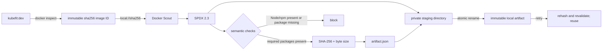

# 0032: Binding an SPDX inventory to the exact image

- **Date:** 2026-08-21
- **Status:** validated locally
- **Related phase:** Phase 6 — presentation layer and packaging
- **Feature commit:** `99ceadf feat: generate verified image SBOM`

## Why

The packaged image now runs correctly, but a successful container says nothing
about the complete software inventory inside it. Before vulnerability policy,
signing, or public publication, KubeFit needs a machine-readable answer to a more
basic question: which exact image was inspected, what packages were found, and can
the saved evidence be changed without detection?

A report against `kubefit:dev` alone is unsafe because that mutable tag can point to
a different local image minutes later. A raw SPDX file is also insufficient: it
does not give the project a stable artifact identity or an independent digest and
size check for later reuse.

## Success criteria

- Resolve the requested local tag to one full `sha256` image ID before analysis.
- Ask the scanner to analyze that image ID, not the mutable tag.
- Require Linux and the expected numeric runtime user.
- Generate SPDX 2.3 and require the KubeFit/FastAPI/Uvicorn runtime packages.
- Prove Node and npm build tools are absent from the final runtime inventory.
- Bind the SPDX bytes, byte size, package count, generator, and image metadata in a
  small manifest.
- Publish the two-file artifact through one directory rename.
- Reuse only an intact artifact for the same image and reject tampering.
- Keep generated local evidence out of Git.

## What changed

`generate-image-sbom.sh` uses the Docker Scout already distributed with the local
Docker installation. It creates this structure under the ignored
`.kubefit/supply-chain/` directory:

```text
image-sbom-<first-128-bits-of-image-id>/
├── artifact.json
└── sbom.spdx.json
```

`artifact.json` retains the full image ID, original requested reference, platform,
runtime user, image creation time, SPDX namespace and generation time, generator,
package count, byte size, and SHA-256. The shortened directory identity is only a
handle; the full 256-bit value remains mandatory inside the manifest.

## How



The critical conclusion is that the mutable reference is used only for the initial
lookup. Both scanning and saved evidence are bound to the resolved image ID.

| Boundary | Selected behavior | Reason |
|---|---|---|
| Scanner | Existing Docker Scout | Avoid an unreviewed installer in this slice |
| Format | SPDX 2.3 JSON | Standard, structured, machine-readable inventory |
| Artifact identity | First 128 bits of image ID | Stable path with full ID rechecked in manifest |
| Retry | Verify and reuse first artifact | Scout output contains nondeterministic metadata |
| Storage | Ignored local `.kubefit/` | Evidence may be large and is not yet a release asset |
| CVE decision | Deferred | Vulnerability databases and policy have different freshness rules |

## Problems encountered

No standalone Syft, Trivy, Grype, Cosign, or Crane command was installed. Running
`docker sbom --help` did not expose an SBOM plugin; Docker returned its general help.
Docker Scout 1.23.1 did provide `scout sbom`, so the slice used that available tool
without downloading another binary.

The first probe reported 162 indexed packages while the SPDX `packages` array had
163 entries. The extra entry is the container/root package named `kubefit`; the
artifact records the SPDX array length because that is the exact saved document
being verified.

Docker Scout inserts a generation timestamp and a UUID-backed document namespace.
Fresh SBOM generation for the same image is therefore not byte-deterministic. Using
the SBOM digest itself as the artifact ID would produce different IDs for equivalent
inventory. KubeFit instead derives the artifact ID from the immutable image ID,
keeps the first complete result, and makes retries hash and semantically validate
that result before reuse.

The image had no OCI revision label. This slice deliberately does not claim that
the local image ID is bound to a Git commit. That requires build provenance or an
explicit source-revision label and remains separate from an inventory SBOM.

The behavioral tests use a fake Docker executable and real `jq`. They prove first
publication, exact reuse, post-publication byte tampering rejection, and required
package rejection without depending on Docker Desktop during the Python suite.

## Evidence

```text
Resolved image ID:
  sha256:0dfb4a4cea80c6324d0c73c99f3488c58b2edccccc6136f5d6bd1b6a8b1758d7
Artifact ID: image-sbom-0dfb4a4cea80c6324d0c73c99f3488c5
Platform: linux/arm64
Runtime user: 10001:10001
SPDX version: 2.3
Generator: docker-scout-1.23.1
SPDX package entries: 163
SPDX byte size: 3,413,108
SPDX SHA-256: 7652667e242602654badf64a48043d64e8026531aa655e3f26c44a31a6ef5375
Required packages: kubefit, fastapi, uvicorn present
Forbidden runtime packages: node, npm absent
First execution: reused=false
Second execution: reused=true after digest/size/semantic validation
SBOM behavioral tests: 2 passed
Full Python suite: 285 passed, 1 external Starlette/httpx2 warning
Dashboard tests: 4 passed
Ruff, Vite build, Helm lint, Bash syntax, diff check: passed
```

## Decision and limitations

It is now safe to claim that the inspected local image has a tamper-evident SPDX
inventory bound to its complete Docker image ID, and that Node/npm do not appear as
runtime packages. This is inventory evidence, not proof that every package is safe.

The artifact has not been uploaded, attached to an OCI manifest, signed, or linked
to a Git revision. Docker Scout's vulnerability database was not evaluated, so no
zero-CVE claim is made. Package absence is based on the scanner's observable
inventory, not a byte-for-byte proof that no similarly named executable exists.

## Next question

How should a freshness-stamped vulnerability report consume this exact SBOM and
fail on critical/high findings without hiding unfixed base-image risk?
