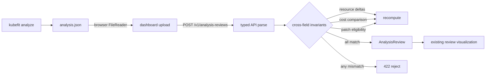

# 0033: Reviewing a real analysis artifact without overstating proof

- **Date:** 2026-08-21
- **Status:** validated locally
- **Related phase:** Phase 6 — presentation layer and packaging
- **Feature commit:** `16efaba feat: review analysis artifacts in dashboard`

## Why

The first dashboard demonstrated the evaluation model with editable examples, but
it could not review the JSON emitted by `kubefit analyze`. A demo therefore had a
gap between live collection and the visual explanation: an operator could save an
artifact, or inspect a dashboard, but could not carry the same evidence from one to
the other.

Simply rendering uploaded JSON would create a more serious trust problem. A stale
or edited cost total could look authoritative even when it no longer matched the
resource values. The server must parse the typed artifact and independently check
every relationship that schema v1 contains before returning a review model.

## Success criteria

- Load a `kubefit analyze` JSON file from the dashboard.
- Parse and validate it on the API, not in browser-owned domain logic.
- Recompute resource deltas, request-cost comparison, and patch eligibility.
- Preserve Deployment UID and creation time in the visual review context.
- Reject inconsistent artifacts with a structured validation error.
- State explicitly which recommendation claims schema v1 cannot replay.
- Keep upload review read-only and separate from proposal or cluster mutation.

## What changed

`POST /v1/analysis-reviews` now accepts the same typed `AnalysisArtifact` emitted by
the CLI. Loading an artifact runs both Pydantic validation and cross-field
integrity checks. The API returns an `AnalysisReview` containing the target,
workload identity, evaluation, four completed checks, and explicit limitations.

The dashboard accepts a JSON file, applies a 1 MiB client-side guard, sends its raw
bytes to the same-origin API, and renders the returned evaluation through the
existing result components. An artifact context card identifies the exact
Deployment incarnation and labels the result `INTEGRITY ONLY`.

## How



The important boundary is the API response: the browser selects and displays an
artifact, but it does not decide whether the artifact is internally consistent.

| Claim | Schema v1 review | Reason |
|---|---|---|
| Recommended requests and limits are structurally valid | Checked | Values must be positive and limits must cover requests |
| Request change percentages match resource values | Recomputed | Current and recommended requests are both retained |
| Monthly request-cost comparison is internally consistent | Recomputed | Rates, horizon, current values, and recommended values are retained |
| Patch eligibility matches the evaluation | Recomputed | Readiness, recommendation, cost, and risk inputs are retained |
| P95/P99 produced the recommended values | Not replayable | Raw `ObservedUsage` is absent from schema v1 |
| Producer and repository bytes are authentic | Not verified | Artifact has no signature or repository-content binding |

## Problems encountered

The first upload test used `File.text()`. The jsdom file implementation used by the
locked test environment did not expose that method, so the test failed with
`file.text is not a function`. The dashboard now uses `FileReader`, which covers the
test environment and a wider browser compatibility range.

The full Python regression suite then exposed an older CLI test fixture that made
an artifact invalid by changing only its saved eligibility result. The new
cross-field validator correctly rejected it before the intended CLI assertion. The
fixture was corrected to change recommendation readiness and recompute eligibility,
so it now represents a valid but blocked artifact instead of silently relying on an
impossible state.

The 1 MiB check is a dashboard usability guard, not an API-wide request-body limit.
Server-side body limiting belongs at the ASGI proxy or deployment boundary and is
not claimed by this slice.

## Evidence

```text
Python suite: 291 passed
Dashboard tests: 6 passed
Dashboard production build:
  HTML 0.57 kB
  CSS 9.63 kB
  JS 207.70 kB
Ruff: passed
Helm lint: 1 chart, 0 failed (icon recommendation only)
Docker image rebuild: passed
Packaged image OpenAPI contains /v1/analysis-reviews: yes
Packaged image schema contains verification_level: yes
Packaged dashboard bundle contains analysis.json workflow: yes
Packaged image /healthz: HTTP 200
Diff check: passed
Known warning: 1 external Starlette/httpx 2 compatibility warning
```

Backend tests exercise a complete typed artifact and deliberately altered change
percentage, cost, and eligibility fields. Dashboard tests cover successful upload
and the oversize guard. The packaged-image probe confirms the route and UI are in
the delivered artifact. This slice did not generate an upload from a live cluster,
so it does not claim end-to-end live collection evidence.

## Decision and limitations

It is now safe to claim that a reviewer can load an analysis artifact and see its
identity, recommendation, cost, risk, and GitOps gate after the server has checked
the relationships retained by schema v1. An internally inconsistent artifact is
rejected instead of visualized.

`integrity_only` is intentionally narrower than `fully_replayed`. The review does
not prove that percentile samples justify the recommendation, identify who produced
the file, or bind it to repository YAML. Those boundaries remain visible in the UI
instead of being hidden behind a generic success state.

## Next question

Should analysis schema v2 retain canonical `ObservedUsage`, recommendation-policy
version, and input hashes so the API can replay P95/P99 recommendation generation
and graduate the review from `integrity_only` to `fully_replayed`?
