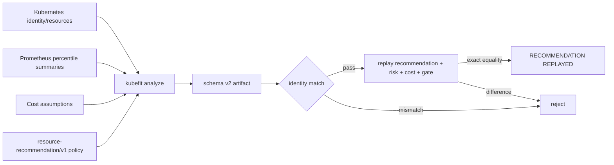

# 0034: Replaying recommendations without weakening observation gates

- **Date:** 2026-08-21
- **Status:** validated locally and against a collecting kind workload
- **Related phase:** Phase 6 — presentation layer and packaging
- **Feature commit:** `1fa58f3 feat: replay schema v2 recommendations`

## Why

Schema v1 retained the final evaluation but omitted the observation and policy
inputs that produced it. The review API could recompute resource deltas, cost, and
eligibility, but an edited recommendation that remained internally consistent could
not be distinguished from the CLI result. That made `integrity_only` the strongest
honest review claim.

At the same time, the live demo workload was not yet eligible. Its Pods had existed
for 14 hours, but the one-day readiness query found only 74 five-minute samples
across two Pods: 12.8% coverage against the 70% and 100-sample gates. Reducing the
gate for demo speed would undermine the product's core safety claim. This slice
therefore improves artifact replay while the persistent Prometheus instance keeps
collecting evidence under the existing policy.

## Success criteria

- Make new `kubefit analyze` output self-contained for recommendation replay.
- Retain the exact aggregate observation and all numeric recommendation policy inputs.
- Recompute recommendation, risk, cost, and eligibility when schema v2 is loaded.
- Reject altered observations, policy inputs, workload identity, or evaluation.
- Continue accepting schema v1 with its narrower `integrity_only` claim.
- Preserve schema v1 serialized bytes so existing content IDs and branch names do
  not change.
- Distinguish recommendation replay from raw Prometheus percentile replay.
- Confirm a real collecting workload emits v2 without bypassing its blocked gate.

## What changed

`AnalysisArtifact` now accepts two explicit versions. Existing schema v1 artifacts
remain unchanged. New CLI output uses schema v2 and adds:

- `observed_usage`: the canonical P95/P99, maxima, coverage, replica, runtime-risk,
  and workload-identity inputs;
- `recommendation_policy`: algorithm identity plus every margin, multiplier,
  rounding step, floor, and readiness threshold.

Loading v2 first checks workload UID, creation time, and desired replica identity.
It then reruns `evaluate_resources` with the retained policy and requires the entire
stored evaluation to equal the replayed result. The dashboard labels this state
`RECOMMENDATION REPLAYED`; v1 remains `INTEGRITY ONLY`.

## How



The conclusion is narrower than full metric replay: v2 proves that retained
aggregate inputs and policy produce the saved decision, not that raw samples
produce the retained percentile summaries.

| Layer | v1 | v2 |
|---|---|---|
| Resource/cost/eligibility invariants | Recomputed | Recomputed |
| Aggregate observation inputs | Missing | Retained |
| Policy parameters and algorithm ID | Missing | Retained |
| Recommendation and risk replay | No | Exact equality required |
| Raw Prometheus samples | Missing | Missing |
| P95/P99 aggregation replay | No | No |
| Producer signature/repository binding | No | No |

## Problems encountered

The first full regression found that optional v2 fields were serialized as `null`
on v1 objects. Proposal IDs are content-addressed, so those harmless-looking keys
changed a golden proposal digest and its deterministic branch from
`kubefit/demo-demo-444bf372` to `kubefit/demo-demo-9f16f077`. The fields now use
conditional exclusion when absent. A regression assertion proves v1 dumps omit
both fields, and the original branch identity passes again.

The live readiness investigation also showed why Pod age is not observation age.
Prometheus reported 498 raw cAdvisor counter samples per Pod at the 15-second scrape
interval, while the KubeFit five-minute range query produced 74 combined samples.
Prometheus itself was healthy with a two-day/4 GB retention policy and a bound 5 GiB
PVC. The available evidence proves a scrape continuity gap, but it does not prove
whether host sleep, Docker suspension, or another local interruption caused every
missing interval. Readiness correctly bases its decision on samples rather than
wall-clock Pod age.

## Evidence

```text
Focused Python tests: 42 passed
Full Python suite: 297 passed
Dashboard tests: 7 passed
Ruff: passed
Dashboard production build:
  HTML 0.57 kB
  CSS 9.63 kB
  JS 207.79 kB
Helm lint: 1 chart, 0 failed (icon recommendation only)
Diff check: passed
Known warning: 1 external Starlette/httpx 2 compatibility warning

Live kind readiness at 2026-08-21T05:17:36Z:
  replicas: desired=2, available=2, observed=2
  usage samples: 74 / required 405
  usage coverage: 12.8% / required 70%
  throttling samples: 74 / required 405
  status: collecting
  gate: blocked
  projected readiness: 2026-08-21T19:07:36Z

Live schema v2 probe minutes later:
  schema_version: 2
  policy: resource-recommendation/v1
  sample_count: 76
  observation_coverage: 13.15%
  readiness: insufficient_data
  gate: blocked
```

The projected readiness time assumes uninterrupted metric production and stable
replicas. In Asia/Seoul it is 2026-08-22 04:07:36 KST. It is a projection, not a
scheduled claim.

## Decision and limitations

It is now safe to claim that new analysis artifacts can replay the complete KubeFit
decision from retained aggregate observation, policy, resource, price, and replica
inputs. Changed inputs or changed output are rejected. Existing v1 artifacts remain
byte-compatible and reviewable at their original integrity level.

Schema v2 does not retain every Prometheus sample, query response, or query text.
It therefore cannot independently prove the percentile calculation or metric-source
authenticity. It is also unsigned and is not yet bound to repository manifest bytes.

## Next question

After uninterrupted collection reaches `eligible`, does the real v2 artifact pass
proposal creation and the restoring before/after benchmark while preserving latency,
error, throttling, OOM, and rollback evidence?
