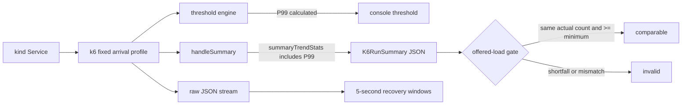

# 0035: Making the fixed k6 profile produce usable live evidence

- **Date:** 2026-08-22
- **Status:** validated against the live local demo Service
- **Related phase:** Phase 4 — reproducible before/after benchmark
- **Feature commit:** `fb1763a fix: preserve live k6 benchmark evidence`

## Why

The benchmark profile and executor had extensive isolated tests but had not yet run
against the real demo Service. Observation readiness was still collecting, so a
full before/after mutation remained correctly blocked. A no-mutation baseline smoke
could still test the next uncertain boundary: whether the checked-in k6 script can
produce the exact summary and raw evidence that `SubprocessK6Executor` expects.

The first live run delivered all traffic successfully but failed while generating
its summary JSON. This would have made an otherwise healthy full benchmark fail
after spending almost three minutes on each measurement.

## Success criteria

- Run the checked-in four-phase profile against the real kind Service without
  changing its Deployment.
- Export both P95 and P99 values consumed by the typed summary.
- Require no dropped iterations or HTTP errors.
- Parse the saved summary through `K6RunSummary`.
- Derive recovery from the raw JSON stream.
- Treat small scheduler boundary overshoot as comparable only when before and after
  complete the same count at or above the fixed minimum.
- Preserve existing exact-count benchmark artifact identities.

## What changed

The k6 options now explicitly set `summaryTrendStats` through P99. Thresholds can
calculate P99 internally, but that does not place P99 in the `handleSummary` metric
value map. The explicit option makes the script's output contract match its parser.

The offered-load gate still fixes minimum loads at 300 steady, 750 spike, and 300
recovery iterations. It now accepts a boundary overshoot only when both runs report
the same completed count, each count meets the fixed minimum, neither run drops an
iteration, and requests cover completed iterations. A before/after mismatch remains
invalid.

## How



The critical distinction is that a threshold metric and an exported summary metric
are separate k6 interfaces. Both must be configured for durable evidence.

| Phase | Contract minimum | Live completed | Error rate | P95 | P99 |
|---|---:|---:|---:|---:|---:|
| steady | 300 | 301 | 0% | 6.882 ms | 21.296 ms |
| spike | 750 | 751 | 0% | 5.100 ms | 8.202 ms |
| recovery | 300 | 301 | 0% | 6.139 ms | 10.186 ms |

## Problems encountered

The first smoke completed 1,363 requests with no errors and printed valid P99
threshold values, but `handleSummary` raised:

```text
k6 summary is missing http_req_duration{kubefit_phase:steady}.p(99)
```

k6 1.4.2 returned process exit code 0 despite that script exception. KubeFit would
still fail closed because the expected summary file was absent, but process success
alone was not sufficient evidence. Adding P99 to `summaryTrendStats` produced the
file on the second live run, and the Python model parsed it successfully.

Both live runs also completed 301/751/301 iterations rather than the arithmetic
300/750/300. Treating exactly 300 as mandatory would reject real output from the
fixed profile. Simply allowing any excess would weaken comparability, so the gate
requires equal actual before/after counts at or above the promised minimum.

The first implementation changed the success reason for older exact-count results.
Because verdict bytes participate in content-addressed benchmark IDs, a golden
benchmark ID changed even though its evidence had not. Exact-count runs now retain
their original reason text; only overshoot results use the new explanation. The
golden pull-request body and benchmark ID pass unchanged.

## Evidence

```text
Live target preflight: HTTP 200
Profile: kubefit-load-v1
Live fixed-profile duration: approximately 160 seconds
Completed measured-phase requests: 1,353
Warmup requests: 10
Total requests: 1,363
Dropped iterations: 0
HTTP errors: 0
Spike recovery: 5.0 seconds, recovered=true
Raw evidence size: 3,522,982 bytes
Typed K6RunSummary parse: passed
Recovery calculation from raw JSON: passed
k6 inspect summaryTrendStats includes p(99): passed
Focused benchmark tests: 53 passed
Full Python suite: 300 passed
Dashboard tests: 7 passed
Ruff, dashboard production build, Helm lint, diff check: passed
Known warning: 1 external Starlette/httpx 2 compatibility warning
```

This is one unchanged baseline smoke, not a before/after optimization result. It
does not support a savings or no-regression claim.

## Decision and limitations

It is now safe to claim that the checked-in profile can drive the real demo Service,
write P95/P99 summary evidence, retain its raw stream, and derive recovery. The
comparison contract accepts the observed one-iteration boundary overshoot without
allowing different before/after loads.

The smoke did not apply a proposal, query aligned throttling for the retained run,
publish an immutable benchmark result, or exercise restoration. Those remain gated
on an eligible analysis artifact.

## Next question

Once readiness reaches 70% coverage, does the full restoring benchmark produce two
matching live loads and a passing immutable result for the schema v2 proposal?
