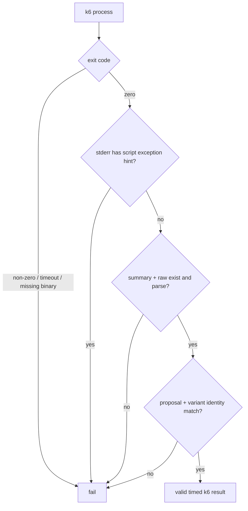

# 0036: Rejecting a k6 script failure that exits successfully

- **Date:** 2026-08-22
- **Status:** validated locally from a live-observed failure
- **Related phase:** Phase 4 — reproducible before/after benchmark
- **Feature commit:** `08a0a41 fix: reject silent k6 script failures`

## Why

The first live k6 smoke in entry 0035 showed an unexpected process boundary: a
JavaScript exception in `handleSummary` was written to stderr, but k6 1.4.2 returned
exit code 0. KubeFit still rejected that run later because `summary.json` was absent,
but the reported cause was the generic `k6 output is missing or invalid`.

A benchmark runner must not treat process success as evidence success. Detecting the
known script-exception signal at the subprocess boundary gives an immediate and
accurate failure, while retaining the existing typed output checks as a second gate.

## Success criteria

- Reject k6 stderr containing its structured `hint="script exception"` marker even
  when the process returns zero.
- Continue rejecting exit-zero runs that do not publish summary/raw outputs.
- Preserve typed summary, identity, and raw recovery validation.
- Do not reject ordinary stderr unless it carries the explicit script-exception hint.

## What changed

The production `_run_k6` adapter now inspects captured stderr after a successful
subprocess return and raises `BenchmarkMeasurementError` for the exact k6 script
exception hint. `SubprocessK6Executor` independently continues to require both
temporary output files and to parse their schemas and identity.

## How



No single condition grants success. Each boundary can only reject; valid evidence
requires every gate to pass.

## Problems encountered

Treating any `level=error` stderr line as fatal would be too broad because future k6
extensions or workload logging may use that severity for non-script events already
represented in typed metrics. The implementation matches the explicit
`hint="script exception"` marker observed in the live failure instead.

The live 160-second profile was not rerun for this slice. Entry 0035 already proved
the corrected profile produces valid outputs. This regression replays the exact
structured stderr boundary with a zero-return `CompletedProcess`, and separately
proves that silent output absence is rejected.

## Evidence

```text
Focused benchmark tests: 55 passed
Full Python suite: 302 passed
Dashboard tests: 7 passed
Ruff: passed
Dashboard production build: passed
Helm lint: 1 chart, 0 failed (icon recommendation only)
Diff check: passed
Known warning: 1 external Starlette/httpx 2 compatibility warning
```

## Decision and limitations

It is now safe to claim that KubeFit does not accept k6 exit code 0 by itself. The
known script-exception hint fails immediately, and missing or invalid output still
fails independently.

The marker is part of k6's current textual stderr behavior rather than a versioned
machine-readable API. A future k6 format change could bypass the early diagnostic,
but it cannot bypass mandatory summary/raw existence and typed parsing.

## Next question

When continuous observation becomes eligible, can both full k6 executions pass all
process, output, identity, load-comparability, Prometheus, Kubernetes, restoration,
and artifact-publication gates together?
