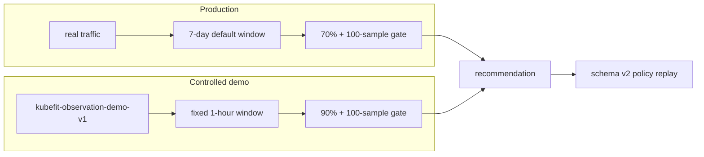

# 0037: Replacing a 24-hour idle wait with controlled demo observation

- **Date:** 2026-08-22
- **Status:** implementation validated; first controlled live observation in progress
- **Related phase:** Phase 4 — reproducible before/after benchmark
- **Feature commit:** `8a94f67 feat: add controlled demo observation profile`

## Why

The local readiness path originally reused a one-day production-style window. That
proved persistence and fail-closed coverage, but the demo Deployment had no real
users. Waiting for 70% of 24 hours mostly collected idle nginx samples plus one
160-second k6 smoke. A longer idle window does not make its percentile recommendation
more representative and can hide the short loaded interval.

Readiness remains necessary; the wrong part was the evidence window. Production
should observe real traffic over days. A local demo should generate a declared,
repeatable workload throughout a shorter window and must identify that result as
demo evidence rather than production evidence.

## Success criteria

- Preserve the production default: seven days, five-minute step, 70% coverage, and
  at least 100 samples.
- Add one explicit demo profile with no caller-adjustable shortcuts.
- Fix demo observation to one hour, one-minute step, 90% coverage, and 100 samples.
- Require 110 of 122 expected samples for the two-Pod demo.
- Label short-window recommendation evidence as controlled demo evidence.
- Provide a fixed one-hour traffic profile that fills the complete observation window.
- Reject attempts to combine demo mode with `--days` or `--step-seconds`.
- Keep schema v2 policy replay exact by retaining the selected demo thresholds.

## What changed

Both `readiness` and `analyze` now accept:

```text
--observation-profile production  # default
--observation-profile demo        # fixed controlled local path
```

The production profile retains existing defaults and overrides. Demo mode fixes the
window and step and supplies a stricter 90% coverage policy. Fractional-day windows
now flow through Prometheus collection, `ObservedUsage`, readiness, recommendation,
and schema v2 replay. A one-hour result is rendered as `1-hour P95/P99`, not an
opaque fractional day, and carries a non-production warning.

`benchmarks/k6/observation_profile.js` defines `kubefit-observation-demo-v1`:

| Phase | Rate | Duration | Start |
|---|---:|---:|---:|
| warmup | 5 RPS | 10 min | 0 min |
| steady | 25 RPS | 35 min | 10 min |
| spike | 100 RPS | 5 min | 45 min |
| recovery | 25 RPS | 10 min | 50 min |

It fails on at least 1% HTTP errors, P99 at or above one second, or any dropped
iteration. It changes no Kubernetes object.

## How



The two paths share recommendation logic but make different evidence claims. Demo
mode is not a faster alias for production mode.

For two Pods, the demo gate is:

```text
expected = (floor(3600 / 60) + 1) × 2 = 122
coverage requirement = ceil(122 × 0.90) = 110
required = max(100, 110) = 110 samples
```

## Problems encountered

The first demo-profile probe saw 106/110 samples and 86.9% coverage, with an
estimated two minutes remaining. That proved the shorter mechanics, but the window
still contained mostly idle time and the earlier 160-second smoke. It was deliberately
not used to create a proposal.

Sampling every few seconds could make a ten-minute demo exceed 100 samples, but the
CPU and throttling queries use five-minute rate windows. Counting heavily overlapping
points as independent evidence would create an impressive sample count without
equivalent information. The selected one-minute step and one-hour window are still
correlated, so the output remains explicitly demo-only, but they avoid the most
extreme form of that shortcut.

The first controlled traffic run began around 2026-08-22 01:21 KST. It is expected
to finish around 02:21 KST. This entry does not claim its result before completion.

## Evidence

```text
Focused profile/collector/readiness tests: 91 passed
Full Python suite: 308 passed
Dashboard tests: 7 passed
Ruff: passed
Dashboard production build: passed
Helm lint: 1 chart, 0 failed (icon recommendation only)
k6 inspect:
  profile kubefit-observation-demo-v1 parsed
  four phases span exactly 60 minutes
  rates 5 -> 25 -> 100 -> 25 RPS
Live pre-run demo readiness:
  samples 106 / 110
  coverage 86.9% / 90%
  estimate 2 minutes
  deliberately not proposed because the window was not fully controlled traffic
```

## Decision and limitations

It is now safe to claim that KubeFit has separate production and controlled-demo
observation policies and that short-window output identifies its limitation. It is
not yet safe to claim that the first controlled run completed or produced a passing
recommendation; that evidence belongs to the next entry after the process exits and
readiness is queried again.

The demo profile does not cryptographically bind its k6 output to the later analysis
artifact. Process timing and commands are currently runbook evidence. Binding a
traffic-profile digest and exact run interval would be a stronger future boundary.

## Next question

After `kubefit-observation-demo-v1` finishes, does demo readiness become eligible
and produce a schema v2 proposal whose restoring before/after benchmark passes?
