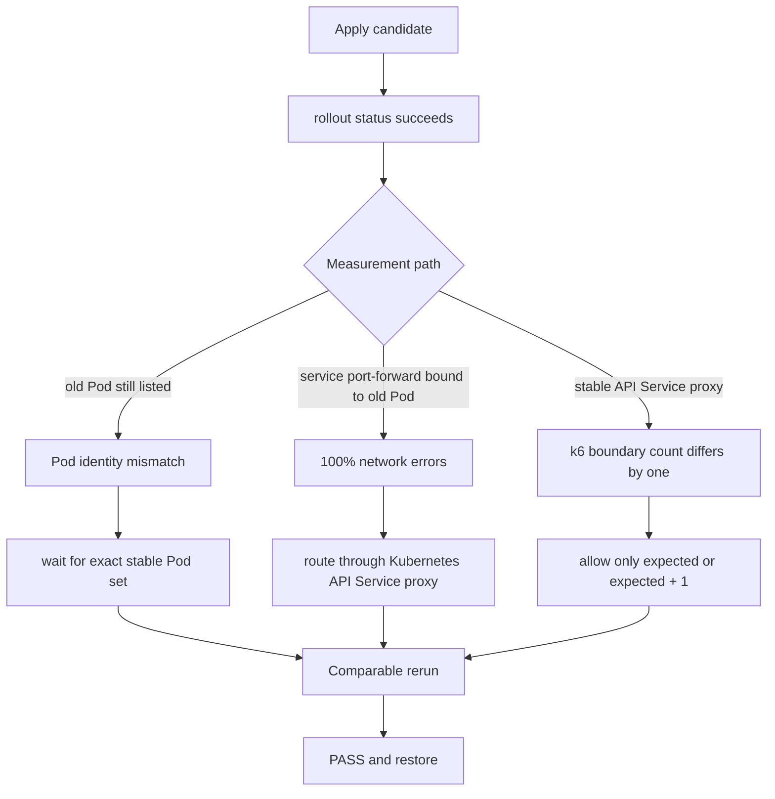

# 0038: Making the controlled demo benchmark comparable

- **Date:** 2026-08-22
- **Status:** live benchmark passed and workload restored
- **Related phase:** Phase 4 — reproducible before/after benchmark
- **Feature commit:** `19ab791 fix: stabilize live benchmark comparisons`
- **Proposal:** `proposal-925669808e28e594baeeb442c3d447c8`
- **Passing benchmark:** `benchmark-f84d0caf061d50a5d93bc03088eb0247`

## Why

The one-hour demo observation had to end in a real before/after decision, not only a
recommendation. The first attempt exposed three measurement-harness boundaries that
could be mistaken for application failures: old rollout Pods in a snapshot, a
Pod-bound local port-forward, and k6's one-iteration scheduling edge.

## Observation and proposal

The controlled load process was manually interrupted after 95,469 requests and
returned k6 exit code 105, so it is not recorded as a successful one-hour k6 run.
The independent Prometheus readiness query still found 114 samples, 93.44% coverage,
both usage and throttling signals, 2/2 Pods, and no OOM, restart, or throttling risk.
That eligible window produced this recommendation:

| Resource | Current | Recommended | Change |
|---|---:|---:|---:|
| CPU request | 1000m | 20m | -98.0% |
| CPU limit | 2000m | 40m | -98.0% |
| Memory request | 2048Mi | 32Mi | -98.4% |
| Memory limit | 4096Mi | 48Mi | -98.8% |
| Projected request cost | $73.000000 | $1.396125 | -98.088% |

The cost uses the checked-in example price source, so it demonstrates comparison
mechanics rather than a cloud bill claim.

## What failed before the pass



The sequence matters: none of the first three outcomes justified changing the
recommendation because each failure occurred in evidence collection or comparison.

1. `rollout status` returned before terminating old ReplicaSet Pods disappeared.
   Runtime snapshots then contained different Pod identities. Restoration succeeded.
2. After Pod stabilization was added, an external `kubectl port-forward service/...`
   remained attached to the removed baseline Pod. Candidate requests failed before
   receiving an HTTP response, producing 0ms latency and 100% errors. This result was
   retained as `fail` but rejected as application evidence.
3. A Kubernetes API Service proxy survived the rollout and produced zero errors.
   The run was `invalid` only because 751 versus 750 spike iterations and 301 versus
   300 recovery iterations did not match exactly.

## How the boundary changed

After `kubectl rollout status`, the controller now polls until the selector returns
exactly the desired Pod count, no Pod has a deletion timestamp, every Pod is Running,
and every target container is Ready. A Pod replacement during the actual load still
invalidates runtime deltas.

The offered-load rule now accepts independently for each run:

```text
expected <= completed <= expected + 1
dropped_iterations == 0
requests >= completed
```

This admits only the observed k6 boundary race. A short run or a two-iteration
overshoot remains invalid.

## Final evidence

The final immutable local result passed every check and restored the original
1000m/2Gi requests and 2000m/4Gi limits.

| Signal | Before | After | Verdict boundary |
|---|---:|---:|---|
| Steady P95 | 10.311ms | 10.032ms | -2.705%, pass |
| Steady P99 | 11.145ms | 10.680ms | -4.169%, pass |
| Spike P95 | 8.188ms | 8.204ms | +0.200%, pass |
| Spike P99 | 8.800ms | 9.135ms | +3.808%, pass |
| Error rate | 0% | 0% | pass |
| CPU throttling P95 | 0% | 0% | pass |
| OOMKilled / restarts | 0 / 0 | 0 / 0 | pass |
| Recovery time | 5s | 5s | pass |
| Projected request cost | $73.000000 | $1.396125 | -98.088% |

Verification commands:

```text
Focused benchmark and Kubernetes tests: 93 passed
Full Python suite: 309 passed (one upstream Starlette deprecation warning)
Ruff: passed
Dashboard tests: 7 passed
Dashboard production build: passed
Helm lint: 1 chart, 0 failed (icon recommendation only)
Final benchmark verdict: pass
Workload restored: true
```

## Decision and limitations

It is now safe to claim that this controlled nginx workload passed KubeFit's fixed
local safety policy at the recommended values and projected 98.088% lower request
cost. It is not evidence that the same reduction is safe for a real application or
production traffic. The observation traffic process was interrupted, the pricing is
illustrative, and the benchmark covers about 160 seconds per variant.

The CLI still accepts any target URL and cannot prove that it survives rollouts.
Local documentation now uses the Kubernetes API Service proxy, but a future version
should own its in-cluster traffic path or attest target reachability before each run.

## Next question

Can the passing immutable result be bound into a dry-run PR plan without publishing
anything externally, and does the dashboard explain both the safety pass and the
controlled-demo limitation?
