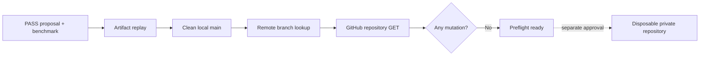

# 0039: Authenticated Draft PR publication preflight

- **Date:** 2026-08-22
- **Status:** authenticated preflight ready; no mutation performed
- **Related phase:** Phase 5 — GitHub draft pull request
- **Proposal:** `proposal-925669808e28e594baeeb442c3d447c8`
- **Benchmark:** `benchmark-f84d0caf061d50a5d93bc03088eb0247`

## Why

The passing local benchmark is not yet a GitOps demonstration. Before creating any
branch or pull request, KubeFit must independently reload the artifacts, verify the
repository state, inspect the exact remote branch, and prove GitHub API readability.
This preflight must remain useful when authentication is absent and must never mutate
Git or GitHub.

The repository's `origin` is the real public KubeFit repository. It is suitable for
a read-only check, but the live publication runbook forbids using it as the mutation
target. Publication requires a separately named private disposable repository.

## What was checked

The dashed edge is intentionally not crossed by this development slice.

The first run omitted `GITHUB_TOKEN`. Artifact, local Git, and remote-ref checks
passed, then the command exited 2 with exactly one blocker: missing API credentials.
It reported `mutation_performed: false`.

`gh auth status --hostname github.com` then confirmed the intended active account
`sangmu1126`, HTTPS Git operations, and a keyring-backed credential. The token value
was never printed or passed as a command argument. The second run supplied it through
the `GITHUB_TOKEN` environment boundary and exited 0.

## Evidence

| Check | Result |
|---|---|
| Artifact relationship | ready |
| Proposal verdict input | passing benchmark accepted |
| Local branch | `main` at `13c1677d2844d391fc21b29ce1f819d5595f2c12` |
| Local publication branch | absent |
| Planned branch | `kubefit/kubefit-demo-overprovisioned-api-92566980` |
| Planned changed path | `deploy/demo/overprovisioned-api.yaml` |
| Remote repository | `sangmu1126/kubefit` |
| Remote publication branch | absent |
| GitHub default branch | `main` |
| GitHub API repository read | ready |
| Blockers | none |
| Mutation performed | false |

The API reported repository permissions, but the preflight correctly warns that a
read-only request cannot prove a later branch push or pull-request write. Those are
validated only by the explicitly approved live run.

## Decision and limitations

It is now safe to claim that the exact passing proposal/benchmark pair can produce a
valid PR plan against the current clean checkout and that authenticated GitHub read
access works. No local branch, commit, remote branch, repository, or pull request was
created by this step.

It is not safe to publish to `origin`. The next step creates a uniquely named private
repository under the confirmed account, attaches it under a non-`origin` remote,
publishes twice to prove idempotency, captures five independent evidence files, and
archives the target. Repository creation, branch push, Draft PR creation, and archive
are external mutations and require explicit approval.

## Next question

May the live run create and later archive the named private disposable GitHub
repository required to close Phase 5?
