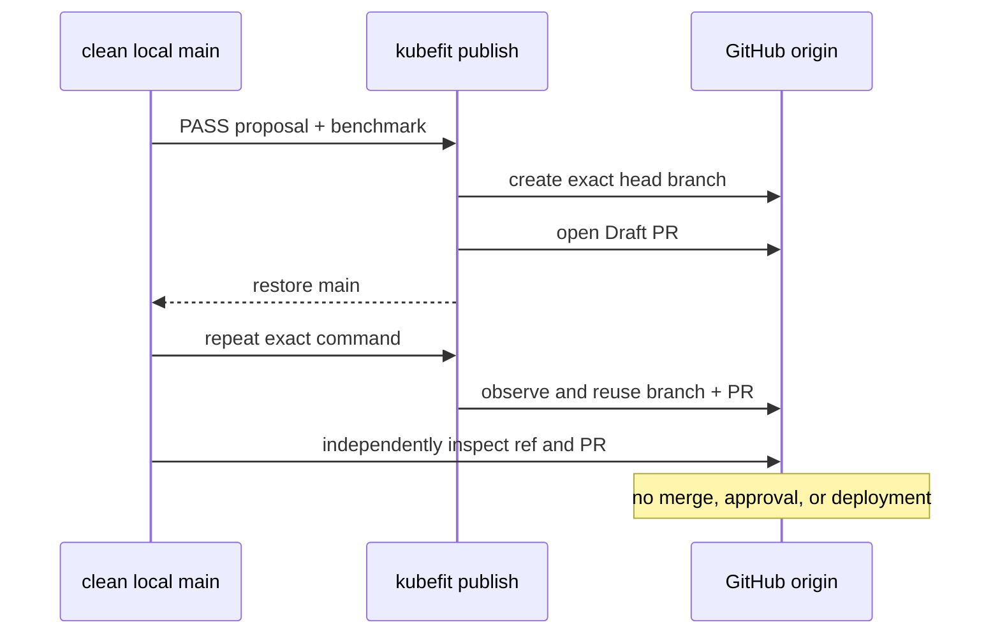

# 0040: Publishing the verified change as a real Draft PR

- **Date:** 2026-08-22
- **Status:** live Draft PR created and idempotently reused
- **Related phase:** Phase 5 — GitHub draft pull request
- **Pull request:** [sangmu1126/kubefit#1](https://github.com/sangmu1126/kubefit/pull/1)
- **Head commit:** `9a4697302d5fe727f7bbdd2a84259facc154d4e5`

## Why

The authenticated preflight proved the artifacts and repository were ready, but it
did not prove Git push or pull-request write permission. The next evidence boundary
was an actual reviewer-visible Draft PR generated from the passing proposal and
benchmark.

The older live-demo runbook mandated a separate private disposable repository. That
was a conservative test-isolation choice, not a technical product requirement. A
fresh read-only check showed local `main` and `origin/main` at the same commit, a
clean checkout, and no planned head branch. Publishing to the real project therefore
gave stronger portfolio evidence without mixing unrelated changes.

## Safety boundary

The GitHub publication skill kept the change Draft-only, resolved one explicit
base/head pair, and required reuse rather than duplicate PR creation.

## First and second publication

| Field | First run | Second run |
|---|---|---|
| Branch | `kubefit/kubefit-demo-overprovisioned-api-92566980` | same |
| Commit | `9a4697302d5fe727f7bbdd2a84259facc154d4e5` | same |
| Branch reused | false | true |
| Pull request | #1 | #1 |
| Pull request reused | false | true |
| Draft | true | true |

The second command created no additional branch, commit, or pull request.

## Independent GitHub evidence

KubeFit's returned flags were checked against the remote ref and GitHub API:

| Check | Observed result |
|---|---|
| Remote head SHA | `9a4697302d5fe727f7bbdd2a84259facc154d4e5` |
| PR state | `OPEN` |
| Draft state | `true` |
| Base | `main` |
| Head | `kubefit/kubefit-demo-overprovisioned-api-92566980` |
| Mergeability | `MERGEABLE` |
| Changed files | 1 |
| Changed path | `deploy/demo/overprovisioned-api.yaml` |
| Diff size | 4 additions, 4 deletions |

The generated body references proposal
`proposal-925669808e28e594baeeb442c3d447c8` and benchmark
`benchmark-f84d0caf061d50a5d93bc03088eb0247`, labels the 98.088% request-cost
change as a projection rather than a guaranteed invoice saving, reports benchmark
latency and runtime signals, and tells the reviewer how to roll back.

## Evidence limitation discovered

The exact five-file `verify-publication` workflow was not claimed for this run. The
authenticated preflight in entry 0039 occurred before its documentation commit, so
its recorded base SHA was `13c1677…`; publication later started from `8a170b7…`.
Immediately before publication, `git ls-remote` did prove that `origin/main` matched
`8a170b7…` and the head branch was absent, but that output was not captured in the
five-file preflight JSON format.

Reusing the older JSON would make the verifier pass while obscuring this ordering
difference, so no such artifact was fabricated. This reveals a verifier hardening
opportunity: GitHub evidence should bind the PR base SHA to the preflight base SHA.

GitHub also reported an empty status-check rollup because the repository has no CI
workflow yet. The PR is a valid GitOps handoff, but not yet CI-backed evidence.

## Decision and limitations

Phase 5 is complete for the MVP definition: a real Draft PR traces one manifest
change to the exact passing proposal and benchmark, includes rollback guidance, and
was reused idempotently. It remains unmerged and has triggered no deployment.

The remaining publication hardening is to bind the preflight base SHA in the offline
verifier and add CI checks. Neither requires changing or merging the open Draft PR.

## Next question

Can CI validate Python, dashboard, Helm, and Docker boundaries on both `main` and the
open Draft PR before the presentation-layer work continues?
