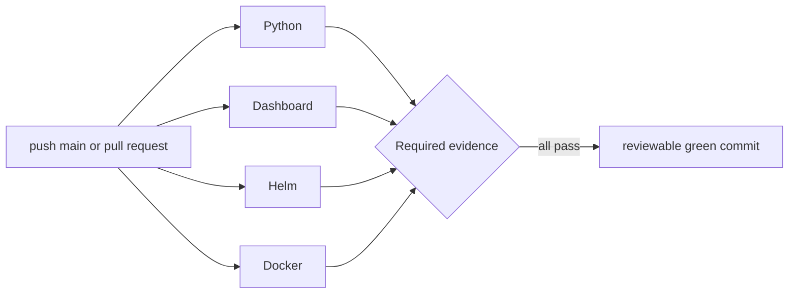

# 0041: Adding independent repository quality gates

- **Date:** 2026-08-22
- **Status:** locally validated; GitHub-hosted run pending
- **Related phase:** Phase 6 — presentation layer and packaging
- **Feature commit:** `be08c60 ci: add repository quality gates`

## Why

Draft PR #1 proved the GitOps publication path but GitHub reported an empty
`statusCheckRollup`. Local test output is useful development evidence; it does not
protect future pushes or pull requests from regressions. KubeFit needs repository
checks that identify which boundary failed instead of returning one opaque build.

## Success criteria

- Run on pushes to `main` and on pull requests.
- Grant the workflow only read access to repository contents.
- Expose Python, dashboard, Helm, and Docker as independent checks.
- Bound every job with a timeout and cancel superseded runs on the same ref.
- Pin every external Action to a complete commit SHA.
- Use the same major runtimes as the production image: Python 3.14 and Node 24.
- Validate workflow structure with repository-owned tests.

## What changed



The four jobs run independently so a TypeScript failure does not look like a Python
failure and an image-packaging failure cannot hide behind unit-test success.

| Job | Runtime/tool | Commands | Timeout |
|---|---|---|---:|
| Python | Python 3.14 | editable dev install, Ruff, Pytest | 10 min |
| Dashboard | Node 24 | `npm ci`, Vitest, Vite build | 10 min |
| Helm | Helm 4.2.4 | lint and default render | 10 min |
| Docker | hosted Docker | production build and runtime-user inspection | 15 min |

The workflow declares `permissions: contents: read`. Its concurrency key combines
workflow and ref, with `cancel-in-progress: true`, so an obsolete run does not keep
consuming time after a newer push.

Official Actions are not referenced through mutable major tags at execution time.
Their major tags were resolved from the official Git remotes and recorded as full
commits:

| Action | Major | Pinned commit |
|---|---:|---|
| `actions/checkout` | v6 | `d23441a48e516b6c34aea4fa41551a30e30af803` |
| `actions/setup-python` | v6 | `ece7cb06caefa5fff74198d8649806c4678c61a1` |
| `actions/setup-node` | v7 | `820762786026740c76f36085b0efc47a31fe5020` |
| `azure/setup-helm` | v5 | `59b1c81c6280f5abebb1fb1bc585696daa7dfb42` |

## Contract tests

`tests/test_ci_workflow.py` parses the checked-in YAML with a scalar-preserving
loader and fails if:

- the `main`/pull-request triggers or read-only permission change;
- one of the four named jobs disappears;
- timeouts are removed;
- an external Action is no longer pinned to 40 lowercase hexadecimal characters;
- a repository verification command is omitted or replaced.

These tests do not emulate a GitHub runner. They protect the intended workflow
contract and leave actual runner behavior to the live PR run.

## Evidence

```text
Focused CI and Helm tests: 13 passed
Full Python suite: 313 passed (one upstream Starlette deprecation warning)
Ruff: passed
Dashboard tests: 7 passed
Dashboard production build: passed
Helm lint: 1 chart, 0 failed (icon recommendation only)
Helm default render: passed
Docker production build: passed
Docker runtime user: 10001:10001
Git diff whitespace check: passed
```

The Docker build resolved the current `node:24-alpine` and `python:3.14-slim` tags to
content digests for that build and successfully created the wheel, dashboard bundle,
and final non-root image.

## Decision and limitations

It is safe to claim that the workflow matches repository verification commands and
all four boundaries pass locally. It is not yet safe to claim that GitHub-hosted
runners execute them successfully; that evidence requires publishing this branch and
observing the Actions run.

Python dependencies use bounded version ranges rather than a lock file, and Docker
base images remain tag-addressed in the Dockerfile. Action code is commit-pinned, but
the full dependency and base-image supply chain is not yet immutable.

The workflow only reports checks. Branch protection requiring those checks remains a
repository-administration decision and is not changed automatically.

## Next question

Do all four jobs pass on GitHub's hosted runner when this feature branch is opened as
a Draft PR, and does the PR expose each job as an independent status check?
