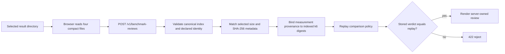
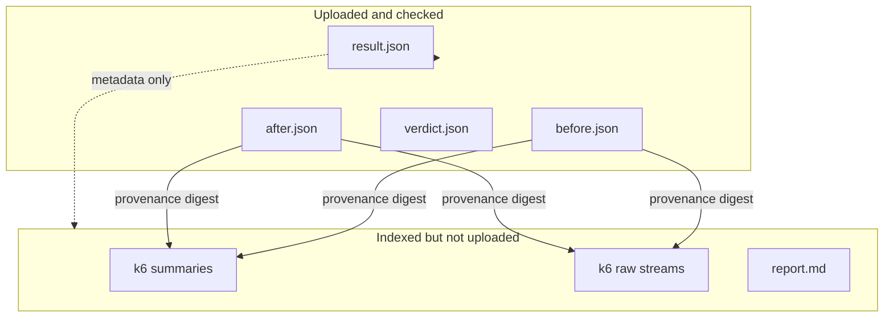

# 0042: Reviewing indexed benchmark evidence in the dashboard

- **Date:** 2026-08-22
- **Status:** validated
- **Related phase:** Phase 6 — presentation layer and packaging
- **Feature commit:** `c6eb70a feat: review benchmark results in dashboard`

## Why

The immutable benchmark bundle already answered whether a candidate passed, but its
evidence was available only as JSON and Markdown files. A reviewer could not compare
latency, runtime failures, and cost on the existing dashboard. Rendering the stored
`verdict.json` directly would also turn a tampered verdict into an authoritative-looking
screen.

Uploading the complete passing demo bundle was not a good default either. It is 6.7 MiB,
almost entirely because it retains raw k6 streams. A review page does not need to transfer
those raw streams, but it must be explicit about what it did not verify.

## Success criteria

- Select an immutable benchmark result directory without reading its large raw k6 files.
- Bind selected before, after, and verdict bytes to the canonical result index.
- Replay the verdict on the API rather than trusting either the browser or stored verdict.
- Visualize cost, latency P95/P99, errors, throttling, recovery, OOM, and restarts.
- Reject missing, oversized, tampered, or semantically inconsistent review inputs.
- Name the difference between an index-bound replay and complete artifact verification.

## What changed

The dashboard now accepts a benchmark result directory alongside `analysis.json`. It reads
only four files totaling 8,089 bytes in the final demo result:

| Selected file | Bytes | Purpose |
|---|---:|---|
| `result.json` | 1,457 | Artifact identity and payload metadata |
| `measurements/before.json` | 1,437 | Baseline performance and runtime signals |
| `measurements/after.json` | 1,427 | Candidate performance and runtime signals |
| `verdict.json` | 3,768 | Stored decision to compare with replay |

The API returns a typed `index_bound_replay` review. The result surface leads with PASS,
FAIL, or INVALID, then shows request-cost change, maximum candidate error rate, runtime
failures, before/after bars, and every policy check. Verification scope and limitations
remain visible in the same surface.

## How



The browser performs only file selection and size guarding. It does not calculate the
verdict. The API checks five boundaries:

1. the canonical index declares an artifact ID consistent with its declared digest;
2. selected payload bytes match indexed sizes and SHA-256 values;
3. before and after measurements bind to the indexed proposal and variant order;
4. their provenance digests bind to the four indexed k6 evidence entries;
5. a fresh policy comparison exactly matches the stored verdict.

### Verification boundary



This supports a replay tied to one supplied index. It does not prove that the omitted raw
bytes exist, match their indexed hashes, or produce the retained summaries. The existing
filesystem loader remains the complete verifier for a locally available full bundle.

### Alternatives and trade-offs

| Option | Benefit | Cost or risk | Decision |
|---|---|---|---|
| Render `verdict.json` in the browser | Smallest implementation | Trusts stored output and duplicates authority in UI | Rejected |
| Upload all 6.7 MiB | Can recompute the complete artifact digest | Large JSON transfer and browser memory cost for each review | Deferred |
| Upload four indexed files and replay on API | Compact, tamper-detecting for selected bytes, one decision authority | Cannot verify omitted evidence bytes | Selected |
| Give the API a local filesystem path | Enables complete loader reuse | Unsafe and unavailable in remote browser/API deployments | Rejected |

## Problems encountered

The first UI assertion expected the exact limitation text, but the rendered list prefixes
limitations with a warning marker. The behavior was correct; the assertion was changed to
match the semantic text rather than presentation punctuation.

One combined verification command ran `npm` from the repository root, where no
`package.json` exists. Python verification had already passed; dashboard tests and build
were rerun from `dashboard/` and passed. This was a command working-directory error, not a
product failure.

The request model initially limited Python characters, which can undercount UTF-8 bytes.
The review function now enforces the 128 KiB boundary after encoding, with a multibyte test.

## Evidence

### Reproduction

```bash
.venv/bin/pytest -q
.venv/bin/ruff check .
cd dashboard
npm test -- --run
npm run build
cd ..
docker build -t kubefit:benchmark-review .
```

The production demo artifact was also loaded through `review_benchmark_result` using its
four compact files.

### Results

| Evidence | Result |
|---|---|
| Python suite | 319 passed; one upstream Starlette deprecation warning |
| Ruff | Passed |
| Dashboard suite | 9 passed |
| TypeScript and Vite production build | Passed |
| Production Docker image build | Passed; dashboard and Python wheel packaged |
| Real artifact replay | `benchmark-f84d…0247`, PASS, `-98.088%`, 5 review checks |
| Selected bytes / complete bundle | 8,089 bytes / 6.7 MiB |

## Decision and limitations

It is now safe to claim that the dashboard visualizes a server-replayed decision from
before/after measurements whose exact bytes match the supplied result index. It rejects
selected-file tampering and a stored verdict that conflicts with the replay.

It is not safe to call this complete artifact verification. Raw k6 bytes, summaries, and
`report.md` are not uploaded, so their bytes and the aggregate content digest are not
recomputed. The fixed approximately 160-second run is controlled demo evidence, not proof
of representative production traffic. The benchmark bundle also does not encode the
proposal's controlled-demo observation provenance; reviewers must inspect the proposal
analysis separately.

## Next question

Can a reviewer follow one explicit link from a published Draft PR to the proposal,
benchmark review, and rollback evidence without manually locating local artifact folders?
