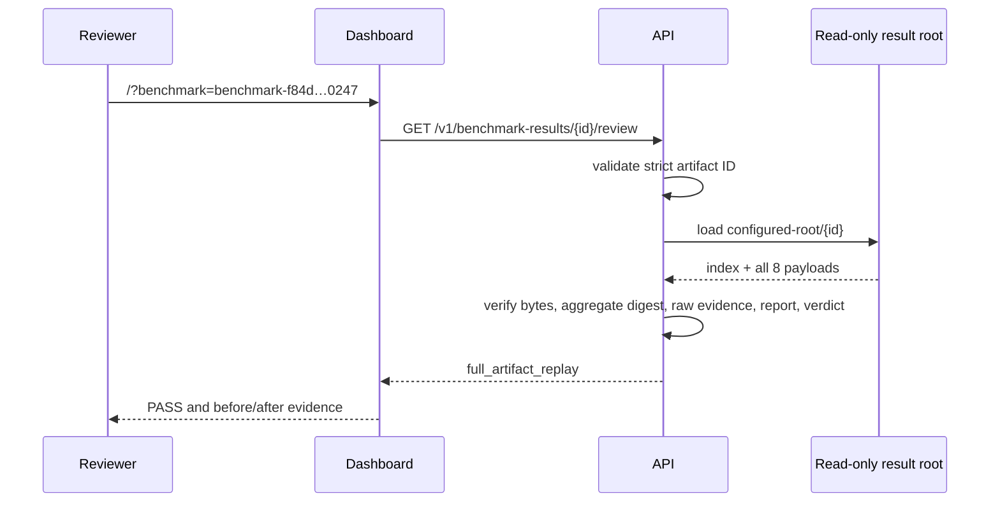

# 0043: Opening a fully verified benchmark review by URL

- **Date:** 2026-08-22
- **Status:** validated locally, in the packaged container, and on GitHub-hosted runners
- **Related phase:** Phase 6 — presentation layer and packaging
- **Feature commit:** `7798a44 feat: open fully verified benchmark links`
- **Draft PR:** [sangmu1126/kubefit#4](https://github.com/sangmu1126/kubefit/pull/4)

## Why

Entry 0042 made benchmark evidence understandable, but every reviewer still had to locate
and select a local result folder. A PR or demo could name an artifact ID without providing
a direct route back to its review. The compact upload also intentionally could not verify
the omitted 6.7 MiB raw evidence bundle.

The next slice needed a stable URL while preserving two boundaries: a browser must not
choose a server filesystem path, and configuring the dashboard must not silently publish
local artifacts.

## Success criteria

- Open one exact result using `/?benchmark=benchmark-<digest>`.
- Let the server derive the path only from a strict artifact ID and configured root.
- Reuse the complete immutable-result loader, including raw evidence and report checks.
- Distinguish full verification from the compact `index_bound_replay` response.
- Return 404 when storage is not configured or the identity is unknown.
- Reject unsafe roots, malformed IDs, symlinked results, and tampered omitted files.
- Prove the packaged non-root image starts and serves the real PASS artifact.

## What changed



The API exposes stored reviews only when
`KUBEFIT_BENCHMARK_RESULTS_DIRECTORY` names an existing regular directory. The route
accepts only `benchmark-` followed by 32 lowercase hexadecimal characters. It never
accepts a filesystem path from the browser.

The dashboard recognizes the query at startup and labels the result `FULL ARTIFACT
REPLAY`. Manual folder selection remains available and retains its honest `INDEX-BOUND
REPLAY` label.

## How the verification levels differ

| Boundary | Index-bound upload | Full stored review |
|---|---:|---:|
| Canonical index and declared identity | Yes | Yes |
| Selected before/after/verdict byte hashes | Yes | Yes |
| Complete expected file set | Metadata only | Yes |
| Every payload size and SHA-256 | No | Yes |
| Aggregate content digest | No | Yes |
| Raw k6/summary semantic replay | Digest binding only | Yes |
| Generated `report.md` replay | No | Yes |
| Benchmark verdict replay | Yes | Yes |

Neither level proves that a fixed controlled demo represents production traffic or
reconstructs the proposal's observation provenance.

### Alternatives and trade-offs

| Option | Benefit | Cost or risk | Decision |
|---|---|---|---|
| Put a server path in the URL | Simple | Path traversal and host-layout disclosure | Rejected |
| Upload the whole result from every browser | Complete client-supplied evidence | Repeated multi-megabyte transfer and memory use | Rejected |
| Publish results automatically | Globally reachable links | Expands privacy, credentials, retention, and hosting scope | Rejected |
| Operator-configured root plus artifact ID | Stable URL and full server replay | Requires deliberate storage provisioning | Selected |

## Problems encountered

The first image built successfully but exited before serving requests:

```text
ModuleNotFoundError: No module named 'httpx'
```

`collector.prometheus` imports `httpx`, but `pyproject.toml` had classified it as a
development-only dependency. Source tests passed because the development environment had
installed that extra. Importing benchmark review code from the packaged API exposed the
missing runtime dependency.

`httpx` was moved into the core dependency set and removed from the development extra. A
packaging contract test now asserts that classification. The rebuilt image installed
`httpx`, started as a non-root user, read the host result directory through a read-only
mount, fully verified the real artifact, returned HTTP 200, and shut down cleanly.

A first local `curl` ran before Docker Desktop had exposed the port and returned connection
failure. Retrying after the Uvicorn startup message reached the API; no product change was
needed for that timing issue.

## Evidence

### Reproduction

```bash
.venv/bin/pytest -q
.venv/bin/ruff check .
npm --prefix dashboard test -- --run
npm --prefix dashboard run build
docker build -t kubefit:shareable-review .
docker run --rm -p 18000:8000 \
  -v "$PWD/benchmarks/results:/var/lib/kubefit/results:ro" \
  -e KUBEFIT_BENCHMARK_RESULTS_DIRECTORY=/var/lib/kubefit/results \
  kubefit:shareable-review
```

The running container was queried at
`/v1/benchmark-results/benchmark-f84d0caf061d50a5d93bc03088eb0247/review`.

### Results

| Evidence | Result |
|---|---|
| Python suite | 326 passed; one upstream Starlette deprecation warning |
| Ruff | Passed |
| Dashboard suite | 11 passed |
| TypeScript and Vite production build | Passed |
| Docker build after dependency repair | Passed |
| Packaged non-root API startup | Passed |
| Real full result review | HTTP 200, `full_artifact_replay`, PASS, `-98.088%` |
| Read-only result mount | Passed |
| GitHub Actions run | [32553636654](https://github.com/sangmu1126/kubefit/actions/runs/32553636654), all four jobs passed |

### GitHub-hosted validation

Draft PR #4 targets `feat/benchmark-review-dashboard`, keeping the full-review slice to
two commits and 16 files while PR #3 remains independently reviewable. GitHub reported the
PR as Draft, open, and mergeable. Its first hosted run passed without a retry:

| Job | Result | Duration |
|---|---|---:|
| Python | Passed | 23s |
| Docker | Passed | 19s |
| Dashboard | Passed | 17s |
| Helm | Passed | 7s |

## Decision and limitations

It is now safe to give a reviewer a stable artifact-ID query when the same API deployment
has deliberately provisioned the complete result directory. The response supports a
stronger claim than browser upload because all stored bytes and semantic relationships are
revalidated before rendering.

The query is not a globally accessible link by itself. KubeFit does not upload evidence,
configure DNS, authenticate viewers, or define retention. A deployment exposing benchmark
storage must make those privacy and access-control decisions explicitly. The current Helm
chart does not provision such storage automatically.

## Next question

Should the optional review URL be injected into generated Draft PR bodies only when an
operator supplies an explicit public base URL, without weakening the one-file GitOps diff?
