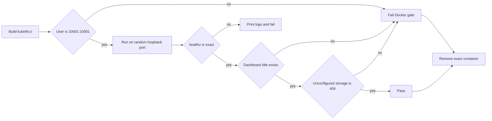

# 0044: Testing the packaged runtime in CI

- **Date:** 2026-08-24
- **Status:** validated locally and on GitHub-hosted runners
- **Related phase:** Phase 6 — presentation layer and packaging
- **Feature commit:** `57ffbd5 ci: smoke test packaged runtime`
- **Draft PR:** [sangmu1126/kubefit#5](https://github.com/sangmu1126/kubefit/pull/5)

## Why

The Docker quality gate built the production image and inspected its configured user, but
never started it. Entry 0043 demonstrated the consequence: the image built successfully
and then exited during API import because `httpx` had been classified as a development-only
dependency.

The dependency was repaired, but a package-name assertion only prevents that exact
regression. CI needs to validate the observable runtime boundary so a different missing
wheel, import error, invalid entrypoint, or absent dashboard fails before review.

## Success criteria

- Start the exact image built by the Docker CI job.
- Publish only to an ephemeral loopback port.
- Verify the configured numeric non-root user before execution.
- Require a valid `/healthz` response and packaged dashboard title.
- Confirm benchmark storage remains disabled by default with HTTP 404.
- Print container logs when startup fails.
- Remove only the uniquely named container created by the script on every exit path.
- Protect the workflow and script boundaries with repository tests.

## What changed



`deploy/local/verify-image-runtime.sh` accepts an image reference and creates a container
named with its process ID. Docker assigns the host port through
`--publish 127.0.0.1::8000`, avoiding public binds and fixed-port collisions. A bounded
readiness loop checks both container state and HTTP health. Because the container is not
created with Docker's automatic removal flag, logs remain available if the process exits;
the EXIT trap then force-removes that one resolved name.

The Docker workflow calls this reusable script after build and user inspection. Contract
tests require the new command, Bash syntax, loopback publication, runtime checks, failure
logs, and exact cleanup target.

### Alternatives and trade-offs

| Option | Benefit | Cost or risk | Decision |
|---|---|---|---|
| Keep build-only CI | Fastest | Cannot detect startup/import failures | Rejected |
| Run only `python -c 'import api.main'` | Detects imports | Misses entrypoint, server, and packaged assets | Rejected |
| Use a fixed host port | Simple | Collides with developer or runner services | Rejected |
| Start image on random loopback port | Tests deployed boundary without public exposure | Adds bounded startup time | Selected |
| Run full kind/Helm integration in every PR | Closest to cluster deployment | Much slower and duplicates the dedicated local proof | Deferred |

## Problems encountered

The original Docker gate's green result had been interpreted too broadly. It proved that
the wheel and image layers could be constructed, not that the installed application could
be imported or served. The `ModuleNotFoundError` from entry 0043 made that distinction
concrete and determined this slice's runtime assertions.

The first script version used `docker run --rm`. That cleans up conveniently, but also
deletes a failed container before its logs can be inspected. Automatic removal was dropped;
the script now preserves a stopped container long enough to print logs and uses its EXIT
trap for deterministic cleanup.

The second local run took most of the bounded readiness window while Docker Desktop exposed
the random port, then passed. The loop deliberately tolerates that startup variation while
remaining bounded. A post-run Docker query confirmed no `kubefit-runtime-verify-*`
container remained.

## Evidence

### Reproduction

```bash
.venv/bin/pytest -q
.venv/bin/ruff check .
bash -n deploy/local/verify-image-runtime.sh
deploy/local/verify-image-runtime.sh kubefit:shareable-review
docker ps --all --filter name=kubefit-runtime-verify --format '{{.Names}}'
```

### Results

| Evidence | Result |
|---|---|
| Focused CI/script contract tests | 6 passed |
| Full Python suite | 328 passed; one upstream Starlette deprecation warning |
| Ruff | Passed |
| Bash syntax | Passed |
| Runtime startup and exact health response | Passed |
| Packaged dashboard title | Passed |
| Unconfigured benchmark storage | HTTP 404 |
| Temporary containers after exit | 0 |
| GitHub Actions run | [32688071560](https://github.com/sangmu1126/kubefit/actions/runs/32688071560), all four jobs passed |

### GitHub-hosted validation

Draft PR #5 targets `feat/shareable-benchmark-review`, so its eight-file diff contains only
the runtime gate and its evidence. GitHub reported the PR as Draft, open, and mergeable.
All four jobs passed on the first run:

| Job | Result | Duration |
|---|---|---:|
| Python | Passed | 27s |
| Docker | Passed | 22s |
| Dashboard | Passed | 15s |
| Helm | Passed | 4s |

The Docker job log independently shows the `Smoke test packaged runtime` step starting
`kubefit:ci` and printing the success assertion for startup, health, dashboard, and
disabled storage. This distinguishes the new runtime evidence from a job that merely
retained the old build-only commands.

## Decision and limitations

It is now safe to claim that the Docker quality gate verifies the packaged application can
start and serve its default review surface, not merely that an image can be constructed.
The script remains tokenless and does not mount Kubernetes credentials or benchmark data.

This smoke test does not replace the disposable-kind Helm verification, exercise optional
RBAC, or validate configured benchmark storage. Those paths have separate local integration
evidence.

## Next question

Are PRs #2 through #4 and this runtime gate ready for ordered human approval and merge,
followed by one clean `main` verification and an MVP tag?
