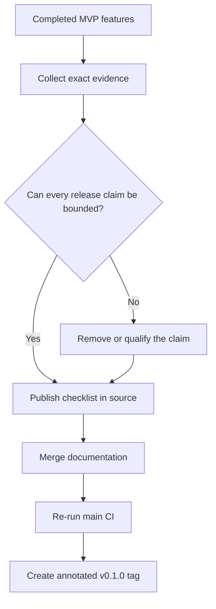

# 0045: Turning an integrated MVP into a bounded release

- **Date:** 2026-08-24
- **Status:** validated locally and on GitHub-hosted runners
- **Related phase:** MVP release preparation
- **Integrated commit:** `caede3391ecf9e9d10633239857bd29bd3cf8991`
- **Documentation PR:** [sangmu1126/kubefit#6](https://github.com/sangmu1126/kubefit/pull/6), merged

## Why

Phases 1–6 were complete and PRs #2 through #5 had been merged, but completion was
distributed across 44 development entries, test output, a live benchmark, and a
Draft GitOps PR. A reviewer landing on the README could see features without one
compact mapping from each claim to its evidence.

Creating `v0.1.0` immediately would also leave an ambiguous boundary: a source MVP
can be ready while public images, signing, provider billing accuracy, and production
autonomy remain intentionally unfinished.

## What changed

- Added a compact verified-evidence matrix near the top of the README.
- Added `docs/release-readiness.md` as the source-of-truth release checklist.
- Bound the candidate to the exact integrated `main` commit and hosted CI run.
- Separated locally and GitHub-hosted evidence from the remaining tag action.
- Listed claims that `v0.1.0` explicitly does not make.
- Preserved Draft PR #1 as evidence of the human approval boundary rather than
  treating an unmerged proposal as incomplete product code.

## How

The release decision is based on checked-in evidence boundaries. The future tag
will point at the documentation merge only after that commit passes the same gates.

## Alternatives considered

| Alternative | Benefit | Problem | Decision |
|---|---|---|---|
| Tag the existing implementation commit immediately | Fastest visible release | Tagged source lacks the final release boundary | Rejected |
| Describe every historical implementation detail in the README | All context in one file | Hides the quick evaluation path in a long narrative | Rejected |
| Claim production readiness from a passing demo | Stronger marketing language | One controlled kind benchmark cannot support that claim | Rejected |
| Publish source MVP with explicit exclusions | Evidence and limitations remain reviewable | Less expansive claim | Selected |

## Evidence

Before this documentation slice, the final integrated commit was independently
validated as follows:

| Check | Result |
|---|---|
| Ruff | Passed |
| Python | 328 passed; one upstream Starlette/httpx deprecation warning |
| Dashboard | 11 passed; production build passed |
| Helm | Lint and default render passed |
| Local packaged image | Startup, health, dashboard, disabled storage passed |
| GitHub Actions | [run 32688444656](https://github.com/sangmu1126/kubefit/actions/runs/32688444656), all four jobs passed |
| Git state | Local `main` and `origin/main` both at `caede339` |

The documentation slice then passed `git diff --check`, verified every referenced
local file, and confirmed that `pyproject.toml` already declares version `0.1.0`.
Draft PR #6 is based directly on `main` and contains only the release contract and
its development record. GitHub Actions
[run 32689338402](https://github.com/sangmu1126/kubefit/actions/runs/32689338402)
independently passed all four jobs:

| Hosted job | Result | Duration |
|---|---|---:|
| Python | Passed | 24s |
| Dashboard | Passed | 14s |
| Helm | Passed | 7s |
| Docker | Passed | 24s |

PR #6 was then approved and merged as `075c7220500ac760e17e3290f532b359986a7df7`.
The resulting `main` workflow
[run 32690444806](https://github.com/sangmu1126/kubefit/actions/runs/32690444806)
passed Python, Dashboard, Helm, and Docker, including the packaged runtime smoke.

## Decision and limitations

KubeFit is ready to be presented as a GitOps-first Kubernetes optimization MVP with
a real controlled benchmark and real Draft PR handoff. It is not yet correct to
claim a published container/chart release, signed supply chain, provider-accurate
savings, HPA optimization, or autonomous production operation.

## Next question

The release boundary is now complete. The next controlled action is to tag the final
clean, four-gate-verified `main` commit as `v0.1.0` and independently verify the
remote annotated tag target.
