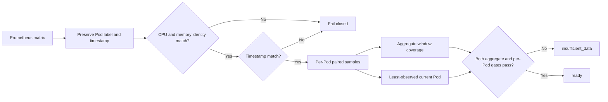

# 0046: Binding Prometheus evidence to Pod identity and time

- **Date:** 2026-08-24
- **Status:** implemented and locally validated
- **Related phase:** post-v0.1.0 correctness hardening
- **Implementation commit:** `90187b7ca64081cdfbe8faca5d564591d123755e`

## Why

The original collector converted every Prometheus range result directly into a list
of values. That discarded the `metric.pod` label and timestamps before readiness was
calculated. Two different unsafe inputs could therefore look complete:

1. CPU series for Pods A/B and memory series for Pods C/D both appeared to cover two
   Pods, even though none of the identities matched.
2. With two replicas, 121 samples from Pod A and one sample from Pod B met an
   aggregate 122-sample requirement even though Pod B had almost no evidence.

This violated KubeFit's explanation boundary. A sample count is not sufficient proof
unless the project can state which Pod and instant contributed that sample.

## What changed

- Preserve each range series as `(metric labels, timestamped samples)`.
- Reject missing or duplicate Pod labels for Pod-grouped workload queries.
- Pair CPU and memory only when both Pod ID and timestamp match.
- Calculate P95/P99 and maxima only from those paired observations.
- Count current Pod identities, rather than substituting historical series count.
- Retain historical authorized ReplicaSet series for recommendation statistics while
  requiring every current Pod to be represented for readiness.
- Expose the least-observed current Pod for usage and throttling.
- Require at least `ceil(policy minimum samples / desired replicas)` samples from
  every current Pod in addition to aggregate count and coverage.
- Keep the new fields optional in `ObservedUsage`, so older schema v2 artifacts that
  lack them retain their original replay behavior.

## How



The per-Pod floor divides the existing policy minimum across the desired replicas:

```text
required per current Pod = ceil(minimum sample count / desired replicas)
```

For the default minimum of 100 and two desired replicas, every current Pod must
contribute at least 50 paired usage samples and 50 throttling samples. This floor
does not replace the aggregate observation threshold; both gates must pass.

Historical rollout Pods can still contribute to the busiest-Pod percentile and
aggregate observation window. They cannot satisfy the current-Pod identity or
least-observed-current-Pod gates.

## Alternatives considered

| Alternative | Benefit | Problem | Decision |
|---|---|---|---|
| Keep aggregate counts and compare only series lengths | Small change | Disjoint identities and timestamps remain indistinguishable | Rejected |
| Require every current Pod to cover 70% of the full window | Strong uniformity | A safe rollout would wait most of a seven-day window despite valid history | Rejected |
| Require only one sample from each current Pod | Fast rollout | A single scrape cannot support a percentile or stable risk claim | Rejected |
| Combine aggregate coverage with a policy-derived per-current-Pod floor | Preserves rollout history while rejecting extreme skew | Adds two explicit evidence fields | Selected |

## Evidence

The two original counterexamples are now regression tests:

| Input | Old result | New result |
|---|---|---|
| CPU Pods A/B; memory Pods C/D | Could report two metric Pods | `PrometheusError`: no matching Pod identities |
| Current Pod samples 121 + 1; aggregate coverage 100% | Could become `ready` | `insufficient_data`; least-observed Pod has 1, requires 50 |

Local verification after the implementation commit:

```text
ruff check .       -> passed
pytest -q          -> 331 passed, 1 upstream Starlette/httpx warning
git diff --check   -> passed
```

Existing schema v1/v2 artifact, CLI, readiness, benchmark, API, and dashboard-facing
Python tests remain green. The changed percentile-unit test also proves that an
unpaired CPU timestamp is excluded instead of silently contributing to CPU P95/max.

## Decision and limitations

KubeFit can now claim that collected CPU/memory recommendation samples are paired by
Pod identity and timestamp, and that current replica skew cannot be hidden by an
aggregate count. This is still not raw-metric replay: the analysis artifact retains
aggregates, not the Prometheus response. Pod lifecycle-aware coverage and scrape
authenticity remain future work.

This is a post-release correctness fix. The immutable `v0.1.0` tag is unchanged; a
future release containing it should use a new version such as `v0.1.1`.

## Next question

Can the benchmark runner guarantee restoration when the operator interrupts it with
Ctrl+C, rather than only when an ordinary `Exception` is raised?
