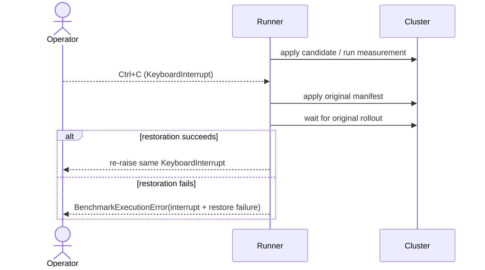

# 0047: Restoring the benchmark after operator interruption

- **Date:** 2026-08-24
- **Status:** implemented and locally validated
- **Related phase:** post-v0.1.0 correctness hardening
- **Implementation commit:** `a6df65a6a1d4f0585143454a6e6a22b6e6f74100`
- **Stacked on:** Draft PR [#8](https://github.com/sangmu1126/kubefit/pull/8)

## Why

The benchmark runner promises to restore the original Deployment after applying the
candidate. Its error handler caught `Exception`, but Python's `KeyboardInterrupt`
inherits directly from `BaseException`. Pressing Ctrl+C during a measurement could
therefore skip the restoration block and leave the candidate resources running.

That is more than a CLI inconvenience: it violates the benchmark's mutation
boundary and makes a human safety action capable of extending the mutation.

## What changed

- Capture interruption-class failures after the first apply becomes possible.
- Always run the existing original-manifest apply and rollout wait.
- Re-raise the same `KeyboardInterrupt` after successful restoration, preserving
  normal shell and CLI interruption semantics.
- If restoration also fails, raise `BenchmarkExecutionError` with both the original
  interruption and restoration failure retained.
- Add regression coverage for interruption during both before and after measurement.

## How



The runner deliberately distinguishes two responsibilities:

```text
ordinary Exception    -> restore, then wrap with benchmark stage
KeyboardInterrupt     -> restore, then re-raise the same interrupt
any + restore failure -> structured error retaining both causes
```

Restoration starts only after workload identity verification and immediately before
the first apply attempt. Therefore a pre-mutation validation interrupt performs no
cluster write, while an interrupt from the first apply onward triggers restoration.

## Alternatives considered

| Alternative | Benefit | Problem | Decision |
|---|---|---|---|
| Keep catching only `Exception` | Conventional narrow handler | Ctrl+C bypasses the safety contract | Rejected |
| Convert Ctrl+C into `BenchmarkExecutionError` | Uniform API errors | Shell sees an ordinary failure instead of an operator interrupt | Rejected |
| Restore, then re-raise the original interrupt | Preserves safety and CLI semantics | Requires explicit `BaseException` boundary | Selected |
| Ignore SIGINT during restoration | Stronger against repeated Ctrl+C | Surprising signal behavior and platform complexity | Deferred |

## Evidence

Three regression cases exercise the new boundary:

| Case | Expected result |
|---|---|
| Ctrl+C during before measurement | Original apply + rollout, then same interrupt |
| Ctrl+C during after measurement | Original apply + rollout, then same interrupt |
| Ctrl+C plus restoration failure | Structured error retains both causes |

Local verification:

```text
benchmark runner tests -> 17 passed
ruff check .           -> passed
pytest -q              -> 334 passed, 1 upstream Starlette/httpx warning
git diff --check       -> passed
```

## Decision and limitations

One operator interruption during benchmark execution can no longer bypass original
Deployment restoration. A second interruption delivered while restoration itself is
running can still interrupt that attempt; KubeFit does not mask signals or run an
external recovery controller. For that reason the benchmark remains scoped to a
disposable cluster and does not claim production-grade transactional mutation.

The immutable `v0.1.0` tag is unchanged. This fix belongs in a later patch release.

## Next question

Can a new user install the default Helm configuration from public artifacts today,
or does the unreleased default image reference make the documented installation
path non-reproducible?
