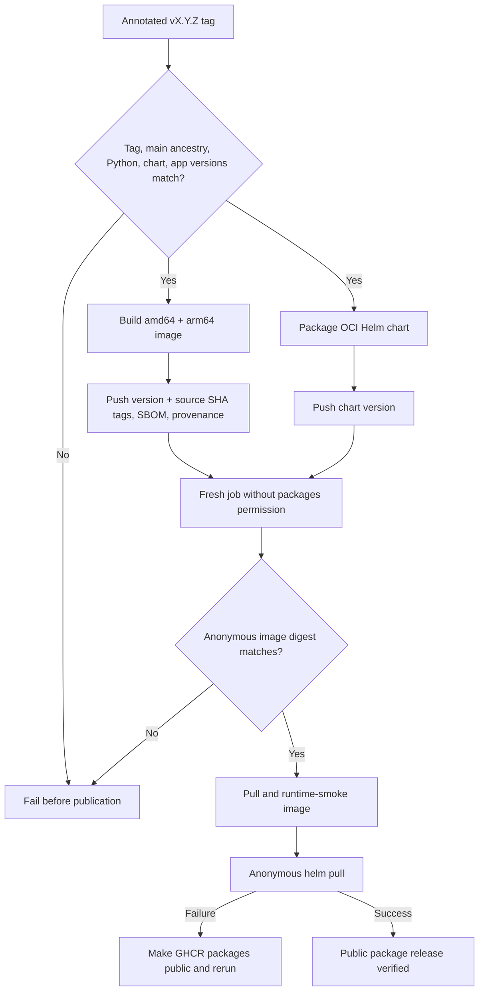

# 0048: Making package publication verifiable from the anonymous boundary

- **Date:** 2026-08-24
- **Status:** implementation validated locally; live publication not yet executed
- **Related phase:** post-v0.1.0 package hardening
- **Implementation commit:** `add9c4deb765d94f2617af54310dde07301f3ae7`
- **Stacked on:** Draft PR [#9](https://github.com/sangmu1126/kubefit/pull/9)

## Why

The Helm chart rendered `ghcr.io/sangmu1126/kubefit:0.1.0` by default, but an
anonymous registry lookup returned:

```text
Get "https://ghcr.io/v2/sangmu1126/kubefit/manifests/0.1.0": denied
```

Local image builds and kind image loading proved the package contents, but they did
not prove that a new user could install the default chart. A renderable chart with
an inaccessible image is not a reproducible installation path.

## What changed

- Added a release workflow triggered by a semantic-version tag or an explicitly
  selected existing annotated tag.
- Require the tag target to be reachable from `main`.
- Require the tag, Python project, chart version, and chart app version to match.
- Build and publish `linux/amd64` and `linux/arm64` images to GHCR.
- Publish version and full source-commit tags without publishing a mutable `latest`.
- Emit BuildKit provenance and SBOM attestations with the image.
- Publish the matching Helm chart as an OCI package.
- Verify image digest, actual image pull/runtime, and Helm pull from a separate job
  that has no package permission and performs no registry login.
- Pin Node and Python base image indexes by multi-architecture digest.
- Bind the chart's default image tag to `Chart.appVersion` with a regression test.

## How



Publication and public verification are intentionally separate jobs. The publish
jobs receive `packages: write`; the final verifier receives only `contents: read`.
It therefore cannot accidentally reuse the publishing credential when proving the
anonymous user path.

The first publication may create private GHCR packages. Both publish jobs complete
before the public verifier runs, so the image and chart packages exist even when the
final gate fails. An owner can then change both packages to public visibility and
rerun the same tag. GitHub documents package visibility and Container Registry
anonymous access in its
[package visibility guide](https://docs.github.com/en/packages/learn-github-packages/configuring-a-packages-access-control-and-visibility)
and
[Container Registry guide](https://docs.github.com/en/packages/working-with-a-github-packages-registry/working-with-the-container-registry).

## Identity contract

```text
release tag       = vX.Y.Z (annotated)
Python version    = X.Y.Z
chart version     = X.Y.Z
chart appVersion  = X.Y.Z
image tags        = X.Y.Z, sha-<full tagged commit>
chart location    = oci://ghcr.io/sangmu1126/charts/kubefit
```

The workflow checks out the tag, not the workflow branch. Manual dispatch can
therefore publish the immutable `v0.1.0` source tag after this workflow reaches the
default branch without moving that tag.

## Alternatives considered

| Alternative | Benefit | Problem | Decision |
|---|---|---|---|
| Document `--set image.repository` only | No registry work | Default installation remains broken | Rejected |
| Publish only an image | Helm default can pull | Chart distribution remains source-checkout-only | Rejected |
| Verify with the publishing login still active | Simple workflow | Does not prove anonymous access | Rejected |
| Publish `latest` | Convenient command | Tag meaning changes and weakens review provenance | Rejected |
| Publish version/SHA image and OCI chart, then verify anonymously | Complete default-user boundary | Requires one-time GHCR visibility action | Selected |

## Evidence

Local validation after implementation:

| Check | Result |
|---|---|
| Anonymous current default lookup | Failed with `denied`, reproducing the defect |
| Release workflow contract tests | Passed |
| Helm lint and default render | Passed |
| Python suite | 340 passed; one upstream Starlette/httpx warning |
| Pinned-base production build | Passed on arm64 Docker Desktop |
| Built image runtime smoke | Startup, health, dashboard, and disabled storage passed |
| Public Buildx format probe | Anonymous digest extraction returned the expected manifest digest |

The hosted release workflow has not run yet because its code is still in a stacked
Draft PR. Public image and chart availability must not be claimed until its final
anonymous verification job passes.

## Decision and limitations

KubeFit now has a reviewable mechanism to publish and independently verify a public
multi-architecture image and matching OCI chart. It does not yet have live public
package evidence.

The current branch pins base image indexes, but Python runtime dependencies are still
resolved from version ranges during image construction. Future tags containing this
commit have stable base images but are not bit-for-bit reproducible until Python
dependencies are locked. A manual `v0.1.0` publication checks out that historical
tag and therefore retains its original mutable base references; its source identity
and generated attestations are still verifiable, but it must not be described as a
fully reproducible build.

## Next question

Should the repository declare its Apache-2.0 license with an actual root `LICENSE`
file before inviting external use and contribution?
