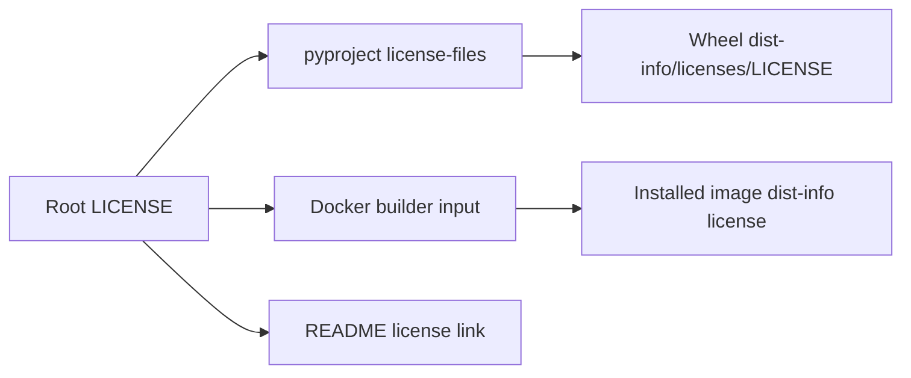

# 0049: Turning a license declaration into a distributed license

- **Date:** 2026-08-24
- **Status:** implemented and locally validated
- **Related phase:** post-v0.1.0 open-source hardening
- **Implementation commit:** `8dc3d4a`
- **Stacked on:** Draft PR [#10](https://github.com/sangmu1126/kubefit/pull/10)

## Why

`pyproject.toml` declared Apache-2.0, but the repository contained no `LICENSE`,
`NOTICE`, or `COPYING` file. A package consumer could see a metadata string without
receiving the license terms that govern source and binary redistribution.

This also weakened the open-source claim: GitHub and package tools discover a root
license file, not an intention recorded only inside build configuration.

## What changed

- Added the complete Apache License 2.0 text from the Apache Software Foundation.
- Replaced the legacy license text table with the PEP 639 SPDX expression
  `Apache-2.0`.
- Declared `LICENSE` as a Python package license file.
- Copied `LICENSE` into the Docker wheel-builder context.
- Linked the distributed license from the README.
- Added regression checks for the complete nine-section license, SPDX metadata,
  package inclusion, Docker input, and README discovery.

## How



The source text was fetched from the
[official Apache License 2.0 text](https://www.apache.org/licenses/LICENSE-2.0.txt)
and compared directly against the checked-in file. The comparison returned no
differences.

The project now uses the metadata contract:

```toml
license = "Apache-2.0"
license-files = ["LICENSE"]
```

## NOTICE decision

Apache-2.0 requires preservation of a `NOTICE` file when the distributed work
already includes one. KubeFit had no existing NOTICE or project-specific attribution
text to carry forward. Creating an empty or invented NOTICE would imply a legal
artifact without information, so none was added.

Third-party Python and dashboard dependencies keep their own licenses. KubeFit's
root license does not relicense those dependencies; the image SBOM remains the
inventory boundary for installed packages.

## Alternatives considered

| Alternative | Benefit | Problem | Decision |
|---|---|---|---|
| Keep only `license = { text = "Apache-2.0" }` | No new file | Does not distribute the terms | Rejected |
| Add a short SPDX-only LICENSE | Compact | Not the complete Apache terms recipients need | Rejected |
| Add official LICENSE and an empty NOTICE | Familiar pair of files | Empty NOTICE has no attribution purpose | Rejected |
| Add official LICENSE and bind it to source, wheel, image, and README | Complete discovery and distribution path | Adds one canonical legal file | Selected |

## Evidence

| Check | Result |
|---|---|
| Official text versus root `LICENSE` | Byte-for-byte match |
| Wheel metadata | `License-Expression: Apache-2.0` |
| Wheel license entry | `kubefit-0.1.0.dist-info/licenses/LICENSE` |
| Wheel entry versus root file | Byte-for-byte match |
| Production image license versus root file | Byte-for-byte match |
| Production image runtime smoke | Passed |
| Ruff | Passed |
| Python suite | 342 passed; one upstream Starlette/httpx warning |

## Decision and limitations

KubeFit can now be distributed as an Apache-2.0 project with the complete terms in
source, Python wheel, and production image. This is a packaging and repository
license boundary, not a full third-party license-compliance audit. Generated SBOMs
identify dependencies, but consolidated attribution reports and automated license
policy checks remain future supply-chain work.

The immutable `v0.1.0` tag predates this file. A later patch release is the first
source tag that can include this corrected license distribution.

## Next question

Can the Python runtime and development environments install exactly the same audited
versions over time, or do broad dependency ranges still change the build result?
